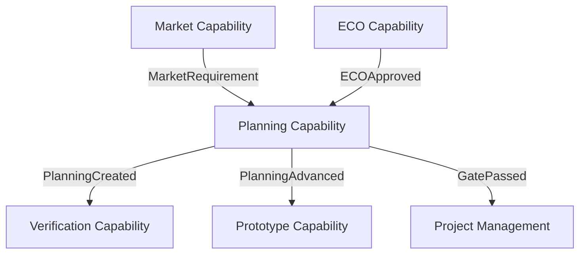

# RFC-2026-001: Planning Capability (Reference RFC)

> **状态**: ✅ **APPROVED WITH REQUIRED CHANGES**
> **作者**: Chief System Architect
> **日期**: 2026-06-30
> **关联**: Constitution / Foundation / Architecture Standard / Data Standard / Governance Standard
>
> **本 RFC 是 ROS 所有后续 Capability RFC 的标准模板（Reference RFC）。**
> 未来新增任何 Capability，均应沿用此结构，仅替换业务内容。

---

## 1. 变更概述

将产品策划（Product Planning）正式定义为 ROS 的第一个 **Foundation-compliant Capability**。
本 RFC 作为 Reference RFC，定义所有 Capability 的标准模板结构。

---

## 2. 动机

Planning 是整个 Digital Thread 的起点：

```
Market Requirement → [Planning] → Verification → Prototype → Test → Certification → MP → Feedback
```

没有 Planning，就没有后续任何 Capability。

---

## 3. Capability Contract

### 3.1 Capability Interface

**Provides（对外提供的能力）：**

| 能力 | 说明 | 调用者 |
|:-----|:------|:-------|
| `CreatePlan()` | 创建产品策划 | PM Workstation, Agent Planner |
| `AdvanceStage()` | 推进阶段门禁 | Workflow Engine |
| `EvaluateGate()` | 评估 Gate 条件 | Gate Rule Engine |
| `GenerateRoadmap()` | 生成产品路线图 | Dashboard |
| `PublishPlanning()` | 发布策划事件 | Event Bus |

**Consumes（消费的事件/数据）：**

| 来源 | 内容 | 说明 |
|:-----|:------|:------|
| Market Capability | `MarketRequirement` | 市场要求变更通知 |
| ECO Capability | `ECOApproved` | 工程变更回写策划 |

**Produces（产生的事件）：**

| 事件 | 消费者 |
|:-----|:--------|
| `PlanningCreated` | Verification, Certification, Workflow Engine |
| `PlanningAdvanced` | Digital Thread, Subscribers |
| `GatePassed` | Project, Dashboard |
| `GateBlocked` | PM, Architecture Board |
| `CostTargetUpdated` | Finance, ECO |

### 3.2 Capability Owner

| 层级 | 角色 | 说明 |
|:-----|:------|:------|
| **Business Owner** | PM Director | 业务决策、需求优先级 |
| **Technical Owner** | Planning Team Lead | 实现、维护、API 质量 |
| **Architecture Owner** | Architecture Board | 架构一致性、Constitution 合规 |

### 3.3 Capability Dependencies



**依赖列表：**

| Capability | 依赖类型 | 说明 | 就绪 |
|:-----------|:---------|:------|:-----|
| Market | 弱依赖（事件驱动） | 市场要求变更通知 | ✅ |
| Projects | 弱依赖 | Plan → Project 关联 | ✅ |
| Gate Rules | 强依赖 | 流程门禁判定 | ✅ |
| Users/RBAC | 基础设施 | 权限控制 | ✅ |

### 3.4 Capability Scope

**In Scope（12 个模块）：**

| 模块 | 说明 | 现有文件 |
|:-----|:------|:---------|
| ProductPlan CRUD | 策划创建/编辑/列表/详情 | `product_plan.py` (1124行) |
| 流程推进 | Idea→Concept→Planning→Development Gate | `product_plan.py` |
| Stage Workflow | 阶段状态机 + Gate 规则 | `product_plan_workflow.py` / `gate_rules.py` |
| PM 提案 | 产品提案创建/审批 | `pm_proposal_api.py`, `pm_proposal_utils.py` |
| 路线图 | 年度规划 + 甘特图 | `pm_roadmap.py` |
| 产品需求 | 需求文档 CRUD | `product_requirements.py` |
| 策划审批 | Review/Approval 流程 | `product_plan_review.py` |
| 订阅通知 | 策划变更通知 | `product_plan_subs.py` |
| PM 工作台 | PM 专属 dashboard | `pm_workspace.py` |
| PM 配置 | 策划类型/模板配置 | `pm_config.py`, `plan_templates.py` |
| 附件管理 | 策划关联附件 | `pm_accessory.py` |
| 统计报表 | 策划数据统计 | `pm_statistics.py` |

**Out of Scope（后续 Capability）：**

| 模块 | 归属 Capability | 计划 |
|:-----|:----------------|:------|
| Project 管理 | Projects Capability | 后续 |
| ECO/ECR | ECO Capability | ✅ Released |
| Verification | Verification Capability | ✅ Released |
| Certification | Certification Capability | ✅ Released |

---

## 4. Event Contract

> ⚠️ **Event Contract 必须先于代码冻结。** 这是 Architecture Board 的强制要求。

### 4.1 事件 Schema

所有事件遵循 Engineering Standard V1.0 Event Specification：

```json
{
  "event_id": "uuid",
  "event_type": "ProductPlan.Created.v1",
  "version": 1,
  "timestamp": "ISO8601",
  "source": "planning-service",
  "trace_id": "uuid",
  "tenant_id": "tenant-id",
  "payload": {
    "plan_id": "PP-20260630-0001",
    "name": "2027 年分体机系列",
    "portfolio": "Residential AC",
    "status": "Concept"
  },
  "metadata": {
    "user_id": "user-id",
    "correlation_id": "uuid"
  }
}
```

### 4.2 事件列表

| 事件 | 版本 | 说明 | Payload 核心字段 |
|:-----|:-----|:------|:-----------------|
| `ProductPlan.Created.v1` | v1 | 策划创建 | plan_id, name, portfolio, status |
| `ProductPlan.StatusChanged.v1` | v1 | 状态变更 | plan_id, from_status, to_status |
| `ProductPlan.CostTargetUpdated.v1` | v1 | 目标成本更新 | plan_id, cost_target, currency |
| `ProductPlan.GatePassed.v1` | v1 | Gate 通过 | plan_id, gate_code, score |
| `ProductPlan.GateBlocked.v1` | v1 | Gate 未通过 | plan_id, gate_code, reason |

### 4.3 Event Version Policy

| 版本 | 触发条件 | 兼容性 | 过渡期 |
|:-----|:---------|:-------|:-------|
| v1 → v2 | 新增非必要字段 | 向后兼容 | 无需过渡 |
| v1 → v2 | 删除/重命名字段 | **不兼容** | 迁移 + 双写 90 天 |
| v1 → v2 | Payload 结构变更 | **不兼容** | Migration Guide 必须 |

**Replay 规则**：Replay 按 Event Type 的当前版本执行。
历史事件存储时保留原始版本号，Replay 时转换为当前版本格式。

---

## 5. Data Contract

### 5.1 核心数据模型

根据 Data Standard V1.0：

| 字段 | 类型 | 说明 | Owner | 合规 |
|:-----|:-----|:------|:------|:-----|
| id | UUID/Serial | 唯一编码 | Planning | ✅ |
| name | String | 策划名称 | Planning | ✅ |
| portfolio | Enum | Residential AC / Commercial AC / Heat Pump / Portable AC | Planning | ✅ |
| business_capability | Enum[] | Cooling / Heating / AI Energy Saving / Voice Control | Planning | ✅ |
| platform | String | 所属平台 | Planning | ✅ |
| status | Enum | Idea→Concept→Planning→Development→Launch→Maintenance→Retirement | Planning | ✅ |
| cost_target | Decimal | 目标成本（只读非 Planning 模块） | Planning | ✅ |
| market | String[] | 目标市场 | Planning | ✅ |
| roadmap | Date | 路线图节点 | Planning | ✅ |

### 5.2 唯一编码

遵循 Data Standard：
```
PP-{YYYYMMDD}-{Sequence}
示例：PP-20260630-0001
```

### 5.3 现有模型扩展

当前子表（ProductPlanInitiation, ProductPlanMarket, ProductPlanTechSpec, ProductPlanTeam）作为扩展保留，
需确保主表 id 与子表关联关系合规。

---

## 6. Gate 规则定义

根据 Governance Standard V1.0 Product Governance：

| Gate | 决策者 | 条件 | 当前状态 |
|:-----|:-------|:------|:---------|
| Concept Review | PM | 业务案例完整 | 🔧 待完成 |
| Feasibility Review | Architecture Board | 技术评估完成 | 🔧 待完成 |
| Planning Review | GM | 资源计划确认 | 🔧 待完成 |
| Verification Review | QA Lead | 覆盖率 ≥ 80% | ❌ 待实现 |
| Launch Review | PM + Cert Lead | 认证就绪 | ❌ 待实现 |
| Retirement Review | GM | EOL 分析完成 | ❌ 待实现 |

---

## 7. Capability KPIs

| 指标 | 定义 | 目标 | 数据来源 |
|:-----|:-----|:-----|:---------|
| Planning Cycle Time | Idea → Planning 完成天数 | ≤ 14 天 | Event Log |
| Gate Pass Rate | Gate 评审一次通过率 | ≥ 70% | Gate Eval Record |
| Planning Rework Rate | 退回上一阶段占比 | ≤ 15% | Status History |
| Cost Target Accuracy | 目标成本与实际成本偏差 | ± 10% | Cost Data |
| Requirement Stability | 策划创建后需求变更次数 | ≤ 3 次 | ECO Link |

---

## 8. Capability SLA

| 操作 | SLA 目标 | 测量方式 |
|:-----|:---------|:---------|
| Create Plan | < 200ms | P95 API Latency |
| Advance Stage | < 300ms | P95 API Latency |
| Gate Evaluation | < 500ms | P95 API Latency |
| Event Publish | < 1s | Event Bus Latency |
| Replay (10,000 events) | < 5min | Replay Duration |

---

## 9. Constitution Compliance Check

| # | 原则 | 结果 | 说明 |
|:-:|:-----|:-----|:------|
| 1 | 数据主权 | ✅ | ProductPlan Owner = PM，清晰 |
| 2 | Digital Thread | ⚠️ | 需补齐 → Verification 的事件链 |
| 3 | AI 真实性 | ✅ | AI 仅建议，不直接修改 |
| 4 | 事件驱动 | ⚠️ | Contract 已冻结，需实现 |
| 5 | 知识结构化 | ✅ | 策划数据已结构化 |
| 6 | 决策可追溯 | ✅ | Gate 决策已记录 |
| 7 | 规则配置化 | ✅ | Gate 规则已配置化 |
| 8 | 向下兼容 | ✅ | API 版本兼容 |
| 9 | Agent 可替换 | ✅ | 不依赖特定 Agent |
| 10 | 架构优先 | ✅ | 遵循 Architecture Standard |
| 11 | Engineering Truth | ✅ | 基于实验和成本数据 |
| 12 | Platform First | ✅ | 模板/配置跨产品线复用 |

---

## 10. Architecture Principles Check

| 原则 | 结果 | 说明 |
|:-----|:-----|:------|
| Simple over Complex | ✅ | 文件/功能按职责拆分清晰 |
| Reuse over Rewrite | ✅ | PM config / plan_template 可复用 |
| Platform over Project | ⚠️ | 部分代码需去项目级硬编码 |
| Configuration over Code | ✅ | Gate 规则/流程已配置化 |
| Evidence over Opinion | ✅ | 决策依赖实验和成本数据 |
| Event over Coupling | ⚠️ | Event Bus 待接入（Contract 已冻结） |

---

## 11. Capability Evolution

```
Planning v1 (2026 H2) ── Foundation Compliance + Event Bus
    ↓
Planning v2 (2027 H1) ── AI 辅助 Gate 评估 + KPI 自动统计
    ↓
Planning v3 (2027 H2) ── 自动优化 Gate 阈值 + Digital Twin 互联
    ↓
Planning v4 (2028+) ─── L3 自主 Gate（AI 主导，人工抽查）
```

---

## 12. 风险评估

| 风险 | 等级 | 缓解措施 |
|:-----|:-----|:---------|
| 代码量过大（1124行 product_plan.py） | Medium | Phase 1 拆分子模块，≤ 600行/文件 |
| 事件驱动缺失 | Medium | Phase 2 按 Event Contract 实现 |
| Gate 规则与标准有差异 | Low | Phase 3 调整 Gate 配置 |
| 现有数据模型与 Data Standard 有差异 | Low | Phase 3 含数据迁移方案 |

---

## 13. 实施计划

```
Phase 1: Capability Contract    → Interface + Owner + Dependencies   [Week 1]
Phase 2: Event Contract         → 5 Events + Schema + Version Policy  [Week 1]
Phase 3: Data Contract          → Model Audit + Compliance            [Week 2]
Phase 4: Implementation         → API + Gate + Event Bus              [Week 2-3]
Phase 5: Compliance Validation  → Constitution Check + Audit          [Week 3]
Phase 6: Architecture Review    → Board Validation                    [Week 3]
Phase 7: Registry → Release     → Capability Registry + Release Notes [Week 4]
```

### 回滚方案

| 组件 | 回滚方式 |
|:-----|:---------|
| Event Bus | 关闭开关，恢复直接调用 |
| 文件拆分 | 保留原文件，渐进替换 |
| 数据模型 | 仅新增字段，不删除/重命名 |

---

## RFC 元数据

```json
{
  "rfc_id": "RFC-2026-001",
  "title": "Planning Capability",
  "status": "APPROVED WITH REQUIRED CHANGES",
  "author": "Chief System Architect",
  "review_date": "2026-06-30",
  "board_score": 98.6,
  "board_decision": "✅ Authorized to start all implementation phases",
  "is_reference": true,
  "capability_ref": "CAP-PLANNING-001",
  "template_for": ["Verification", "Certification", "Supplier", "Manufacturing", "Digital Twin"]
}
```

---

*RFC-2026-001 V2.0 — Reference RFC*
*Architecture Board Decision: ✅ APPROVED*
*实施授权：已授权启动全部 7 个实施阶段*
