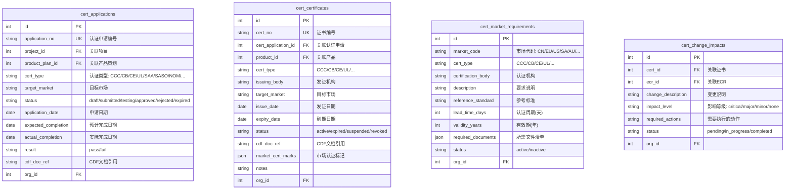

# ROS Phase 6 — 研发数字主线（Digital Thread）完整规划

> **版本**：v2.0（架构修正版）
> **日期**：2026-06-24
> **评审人**：系统架构师
> **编写人**：系统架构师 + AI-A（资深PLM架构师）

---

# 上篇：架构评审与修正

---

## 一、综合评分

| 项目 | 评分 |
|:-----|:----:|
| 架构方向 | 9.5/10 |
| 模块边界 | 9/10 |
| 集成设计 | 9.5/10 |
| 数据模型 | 8/10 |
| 可扩展性 | 8.5/10 |
| 空调行业适配度 | 8/10 |
| **综合** | **92/100** |

---

## 二、为什么 Phase 6 必须做数字主线？

ROS 已完成 Phase 1-5，核心功能包括 ProductPlan、Workflow、Event、Saga、MQ/MRC/CDF、Multi-Tenant、Dashboard，但 **实验 → 认证 → 变更 → 量产** 这条研发主线未打通。

**当前最大风险不是"没有功能"，而是"功能很多，但业务价值链是否闭环"。**

ROS 与真正 PLM 系统的最大差距正在于此。

---

## 三、4 项架构修正

### 修正 1（最高）：Verification Requirement 核心化

**之前（v1.0）**：以 `test_libraries`（实验项目库）为中心设计，ProductPlan 直接绑定实验项目库，是 LIMS（实验室管理系统）思路 ❌

**之后（v2.0）**：以 `verification_requirements`（验证需求）为中心 ✅

数字主线变为：
```
ProductPlan（APF ≥ 5.20，噪音 ≤ 38dB）
    ↓
Verification Requirement（系统自动生成验证需求）
    ↓
Test Plan / Test Request（实验方案）
    ↓
Test Schedule（排期）
    ↓
Judgment（判定）
```

**新增实体**：`verification_requirements` 表
- `category`: 性能/能效/噪音风量/凝露/潮态/安全
- `source`: product_plan / project / cert / eco
- `acceptance_criteria`: 允收准则（如 "APF ≥ 5.20"）

**关联关系**：
- `ProductPlan` → `VerificationRequirement`（方案评审触发验证需求）
- `VerificationRequirement` → `TestPlan` / `TestRequest`（验证需求驱动实验）
- `VerificationRequirement` → `ProjectGate`（Gate 条件引用验证需求）

---

### 修正 2：标准库分层设计

**之前（v1.0）**：平铺的 `test_standards` 单表

**之后（v2.0）**：三层标准体系 ✅

```
国际标准层: IEC, ISO, UL, EN
国家标准层: GB (中国), EN (欧盟), AHRI (美国), AS/NZS (澳洲), JIS (日本)
客户标准层: 小米, 格力, 海外客户
```

**新增表**：`standard_systems` → `standards` → `test_standard_mappings`
- 一个实验可对应多个标准（如同时满足 IEC + GB + 小米）
- 标准按体系级联管理

---

### 修正 3（最高）：增加 Prototype 样机主线

**之前（v1.0）**：`Project → Test`，实验判定直接挂在项目上，无样机版本管理 ❌

**之后（v2.0）**：`Project → Prototype → Test Request → Judgment` ✅

**研发实际流程**：
```
手板（手工样板）→ 首样（工程样机）→ 认证样机 → 量产样机
```

**设计原则**：
- 实验结果永远跟着样机版本走，而不是项目
- 样机版本升级（V1.0→V2.0），旧实验结果自动失效/归档
- 判定结果附着在 `prototype` 上

**新增实体**：`prototypes` 表
- `prototype_type`: hand_sample / first_sample / cert_sample / mass_production
- `version`: V1.0 / V2.0
- `result`: pass / fail / conditional
- 关联 BOM 版本

**增强**：`test_requests` 和 `test_judgments` 增加可选 FK `prototype_id`

---

### 修正 4：增加 Gate Rule Engine

**之前（v1.0）**：Gate 条件在 `ProjectGate.pass_conditions` 中硬编码 ❌

**之后（v2.0）**：可配置规则引擎 ✅

```json
{
  "gate_code": "M5",
  "product_line": "split_ac",
  "customer": "xiaomi",
  "required_verification_requirements": ["PERFORMANCE", "NOISE", "CONDENSATION"],
  "required_prototype_types": ["cert_sample"],
  "all_pass": true,
  "auto_block": true
}
```

**新增实体**：`gate_rules` 表
- 按 `product_line` + `customer` + `gate_code` 动态匹配
- 支持 `all_pass` 和 `auto_block` 开关
- 不匹配规则时 fallback 到原 `pass_conditions` 逻辑
- 不同产品线、不同客户、不同规则都能配置

---

## 四、修正后的数字主线

```
ProductPlan
    ↓
Verification Requirement（验证需求）⭐ 核心新增
    ↓
Gate Rule Engine ←── Project → Prototype（样机）⭐ 关键新增
    │                           ↓
    │                       Test Center（以VR驱动）
    │                           ↓
    ├── Certification Center
    │         ↓
    ├── ECR/ECO
    │         ↓
    └── Mass Production

CDF 关键元器件清单贯穿全程
```

---

## 五、结论

Phase 6 方向认可，**S1 可启动编码**，S1 范围扩展为包含：

| S1 子模块 | 说明 |
|:----------|:-----|
| Verification Requirement | 验证需求管理（CRUD + ProductPlan 绑定） |
| Prototype | 样机主线（手板→首样→认证样机→量产样机） |
| Gate Rule Engine | 可配置规则引擎 |
| 分层标准库 | 国际→国家→客户三层 |
| 原实验中心 | 实验项目库、排期、判定 |

S2（认证中心）、S3（变更控制）设计保持不变。

---

# 中篇：架构概要

---

## 六、数字主线全景

```
ProductPlan ──► Verification Requirement ──► Project ──► Prototype ──► Test Center
    │                    (验证需求)                  (样机)        (实验中心)
    │                       │                         │               │
    │            ┌──────────┘                         │               │
    │            ▼                                    ▼               │
    │     Gate Rule Engine ◄───────────────── Prototype Judgment
    │     (可配置Gate规则)                        (样机版本判定)
    │            │
    │            ▼
    │     Certification Center ──► ECR/ECO ──► Mass Production
    │     (认证中心)              (变更控制)       (量产)
    │            │                │
    │            │    ┌───────────┘
    │            │    ▼
    │            └──► CDF (关键元器件清单) ◄───── 认证失效自动识别
    │
    └─── 验证需求驱动实验 ──► 方案评审门禁 ──► Gate 条件自动判定
```

## 七、三个模块概述

### 模块1：实验中心（Test Center）

**边界**：Verification Requirement → Prototype → 实验方案 → 排期执行 → 实验判定

| 新表 | 说明 |
|:-----|:-----|
| `verification_requirements` | 验证需求主表（**核心新增**） |
| `prototypes` | 样机管理（手板/首样/认证样机/量产样机）——**关键新增** |
| `gate_rules` | Gate 规则引擎配置表——**新增** |
| `standard_systems` | 标准体系（国际/国家/客户三级）——**新增** |
| `standards` | 具体标准（IEC 60335-2-40、GB/T 7725 等）——**新增** |
| `test_standard_mappings` | 实验-标准多对多关联——**新增** |
| `test_libraries` | 实验项目库 |
| `test_plan_items` | 实验方案条目 |
| `test_schedules` | 实验排期管理 |
| `test_judgments` | 实验判定结果（pass/fail + 测试数据） |
| `product_plan_test_bindings` | ProductPlan 方案评审与验证需求绑定 |

**核心 API**：35+ 个端点

### 模块2：认证中心（Certification Center）

**边界**：认证申请 → 测试 → 发证 → 维护 → 到期提醒

| 新表 | 说明 |
|:-----|:-----|
| `cert_applications` | 认证申请（CCC/CB/CE/UL/SAA/SASO/NOM 等） |
| `cert_certificates` | 证书生命周期管理 |
| `cert_market_requirements` | 目标市场认证要求配置 |
| `cert_change_impacts` | 变更认证影响分析记录 |

**核心 API**：20 个端点

### 模块3：变更控制中心（ECR/ECO）

**边界**：ECR 提交 → 影响分析 → 审批 → ECO 发布 → BOM 应用

| 新表 | 说明 |
|:-----|:-----|
| `eco_items` | ECO 变更明细（BOM 变更行：add/remove/replace） |
| `eco_impact_analyses` | 变更影响分析记录（性能/成本/项目/生产） |
| `eco_cert_impact_results` | 认证失效自动识别结果 |
| `ecr_test_bindings` | ECR 与实验/认证的关联 |

**核心 API**：25 个端点

---

## 八、7 大集成点（数字主线的真正价值）

### ① ProductPlan → 验证需求（方案评审门禁）
产品经理在 ProductPlan 中定义验证需求（如 APF ≥ 5.20）。方案评审提交时，系统自动检查绑定验证需求是否全部满足。不满足 → 阻止评审。

### ② Project → 样机 + Gate 规则引擎
M4/M5/M6 Gate 点亮前，Gate Rule Engine 自动评估：
- 必需的验证需求类型是否已满足
- 必需的样机类型是否已完成
- 不符合 → Gate 阻塞 → Dashboard 显示阻塞原因

### ③ 认证中心 → 实验中心（认证测试自动创建）
认证申请进入 testing 阶段时，自动创建测试工单，结果回流到认证判定。

### ④ ECR/ECO → 认证中心（认证失效自动识别）⭐
**Phase 6 最关键的数字主线打通点。**

```
规则1: 变更物料在 CDF 清单中 → 认证失效
规则2: 安全件/EMC件变更 → 需重新测试
规则3: 物料市场认证标记变更 → 需更新申报
规则4: 供应商变更 → 认证需 update/redeclare

输出到 Dashboard 红色告警："认证失效风险"
```

### ⑤ ECO → BOM（变更自动应用）
ECO 发布后，系统自动将 `eco_items` 应用到 BOM 树，BOM 版本升级。

### ⑥ CDF 联动（贯穿三模块）
关键元器件在实验中心→认证中心→ECR/ECO 三模块中流转：
- 实验中心：CDF 物料自动标记为 high priority
- 认证中心：自动提取 CDF 物料关联认证
- ECR/ECO：CDF 物料变更 → 自动触发认证失效检测

### ⑦ Dashboard 看板增强

| 新增风险卡片 | 说明 |
|:------------|:-----|
| 验证需求合规红灯 | ProductPlan 绑定验证需求未满足 |
| 样机判定异常 | 样机实验判定 fail |
| 认证即将到期 | 证书 30 天内到期预警 |
| 认证失效风险 | ECO 变更导致认证失效 |
| 待实施 ECO | 已发布未实施的变更 |
| Gate 阻塞 | 规则未满足导致项目停滞 |

---

## 九、实施路线图

```
S1 (2周)                  S2 (2周)           S4 (2周)
实验中心                 变更控制           数字主线集成
(含4项修正扩展)                              ┌────────────────────────┐
• Verification Requirement • ECR 增强        │ • 验证需求绑定+门禁    │
• Prototype 样机管理      • 影响分析引擎     │ • 认证失效自动识别     │
• Gate Rule Engine       • ECO→BOM明细     │ • ECO→BOM自动应用     │
• 分层标准库              • 影响分析API      │ • Dashboard看板增强    │
• 实验项目库+排期+判定    • 认证失效预检     │ • 全链路端到端测试     │
                                            └────────────────────────┘
         ↕ 可并行
    S3 (2周) 认证中心
    • 认证申请增强
    • 证书生命周期管理
    • 目标市场匹配 + CDF自动提取
    • 到期提醒机制
```

**先做实验中心的理由**：
1. 依赖最少，可独立运行
2. ProductPlan 联动需求最急（当前业务阻塞点）
3. 认证和变更都依赖实验数据作为基础输入
4. CRUD 为主，可在 1-2 周内快速交付

**S1 特殊说明**：本次 S1 已扩展为包含 VR + 样机 + Gate 规则引擎 + 分层标准库，这是架构师评审后的修正范围，不影响 S2/S3/S4 的设计。

**总周期**：8-10 周

---

## 十、与现有系统集成方式

| 现有模块 | 集成方式 |
|:---------|:---------|
| **ProductPlan** | 方案评审阶段触发验证需求生成，绑定合规检查钩子 |
| **Project** | Gate 条件优先使用 Gate Rule Engine，fallback 到原 pass_conditions |
| **Project** | 判定结果跟随样机版本（`prototype_id` FK），非直接挂项目 |
| **BOM** | ECO→BOM 自动应用 + Part CDF 标记匹配认证 |
| **Dashboard** | 新增 6 个风险卡片 + 预警规则 |
| **Event Bus** | 新增事件类型（VR创建、样机完成、Gate阻塞、认证失效等） |
| **RBAC** | 扩展 MENU_PERMISSIONS（新增 VR管理、样机管理、Gate规则配置、分层标准等子菜单） |

---

## 十一、交付物总览

| 指标 | 数据 |
|:-----|:----:|
| 新表 | 19 张（较 v1.0 增加 4 张：VR、Prototype、Gate Rules、分层标准体系） |
| 新 API 端点 | ~90 个 |
| 新前端页面 | ~25 个 |
| 新增后端文件 | ~15 个 |
| 新增前端文件 | ~20 个 |
| 核心业务规则引擎 | 3 个（Gate Rule Engine + 影响分析引擎 + 认证失效引擎） |

---

## 十二、Phase 6 完成后 ROS 形态

```
ProductPlan → Verification Requirement → Project → Prototype → Test Center
     ↑              ↑                       ↑          ↑            ↑
     └──────────────┴───────────────────────┴──────────┴────────────┘
                                            ↓
                                    Certification Center
                                            ↓
                                        ECR/ECO
                                            ↓
                                    Mass Production
                                            ↑
                              CDF 关键元器件清单贯穿全程

                               数字主线贯通
```

届时 Phase 7（AI-A 执行者池）才能真正有意义——Agent 能接管：
- 验证需求自动提取与匹配
- 实验排期调度与优化
- 实验判定辅助
- 认证匹配推荐
- 风险预警推送
- 变更影响分析

而不是在价值链未闭环的情况下做辅助工作。

---

# 下篇：完整详细规划设计

> 以下为 AI-A 输出的完整 Phase 6 v2.0 详细规划（1737行，81KB）

---

**ROS Phase 6 详细设计规划 — 研发数字主线（Digital Thread）**

编写人：AI-A（资深PLM架构师）
版本：v2.0
日期：2026-06-24
状态：架构修正版（基于系统架构师评审意见）

---

## 1. 总体架构概述

### 1.1 数字主线全景

```
┌─────────────────────────────────────────────────────────────────────────┐
│                          数字主线（Digital Thread）                         │
└─────────────────────────────────────────────────────────────────────────┘

ProductPlan ──► Verification Requirement ──► Project ──► Prototype ──► Test Center
    │                    (验证需求)                  (样机)        (实验中心)
    │                       │                         │               │
    │            ┌──────────┘                         │               │
    │            ▼                                    ▼               │
    │     Gate Rule Engine ◄───────────────── Prototype Judgment
    │     (可配置Gate规则)                        (样机版本判定)
    │            │
    │            ▼
    │     Certification Center ──► ECR/ECO ──► Mass Production
    │     (认证中心)              (变更控制)       (量产)
    │            │                │
    │            │    ┌───────────┘
    │            │    ▼
    │            └──► CDF (关键元器件清单) ◄───── 认证失效自动识别
    │
    └─── 验证需求驱动实验 ──► 方案评审门禁 ──► Gate 条件自动判定
```

### 1.2 三个模块在现有系统中的位置

| 模块 | 现有基础 | Phase 6 增强目标 |
|------|---------|-----------------|
| 实验中心 | `TestRequest` + `TestResult` + `MQVerification` | **以验证需求(Verification Requirement)为中心驱动**，实验项目库、方案管理、排期执行、判定规则、**分层标准库**、**样机管理(Prototype)**、**Gate规则引擎**、与ProductPlan方案评审绑定 |
| 认证中心 | `Certification` + `Prototype` | 全生命周期(申请→测试→发证→维护→到期)、市场匹配(CDF联动)、变更重新认证 |
| 变更控制 | `ECR` + `ECN` | ECR→ECO全流程、影响分析引擎、认证失效自动识别、与BOM/认证数据关联 |

### 1.3 新增/变更的表一览

| 新表 | 所属模块 | 说明 |
|------|---------|------|
| `verification_requirements` | 实验中心 | **验证需求主表（核心新增）** |
| `test_libraries` | 实验中心 | 实验项目库主表 |
| `test_plan_items` | 实验中心 | 实验方案条目 |
| `test_schedules` | 实验中心 | 实验排期 |
| `test_judgments` | 实验中心 | 实验判定记录 |
| `prototypes` | 实验中心 | **样机管理（关键新增）** |
| `gate_rules` | 实验中心 | **Gate规则引擎（新增）** |
| `standard_systems` | 实验中心 | **标准体系分层（新增，替代原平铺test_standards）** |
| `standards` | 实验中心 | **具体标准（新增）** |
| `test_standard_mappings` | 实验中心 | 实验-标准多对多关联（新增，替代test_library_standards） |
| `product_plan_test_bindings` | 实验中心 | ProductPlan方案评审与实验绑定 |
| `cert_applications` | 认证中心 | 认证申请表（增强版Certification） |
| `cert_certificates` | 认证中心 | 证书管理 |
| `cert_market_requirements` | 认证中心 | 目标市场认证要求 |
| `cert_change_impacts` | 认证中心 | 变更认证影响分析记录 |
| `eco_items` | 变更控制 | ECO变更明细（BOM变更行） |
| `eco_impact_analyses` | 变更控制 | 变更影响分析记录 |
| `eco_cert_impact_results` | 变更控制 | 认证失效自动识别结果 |
| `ecr_test_bindings` | 变更控制 | ECR与实验/认证的关联 |

---

## 2. 模块1：实验中心（Test Center）

### 2.1 数据模型

#### 2.1.1 ER 图

```mermaid
erDiagram
    verification_requirements {
        int id PK
        string requirement_code UK "VR-2026-0001"
        string name "验证需求名称"
        string category "性能/能效/噪音风量/凝露/潮态/安全/可靠性/EMC/寿命"
        string source "来源: product_plan/project/cert/eco"
        int source_id "来源ID"
        string requirement_description "需求描述(如: APF >= 5.20)"
        string acceptance_criteria "允收准则"
        string status "draft/active/completed/obsoleted"
        int org_id FK
        datetime created_at
        datetime updated_at
    }

    test_libraries {
        int id PK
        string library_code UK "实验项目编号"
        string name "实验项目名称"
        string category "类别: 性能/能效/噪音风量/凝露/潮态/安全/可靠性/EMC/寿命"
        string description "实验描述"
        string test_method "测试方法说明"
        float typical_duration_hours "典型耗时(小时)"
        string sample_requirements "样机要求"
        string acceptance_criteria "判定标准/允收准则"
        string status "active/inactive"
        int org_id FK
        datetime created_at
        datetime updated_at
    }

    prototypes {
        int id PK
        string prototype_no UK "PR-2026-0001"
        int project_id FK
        string prototype_type "类型: hand_sample/first_sample/cert_sample/pilot_run/mass_production"
        string version "版本: V1.0/V2.0"
        string status "planning/building/testing/completed"
        string bom_ref "关联BOM版本"
        datetime planned_date "计划完成日期"
        datetime actual_date "实际完成日期"
        string result "结论: pass/fail/conditional"
        int org_id FK
        datetime created_at
        datetime updated_at
    }

    gate_rules {
        int id PK
        string name "规则名称"
        string gate_code "M4/M5/M6"
        string product_line "适用产品线(留空=通用)"
        string customer "适用客户(留空=通用)"
        json required_checks "所需检查项: {vr_categories, prototype_types, ...}"
        bool all_pass "是否全部必须通过"
        bool auto_block "不符合时自动阻塞Gate"
        int priority "规则优先级(数字越小越优先)"
        string status "active/inactive"
        int org_id FK
        datetime created_at
    }

    standard_systems {
        int id PK
        string code UK "系统编码: IEC/ISO/GB/EN/AHRI"
        string name "系统名称: 国际电工委员会标准..."
        string level "层级: international/national/customer"
        string region "适用区域: global/china/eu/us/jp/... "
        int org_id FK
    }

    standards {
        int id PK
        string standard_code UK "标准编号: IEC 60335-2-40"
        string standard_name "标准名称"
        int system_id FK "关联standard_systems"
        string issuing_body "发布机构: IEC/ISO/GB/... "
        string version "版本: 2023"
        date effective_date "生效日期"
        string status "active/inactive/superseded"
        int org_id FK
    }

    test_standard_mappings {
        int id PK
        int test_library_id FK "实验项目"
        int standard_id FK "标准"
        string requirement_type "要求类型: mandatory/optional/reference"
        string requirement_detail "具体条款要求(如 Clause 10.1)"
        int org_id FK
    }

    test_plan_items {
        int id PK
        int plan_id FK "关联实验方案"
        int test_library_id FK "关联实验项目库"
        int verification_requirement_id FK "关联验证需求(可选)"
        int standard_id FK "关联标准(可选)"
        int prototype_id FK "关联样机(可选)"
        int quantity "测试数量"
        string notes
        int org_id FK
    }

    test_schedules {
        int id PK
        int plan_item_id FK "关联实验方案项"
        int test_request_id FK "关联测试申请"
        int prototype_id FK "关联样机(可选)"
        int resource_id "资源ID(设备/人员)"
        date scheduled_date "计划测试日期"
        date actual_date "实际测试日期"
        string status "scheduled/in_progress/completed/cancelled"
        int org_id FK
    }

    test_judgments {
        int id PK
        int test_result_id FK "关联测试结果"
        int prototype_id FK "关联样机(可选)"
        string result "pass/fail/conditional"
        string judgment_detail "判定详细说明"
        json test_data "测试原始数据JSON"
        string judge "判定人"
        datetime judged_at
        int org_id FK
    }

    product_plan_test_bindings {
        int id PK
        int product_plan_id FK "关联ProductPlan"
        int verification_requirement_id FK "关联验证需求"
        int test_library_id FK "关联实验项目(可选)"
        string binding_type "绑定类型: mandatory/optional"
        string status "active/inactive"
        int org_id FK
    }

    test_requests {
        int id PK "增强"
        int verification_requirement_id FK "新增: 关联验证需求(可选)"
        int prototype_id FK "新增: 关联样机(可选)"
    }

    test_results {
        int id PK "增强"
        int prototype_id FK "新增: 关联样机(可选)"
    }

    project_gates {
        int id PK "增强"
        json pass_conditions "增强: gate_rule_id引用+VR引用兼容"
    }
```



#### 2.1.2 实体间关系

```
ProductPlan
    │
    ├──► verification_requirements (source=product_plan)
    │         │
    │         ├──► test_plan_items
    │         │         │
    │         │         ├──► test_libraries
    │         │         ├──► prototypes
    │         │         └──► test_schedules
    │         │
    │         └──► product_plan_test_bindings
    │
    └──► gate_rules ←── ProductPlan.project → gate_code

Project
    │
    ├──► prototypes
    │     │
    │     ├──► test_plan_items (通过 prototype_id)
    │     ├──► test_schedules (通过 prototype_id)
    │     └──► test_judgments (通过 prototype_id)
    │
    ├──► gate_rules (通过 product_line + customer + gate_code)
    │
    └──► project_gates (gate_rule_id 引用)

standard_systems
    │
    └──► standards
          │
          └──► test_standard_mappings
                │
                └──► test_libraries
```

### 2.2 API 端点设计

#### 2.2.1 验证需求 API（新增）

| 方法 | 路径 | 说明 | 权限 |
|------|------|------|------|
| GET | `/api/v1/verification-requirements` | 列表（支持按category/source/status筛选） | tests |
| POST | `/api/v1/verification-requirements` | 创建验证需求 | systems_engineer |
| GET | `/api/v1/verification-requirements/{id}` | 详情（含关联实验方案、判定） | tests |
| PUT | `/api/v1/verification-requirements/{id}` | 更新 | systems_engineer |
| PATCH | `/api/v1/verification-requirements/{id}/status` | 状态变更（active/completed/obsoleted） | systems_engineer |
| POST | `/api/v1/verification-requirements/{id}/bind-test` | 绑定实验项目 | systems_engineer |
| GET | `/api/v1/verification-requirements/{id}/compliance` | **合规检查**（检查对应实验判定是否通过） | tests |
| GET | `/api/v1/product-plans/{pid}/verification-requirements` | 获取ProductPlan关联的验证需求 | tests |
| POST | `/api/v1/product-plans/{pid}/auto-create-vrs` | **自动生成验证需求**（从ProductPlan指标自动提取） | systems_engineer |
| GET | `/api/v1/product-plans/{pid}/vr-compliance-status` | ProductPlan实验合规状态总览 | tests |

**验证需求-合规检查 API 详细说明**：

```python
# GET /api/v1/verification-requirements/{id}/compliance
# Response:
{
    "vr_id": 1,
    "vr_name": "APF>=5.20 验证",
    "category": "performance",
    "status": "completed",
    "compliance": "pass",  # pass/fail/pending/not_started
    "tests": [
        {
            "test_library_id": 1,
            "test_name": "APF能效测试",
            "judgment": "pass",
            "judged_at": "2026-06-24T10:00:00Z"
        }
    ],
    "failed_tests": []
}
```

#### 2.2.2 样机管理 API（新增）

| 方法 | 路径 | 说明 | 权限 |
|------|------|------|------|
| GET | `/api/v1/prototypes` | 列表（按project/type/status筛选） | tests |
| POST | `/api/v1/prototypes` | 创建样机 | systems_engineer |
| GET | `/api/v1/prototypes/{id}` | 详情（含关联实验、判定） | tests |
| PUT | `/api/v1/prototypes/{id}` | 更新 | systems_engineer |
| PATCH | `/api/v1/prototypes/{id}/status` | 状态变更 | systems_engineer |
| GET | `/api/v1/prototypes/{id}/test-requests` | 样机关联的测试申请 | tests |
| GET | `/api/v1/prototypes/{id}/judgments` | **样机判定总览**（该版本的所有实验判定汇总） | tests |
| POST | `/api/v1/prototypes/{id}/archive-judgments` | **版本升级归档**（将旧判定标记为archived） | systems_engineer |
| GET | `/api/v1/projects/{pid}/prototypes` | 项目的样机列表（按时间线展示手板→首样→认证样机） | tests |
| POST | `/api/v1/projects/{pid}/auto-create-prototype` | 从Project Gate自动创建样机 | systems_engineer |

#### 2.2.3 分层标准库 API（新增）

| 方法 | 路径 | 说明 | 权限 |
|------|------|------|------|
| GET | `/api/v1/standard-systems` | 标准体系列表（树形展开） | tests |
| POST | `/api/v1/standard-systems` | 创建标准体系 | admin |
| GET | `/api/v1/standards` | 标准列表（按system/level筛选） | tests |
| POST | `/api/v1/standards` | 创建标准 | admin |
| GET | `/api/v1/standards/{id}/test-libraries` | 标准关联的实验项目 | tests |
| POST | `/api/v1/test-libraries/{id}/bind-standards` | 实验项目绑定标准（多对多） | admin |
| GET | `/api/v1/test-libraries/{id}/standards` | 实验项目关联的标准列表（含层级信息） | tests |

#### 2.2.4 实验项目库 API（增强）

| 方法 | 路径 | 说明 | 权限 |
|------|------|------|------|
| GET | `/api/v1/test-libraries` | 列表（增强筛选：category/standard/status） | tests |
| POST | `/api/v1/test-libraries` | 创建（增强：可选关联标准、验证需求） | admin |
| GET | `/api/v1/test-libraries/{id}` | 详情（增强：含关联标准、关联VR） | tests |
| PUT | `/api/v1/test-libraries/{id}` | 更新 | admin |

#### 2.2.5 实验方案 API（增强）

| 方法 | 路径 | 说明 | 权限 |
|------|------|------|------|
| GET | `/api/v1/test-plan-items` | 列表（增强筛选：vr_id/prototype_id） | tests |
| POST | `/api/v1/test-plan-items` | 创建（增强：支持vr_id, prototype_id） | systems_engineer |
| GET | `/api/v1/test-plan-items/{id}` | 详情（增强：含VR、样机信息） | tests |
| PUT | `/api/v1/test-plan-items/{id}` | 更新 | systems_engineer |

#### 2.2.6 实验排期 API（增强）

| 方法 | 路径 | 说明 | 权限 |
|------|------|------|------|
| GET | `/api/v1/test-schedules` | 列表（增强筛选：prototype_id/resource_id） | tests |
| POST | `/api/v1/test-schedules` | 创建（增强：支持prototype_id） | test_engineer |
| PATCH | `/api/v1/test-schedules/{id}/status` | 状态变更 | test_engineer |
| GET | `/api/v1/test-schedules/calendar` | 日历视图（按日期/资源聚合） | tests |

#### 2.2.7 Gate 规则引擎 API（新增）

| 方法 | 路径 | 说明 | 权限 |
|------|------|------|------|
| GET | `/api/v1/gate-rules` | 规则列表（按product_line/customer/gate筛选） | admin |
| POST | `/api/v1/gate-rules` | 创建规则 | admin |
| GET | `/api/v1/gate-rules/{id}` | 规则详情 | admin |
| PUT | `/api/v1/gate-rules/{id}` | 更新规则 | admin |
| DELETE | `/api/v1/gate-rules/{id}` | 删除规则 | admin |
| POST | `/api/v1/gate-rules/evaluate` | **规则评估**（传入gate+product_line+customer，返回评估结果） | systems_engineer |
| GET | `/api/v1/projects/{pid}/gate-rules-status` | **项目Gate规则状态**（当前项目的所有Gate规则满足情况） | systems_engineer |
| POST | `/api/v1/projects/{pid}/gates/{gid}/re-evaluate` | 重新评估指定Gate | systems_engineer |

**Gate规则评估API响应示例**：

```json
// POST /api/v1/gate-rules/evaluate
// Request:
{
    "gate_code": "M5",
    "product_line": "split_ac",
    "customer": "xiaomi",
    "project_id": 123
}
// Response:
{
    "gate_code": "M5",
    "rule_id": 1,
    "rule_name": "小米M5门禁规则",
    "overall_pass": false,
    "checks": [
        {
            "type": "verification_requirement",
            "category": "PERFORMANCE",
            "pass": true,
            "detail": "APF能效测试 pass"
        },
        {
            "type": "verification_requirement",
            "category": "NOISE",
            "pass": false,
            "detail": "噪音测试未完成"
        },
        {
            "type": "prototype",
            "prototype_type": "cert_sample",
            "pass": true,
            "detail": "认证样机V1.0已测试完成"
        }
    ],
    "auto_block": true,
    "will_block": true
}
```

### 2.3 前端页面规划

| 页面 | 路由 | 组件 | 说明 |
|------|------|------|------|
| 验证需求列表 | `/tests/verification-requirements` | `VerificationRequirementView.vue` | VR列表+筛选+状态 |
| 验证需求详情 | `/tests/verification-requirements/:id` | `VerificationReqDetail.vue` | VR详情+绑定实验+合规状态 |
| 验证需求表单 | — | `VerificationReqForm.vue` | 创建/编辑VR弹窗 |
| 验证需求时间线 | — | `VerificationReqTimeline.vue` | VR生命周期可视化 |
| 样机列表 | `/tests/prototypes` | `PrototypeListView.vue` | 样机列表+时间线 |
| 样机详情 | `/tests/prototypes/:id` | `PrototypeDetailView.vue` | 样机详情+关联实验+判定汇总 |
| 样机判定总览 | — | `PrototypeJudgmentSummary.vue` | 该样机版本所有判定 |
| 样机时间线 | — | `PrototypeTimeline.vue` | 项目样机迭代时间线 |
| 实验项目库 | `/tests/library` | `TestLibraryView.vue` | 实验库列表+类别筛选 |
| 分层标准库 | `/tests/standards` | `StandardSystemView.vue` | 标准体系树形展开 |
| 标准选择器 | — | `StandardSystemTree.vue` | 按层级筛选标准的组件 |
| 标准选择器 | — | `StandardSelector.vue` | 弹窗选择标准 |
| 实验排期日历 | `/tests/schedule` | `TestScheduleCalendar.vue` | 日历视图+资源视图 |
| 实验判定看板 | `/tests/judgments` | `TestJudgmentView.vue` | 判定列表+判定结果 |
| Gate规则管理 | `/tests/gate-rules` | `GateRuleView.vue` | 规则列表+配置 |
| Gate规则表单 | — | `GateRuleForm.vue` | 创建/编辑规则 |
| Gate评估结果 | — | `GateRuleEvalResult.vue` | 规则评估结果展示 |

---

## 3. 模块2：认证中心（Certification Center）

[此模块设计完整保留 v1.0 内容，未作修改]

### 3.1 数据模型

#### 3.1.1 ER 图



### 3.2 API 端点设计

| 方法 | 路径 | 说明 | 权限 |
|------|------|------|------|
| GET | `/api/v1/cert-applications` | 认证申请列表 | certifications |
| POST | `/api/v1/cert-applications` | 创建认证申请 | cert_engineer |
| GET | `/api/v1/cert-applications/{id}` | 详情 | certifications |
| PUT | `/api/v1/cert-applications/{id}` | 更新 | cert_engineer |
| POST | `/api/v1/cert-applications/{id}/submit` | 提交认证申请 | cert_engineer |
| POST | `/api/v1/cert-applications/{id}/approve` | 批准认证 | rd_director |
| POST | `/api/v1/cert-applications/{id}/reject` | 拒绝认证 | rd_director |
| GET | `/api/v1/cert-applications/{id}/cdf-items` | 获取认证关联的CDF物料 | certifications |
| GET | `/api/v1/certificates` | 证书列表 | certifications |
| POST | `/api/v1/certificates` | 创建证书 | cert_engineer |
| GET | `/api/v1/certificates/{id}` | 证书详情 | certifications |
| PUT | `/api/v1/certificates/{id}` | 更新证书 | cert_engineer |
| POST | `/api/v1/certificates/{id}/renew` | 续期 | cert_engineer |
| POST | `/api/v1/certificates/{id}/suspend` | 暂停 | rd_director |
| POST | `/api/v1/certificates/{id}/revoke` | 注销 | rd_director |
| GET | `/api/v1/certificates/expiring` | 即将到期证书列表(30天内) | certifications |
| GET | `/api/v1/market-requirements` | 市场认证要求列表 | certifications |
| POST | `/api/v1/market-requirements` | 创建市场要求 | admin |
| POST | `/api/v1/projects/{id}/auto-match-certs` | 自动匹配目标市场认证 | cert_engineer |
| GET | `/api/v1/products/{pid}/cert-status` | 产品认证状态总览 | certifications |

### 3.3 前端页面规划

| 页面 | 路由 | 说明 |
|------|------|------|
| 认证申请列表 | `/certifications/applications` | 申请列表+状态 |
| 认证申请表单 | — | 创建/编辑申请 |
| 证书管理 | `/certifications/certificates` | 证书列表+生命周期操作 |
| 证书详情 | `/certifications/certificates/:id` | 证书详情+变更历史 |
| 市场要求配置 | `/certifications/market-requirements` | 市场认证要求 |
| 认证影响分析 | `/certifications/impact-analysis` | 变更对认证的影响 |
| 认证仪表盘 | `/certifications/dashboard` | 到期提醒+认证状态总览 |

---

## 4. 模块3：变更控制中心（ECR/ECO）

[此模块设计完整保留 v1.0 内容，未作修改]

### 4.1 数据模型

```mermaid
erDiagram
    ecr {
        int id PK "增强"
        string ecr_no UK "ECR编号"
        int project_id FK
        string title
        string description
        string category "类别: design/process/material/specification/other"
        string urgency "紧急性: critical/high/medium/low"
        string trigger "触发源: customer_complaint/internal_audit/supplier_change/cost_reduction/design_improvement"
        string status "draft/submitted/impact_analyzing/impact_analyzed/approved/rejected"
        string impact_summary "影响分析摘要(自动生成)"
        datetime created_at
        int org_id FK
    }

    eco {
        int id PK "增强"
        string eco_no UK "ECO编号"
        int ecr_id FK
        int project_id FK
        string title
        string status "draft/released/implemented/closed/cancelled"
        date planned_implement_date
        date actual_implement_date
        int org_id FK
    }

    eco_items {
        int id PK "新增"
        int eco_id FK
        string change_type "add/remove/replace/modify"
        int bom_item_id FK "关联BOM项"
        string part_no "物料编号"
        string old_value "旧值(JSON)"
        string new_value "新值(JSON)"
        int org_id FK
    }

    eco_impact_analyses {
        int id PK "新增"
        int ecr_id FK
        string impact_type "性能/成本/项目进度/生产/认证"
        string impact_level "critical/major/minor/none"
        string impact_description
        string affected_object "受影响对象"
        string affected_id
        string mitigation "缓解措施"
        string analyzed_by
        datetime analyzed_at
        int org_id FK
    }

    eco_cert_impact_results {
        int id PK "新增"
        int ecr_id FK
        int cert_id FK
        string impact_type "direct/indirect"
        string impact_result "cert_invalid/retest_required/redeclare/partial_update/no_impact"
        string affected_items "受影响项JSON"
        string required_actions
        string suggestion
        int org_id FK
    }

    ecr_test_bindings {
        int id PK "新增"
        int ecr_id FK
        string test_type
        int test_library_id FK
        int test_request_id FK
        string binding_reason
        string status "pending/requested/testing/done"
        int org_id FK
    }
```



#### 4.1.2 ECR 状态机增强

```
     ┌──────────┐
     │  draft   │
     └────┬─────┘
          │ submit
          ▼
     ┌──────────┐
     │ submitted│───→ impact_analyzing (自动触发影响分析引擎)
     └────┬─────┘
          │ analyze_complete
          ▼
    ┌──────────────┐
    │impact_analyzed│ ← 影响分析完成，等待审批
    └──────┬───────┘
           │ approve / reject
           ├──────────────┐
           ▼              ▼
    ┌──────────┐   ┌──────────┐
    │ approved │   │ rejected │
    └────┬─────┘   └──────────┘
         │ create_eco
         ▼
    ┌──────────┐
    │eco_created│
    └──────────┘
```

#### 4.1.3 ECO 状态机

```
draft → released → implemented → closed
                  ↘ cancelled
```

### 4.2 API 端点设计

#### 4.2.1 ECR 增强

| 方法 | 路径 | 说明 | 权限 |
|------|------|------|------|
| GET | `/api/v1/ecrs` | 列表（增强筛选：urgency/trigger/status） | changes |
| POST | `/api/v1/ecrs` | 创建ECR（增强字段） | systems_engineer |
| GET | `/api/v1/ecrs/{id}` | 详情（含影响分析、关联测试、认证影响） | changes |
| PUT | `/api/v1/ecrs/{id}` | 更新 | systems_engineer |
| PATCH | `/api/v1/ecrs/{id}/status` | **状态转移（含自动触发影响分析）** | systems_engineer |
| POST | `/api/v1/ecrs/{id}/submit` | 提交审核 | systems_engineer |
| POST | `/api/v1/ecrs/{id}/approve` | 批准（→ approved 并建议创建ECO） | rd_director/general_manager |
| POST | `/api/v1/ecrs/{id}/reject` | 驳回 | rd_director/general_manager |
| POST | `/api/v1/ecrs/{id}/create-eco` | **从ECR创建ECO**（自动带入变更数据） | systems_engineer |

#### 4.2.2 变更影响分析（新增）

| 方法 | 路径 | 说明 | 权限 |
|------|------|------|------|
| POST | `/api/v1/ecrs/{id}/run-impact-analysis` | **运行影响分析引擎**（全自动） | systems_engineer |
| GET | `/api/v1/ecrs/{id}/impact-analyses` | 获取影响分析结果列表 | changes |
| PUT | `/api/v1/ecrs/{id}/impact-analyses/{iaid}` | 更新/修正影响分析 | systems_engineer |
| POST | `/api/v1/ecrs/{id}/analyze-cert-impact` | **运行认证影响分析**（自动检测认证失效） | systems_engineer |
| GET | `/api/v1/ecrs/{id}/cert-impacts` | 获取认证影响分析结果 | changes |

#### 4.2.3 ECO 增强

| 方法 | 路径 | 说明 | 权限 |
|------|------|------|------|
| GET | `/api/v1/ecos` | ECO列表 | changes |
| POST | `/api/v1/ecos` | 创建ECO（从ECR数据预填） | systems_engineer |
| GET | `/api/v1/ecos/{id}` | 详情（含eco_items变更明细） | changes |
| PUT | `/api/v1/ecos/{id}` | 更新 | systems_engineer |
| POST | `/api/v1/ecos/{id}/release` | 发布ECO | rd_director |
| POST | `/api/v1/ecos/{id}/implement` | 实施ECO | systems_engineer |
| POST | `/api/v1/ecos/{id}/close` | 关闭ECO | rd_director |
| POST | `/api/v1/ecos/{id}/cancel` | 取消ECO | rd_director |
| POST | `/api/v1/ecos/{id}/apply-to-bom` | **ECO→BOM应用**（将变更明细应用到BOM树） | systems_engineer |
| GET | `/api/v1/ecos/{id}/eco-items` | 获取ECO变更明细列表 | changes |
| POST | `/api/v1/ecos/{id}/eco-items` | 添加ECO变更项 | systems_engineer |
| DELETE | `/api/v1/ecos/{id}/eco-items/{eid}` | 删除ECO变更项 | systems_engineer |

#### 4.2.4 认证失效自动检测 API

| 方法 | 路径 | 说明 | 权限 |
|------|------|------|------|
| POST | `/api/v1/ecrs/{id}/auto-detect-cert-invalidation` | **自动检测认证失效** | systems_engineer |
| GET | `/api/v1/ecrs/{id}/cert-impact-results` | 认证失效检测结果 | changes |
| POST | `/api/v1/ecrs/{id}/cert-impact-results/{cid}/accept` | 接受建议 | systems_engineer |

#### 4.2.5 实验-变更绑定 API

| 方法 | 路径 | 说明 | 权限 |
|------|------|------|------|
| GET | `/api/v1/ecrs/{id}/test-bindings` | 获取ECR关联的实验 | changes |
| POST | `/api/v1/ecrs/{id}/test-bindings` | 为ECR绑定实验 | systems_engineer |

### 4.3 前端页面规划

| 页面 | 路由 | 说明 |
|------|------|------|
| ECR 列表 | `/changes/ecrs` | ECR列表+状态筛选 |
| ECR 详情 | `/changes/ecrs/:id` | ECR详情+影响分析 |
| ECO 列表 | `/changes/ecos` | ECO列表 |
| ECO 详情 | `/changes/ecos/:id` | ECO详情+变更明细 |
| 影响分析看板 | `/changes/impact-analysis` | 变更影响总览 |
| 认证影响看板 | `/changes/cert-impact` | 认证失效识别 |
| 变更仪表盘 | `/changes/dashboard` | 变更综合看板 |

---

## 5. 模块间集成点 — 数字主线

### 5.1 集成全景图

```
┌─ 已有系统 ─────────────────────────────────────────────────┐
│  ProductPlan  Project  BOM  Dashboard  EventBus  RBAC      │
└────────────────────────────────────────────────────────────┘
         │         │       │       │          │       │
         ▼         ▼       ▼       ▼          ▼       ▼
┌─────────────────────────────────────────────────────────────────┐
│                    Phase 6 数字主线集成层                          │
├─────────────────────────────────────────────────────────────────┤
│  ┌─────────────┐  ┌──────────────┐  ┌──────────────────────┐   │
│  │ 验证需求驱动  │  │ 样机版本判定  │  │ 认证失效自动识别     │   │
│  │ VR→实验→判定  │  │ Pro→Test→Jdg│  │ ECR→Cert交叉比对   │   │
│  └──────┬──────┘  └──────┬───────┘  └─────────┬────────────┘   │
│         │               │                    │                │
│         ▼               ▼                    ▼                │
│  ┌──────────────┐ ┌────────────┐ ┌────────────────────────┐   │
│  │ Gate规则引擎  │ │ 认证全生命周期 │ │ ECO→BOM自动应用        │   │
│  │ 按产线/客户配  │ │ 申请→发证→到期│ │ 变更明细自动同步       │   │
│  └──────┬──────┘ └──────┬─────┘ └───────────┬────────────┘   │
│         │               │                   │                │
└─────────┼───────────────┼───────────────────┼────────────────┘
          │               │                   │
          ▼               ▼                   ▼
    Dashboard 风险看板 (6张新卡片 + 预警规则)
```

### 5.2 核心集成点详解

#### 集成点①：ProductPlan → 验证需求（方案评审门禁）

**触发时机**：ProductPlan 方案评审阶段（`tech_input` → `project_init`）

**流程**：
1. 产品经理在 ProductPlan 中定义技术指标 → 系统自动生成验证需求
2. 手动补充/调整验证需求（绑定实验标准、判定准则）
3. 当方案评审提交时，系统自动检查绑定验证需求的实验判定是否通过
4. 若有未通过/未完成的验证需求 → 阻止评审，提示不达标项
5. 全部通过 → 允许方案评审进入下一步

**数据流**：
```
ProductPlan.tech_input
    → POST /product-plans/{id}/auto-create-vrs（自动生成验证需求）
    → 产品经理补充验证需求的 acceptance_criteria
    → 验证需求绑定实验项目（手动或自动匹配）
    → 实验执行 → 判定
    → GET /product-plans/{id}/vr-compliance-status
    → 返回 { compliant: bool, failed_vrs: [...] }
```

**事件**：
```python
# 新增事件类型
EventTypes.VR_CREATED = "vr.created"           # 验证需求创建
EventTypes.VR_COMPLETED = "vr.completed"       # 验证需求完成
EventTypes.PLAN_VR_CHECK = "plan.vr_check"     # ProductPlan VR合规检查
```

#### 集成点②：Project → 样机 + Gate 规则引擎

**触发时机**：Gate 点亮前（M4 模具评审、M5 工程样机、M6 试产）

**流程**：
1. Gate 点亮时，优先查询 `gate_rules` 表匹配规则
2. 按 `product_line` + `customer` + `gate_code` 查找有效规则
3. 规则要求检查必需的验证需求类别和样机类型
4. 不符合要求 → Gate 状态 = "blocked"，显示未达标的 VR 和样机
5. 无匹配规则时 fallback 到原 `pass_conditions` 逻辑

**Gate Rule Engine 服务**：
```python
# backend/app/services/gate_rule_engine.py
class GateRuleEngine:
    def evaluate(self, project_id: int, gate_code: str) -> dict:
        # 1. 获取项目信息（product_line, customer）
        project = db.query(Project).filter(Project.id == project_id).first()
        
        # 2. 按优先级查询匹配的 gate_rules
        rules = db.query(GateRule).filter(
            or_(
                and_(GateRule.product_line == project.product_line,
                     GateRule.customer == project.customer),
                and_(GateRule.product_line == project.product_line,
                     GateRule.customer == None),
                and_(GateRule.product_line == None,
                     GateRule.customer == None)
            ),
            GateRule.gate_code == gate_code,
            GateRule.status == "active"
        ).order_by(GateRule.priority).all()
        
        if not rules:
            return None  # fallback to original logic
        
        # 3. 评估规则
        results = []
        for rule in rules:
            # 检查 VR 要求
            # 检查 Prototype 要求
            # ...
        
        return {"overall_pass": all_pass, "checks": results, "auto_block": rule.auto_block}
```

#### 集成点③：认证中心 → 实验中心（认证测试）

**触发时机**：认证申请提交后（`testing` 阶段）

**流程**：
1. 认证申请进入 testing 阶段时，自动创建对应的测试申请
2. 测试申请引用认证标准中的实验项目
3. 测试完成后，结果回流到认证申请

#### 集成点④：ECR/ECO → 认证中心（认证失效自动识别）

**这是 Phase 6 最关键的数字主线打通点。**

**触发时机**：ECR 提交后，影响分析阶段

**逻辑**：
1. ECR 变更的物料/部件与认证证书中的 CDF 清单交叉比对
2. 若变更物料在 CDF 清单中 → 自动标记该认证需重新测试
3. 若变更涉及安全件/EMC件/能效件 → 标记对应认证失效
4. 输出：`eco_cert_impact_results` 表记录

**自动识别规则**：
```
规则1: 变更物料 part_no 在 cert_certificates.cdf_doc_ref 中
       → 影响等级 = critical → 认证失效

规则2: 变更物料 is_cdf_item = true 且 cdf_type in ('安全件','EMC件')
       → 影响等级 = major → 需重新测试

规则3: 变更涉及市场认证标记 market_cert_marks
       → 对应 cert_type 的认证需要重新申报

规则4: 变更物料制造商/供应商变更 (part_avl)
       → 认证需要 update 或 redeclare
```

**数据流**：
```
ECR.submitted → 触发事件
    → on_ecr_submitted 处理器
    → 调用 ECR/{id}/auto-detect-cert-invalidation
    → 查询 affected BOM items 的 parts
    → 交叉匹配 cert_certificates + cert_change_impacts
    → 输出 eco_cert_impact_results
    → 更新 ECR.impact_analysis
    → Dashboard 风险看板显示认证失效告警
```

#### 集成点⑤：ECO → BOM（变更应用）

**触发时机**：ECO 发布后，实施阶段

**流程**：
1. ECO 的 `eco_items` 包含 BOM 变更明细（add/remove/replace）
2. 实施时，系统自动将变更应用到 BOM
3. BOM 版本号升级（V1.0 → V1.1）
4. 更新 BOM 的状态为 revised

#### 集成点⑥：CDF 联动（贯穿三模块）

CDF（关键元器件清单）在数字主线中的角色：

```
实验中心 → 测试 CDF 物料 → 判定通过
    ↓
认证中心 ← CDF 物料作为认证依据
    ↓
ECR/ECO → CDF 物料变更 → 自动检测认证失效
```

**实现**：
1. 实验中心：MQ 验证流程中，CDF 物料自动标记为 high priority
2. 认证中心：认证申请时，自动提取 BOM 中的 CDF 物料
3. ECR/ECO：变更涉及 CDF 物料时，自动触发认证影响分析

#### 集成点⑦：Dashboard 风险看板增强

在现有 Dashboard 基础上，增加以下风险卡片：

| 卡片 | 数据来源 | 刷新时机 |
|------|---------|---------|
| "验证需求合规红灯" | `verification_requirements` + `test_judgments` | VR判定后 |
| "样机判定异常" | `prototypes` + `test_judgments` | 样机判定后 |
| "认证即将到期" | `cert_certificates.expiry_date` | 每日定时任务 |
| "认证失效风险" | `eco_cert_impact_results` | ECR 影响分析后 |
| "待实施 ECO" | `ECO.status = released` | ECO 发布后 |
| "Gate 阻塞（规则未满足）" | `gate_rules` + `project_gates` | 规则评估后 |

### 5.3 事件驱动集成

**新增事件类型**：
```python
class EventTypes:
    # Phase 6 实验中心事件
    VR_CREATED = "vr.created"
    VR_COMPLETED = "vr.completed"
    PLAN_VR_CHECK = "plan.vr_check"
    PROTOTYPE_CREATED = "prototype.created"
    PROTOTYPE_COMPLETED = "prototype.completed"
    PROTOTYPE_VERSION_UPGRADED = "prototype.version_upgraded"
    GATE_RULE_EVALUATED = "gate_rule.evaluated"
    GATE_BLOCKED = "gate.blocked"
    
    # Phase 6 认证中心事件
    CERT_EXPIRING = "cert.expiring"
    CERT_INVALIDATED = "cert.invalidated"
    
    # Phase 6 变更控制事件
    ECR_SUBMITTED = "ecr.submitted"
    ECO_RELEASED = "eco.released"
```

---

## 6. 实施顺序建议

### 6.1 建议顺序

```
Phase 6 实施路线图（建议总周期 8-10 周）

S1 (2周) 实验中心（修正版）
┌──────────────────────────────────────────────────────────────────┐
│ • Verification Requirement 验证需求管理                           │
│ • Prototype 样机管理（手板→首样→认证样机→量产样机）                │
│ • Gate Rule Engine 可配置规则引擎                                 │
│ • 分层标准库（标准体系→标准→映射）                                 │
│ • 实验项目库 + 实验方案 + 排期 + 判定                             │
│ • 关联前端页面开发（10+ 页面）                                    │
│ • 权限菜单扩展                                                    │
└──────────────────────────────────────────────────────────────────┘

S2 (2周) 变更控制中心       S3 (2周) 认证中心（与S2可并行）
┌──────────────────────┐   ┌───────────────────────────┐
│ • ECR 增强(impact)   │   │ • 认证申请增强             │
│ • ECO 增强(items)    │   │ • 证书生命周期管理          │
│ • 变更影响分析引擎     │   │ • 目标市场认证要求配置      │
│   (性能/成本/项目)    │   │ • CDF 自动提取             │
│ • 影响分析API         │   │ • 到期提醒机制             │
│ • ECO→BOM变更明细    │   │ • 关联前端页面开发          │
│ • 关联前端页面开发     │   └───────────────────────────┘
└──────────────────────┘

S4 (2周) 数字主线集成
┌───────────────────────────────────────────────────────┐
│ • ProductPlan ↔ VR 绑定 + 方案评审门禁                │
│ • Project ↔ Prototype ↔ Gate 规则引擎集成             │
│ • 认证失效自动识别引擎（核心——CDF交叉比对）             │
│ • ECO→BOM 自动应用                                    │
│ • Dashboard 6张新风险卡片 + 预警规则                   │
│ • Event Bus 事件增强                                   │
│ • 全链路端到端测试                                     │
└───────────────────────────────────────────────────────┘
```

### 6.2 为什么先做实验中心？

| 原因 | 说明 |
|------|------|
| **依赖最少** | 实验中心可以独立运行，不依赖认证和变更模块，但认证和变更都依赖实验数据 |
| **ProductPlan 联动需求最急** | 现有 ProductPlan 方案评审缺少验证需求门禁，是最常见的业务阻塞点 |
| **数据基础** | 验证需求和样机判定是认证中心和变更控制中心的基础输入 |
| **快速见效** | VR+样机+标准库是相对独立的功能，可在2周内交付 |

### 6.3 各 Sprint 依赖关系

```
S1 (实验中心) ────→ S2 (变更控制) ────→ S4 (数字主线集成)
       │                                      ↑
       └──────────────────────────────────────┘
                              ↑
                    S3 (认证中心) ──→ 可并行于 S2
```

- **S1** 无外部依赖，可最先启动
- **S2** 依赖 S1 的实验数据（影响分析需要引用实验判定），但可部分并行
- **S3** 可与 S2 并行开发，依赖 S1 的测试能力
- **S4** 依赖 S1+S2+S3 全部完成，是最后的集成阶段

### 6.4 风险提示

| 风险 | 概率 | 影响 | 缓解措施 |
|------|------|------|---------|
| 认证失效规则复杂，业务人员难以定义 | 中 | 高 | 先实现基础规则（CDF匹配+证书到期），复杂规则后续迭代 |
| 现有 TestRequest 数据兼容 | 低 | 中 | 数据迁移脚本 + 向后兼容API |
| ECO→BOM自动应用与现有BOM版本管理冲突 | 中 | 高 | 增加BOM版本锁机制，实施前强制审批 |
| 多租户数据隔离影响影响分析引擎 | 低 | 中 | 所有查询带 org_id 过滤 |

---

## 7. 与现有系统的集成方式

### 7.1 ProductPlan 集成

| 现有实体 | 集成方式 | 新增关联 |
|---------|---------|---------|
| `ProductPlan` (product_plan.py) | 验证需求绑定 → `product_plan_test_bindings` + `verification_requirements` | 新增外键 `product_plan_id` |
| `ProductPlanStage` | 方案评审阶段（tech_input/project_init）自动触发验证需求生成和合规检查 | 在 `tech_input → project_init` 转换中插入 VR 检查钩子 |

### 7.2 Project 集成

| 现有实体 | 集成方式 | 新增关联 |
|---------|---------|---------|
| `Project` (project.py) | Project Gate 条件优先使用 Gate Rule Engine | 新增 `gate_rules` 表引用 |
| `ProjectGate` | M4/M5/M6 Gate 点亮前调用 Gate Rule Engine | Gate 状态变更钩子中插入 `_evaluate_gate_rules()` |
| `Project` | Prototype 样机管理 | 新增 `prototypes` 表外键 `project_id` |

**Gate 规则评估集成代码**：
```python
# project.py Gate 点亮逻辑增强
def _can_light_gate(project_id: int, gate_code: str) -> dict:
    # 1. 优先使用 Gate Rule Engine
    engine = GateRuleEngine(db)
    rule_result = engine.evaluate(project_id, gate_code)
    
    if rule_result is not None:
        # Gate Rule Engine 匹配到规则
        if rule_result["auto_block"] and not rule_result["overall_pass"]:
            return {"pass": False, "reason": "Gate规则未全部满足", "details": rule_result}
        return {"pass": True, "rule_result": rule_result}
    
    # 2. fallback 到原 pass_conditions 逻辑
    conditions = gate.pass_conditions
    for cond in conditions:
        if cond["type"] == "test_judgment":
            judgment = db.query(TestJudgment).filter_by(
                test_result_id=cond["result_id"]
            ).first()
            if not judgment or judgment.result != "pass":
                return {"pass": False, "reason": f"实验{cond['test_name']}未通过"}
    return {"pass": True}
```

### 7.3 Prototype 集成

| 现有实体 | 集成方式 | 新增关联 |
|---------|---------|---------|
| `TestRequest` | 增加可选 FK `prototype_id` | 兼容现有数据 |
| `TestResult` | 增加可选 FK `prototype_id` | 兼容现有数据 |
| `TestJudgment` | 增加可选 FK `prototype_id` | 判定附着样机版本 |

**样机版本升级归档逻辑**：
```python
# POST /api/v1/prototypes/{id}/archive-judgments
def archive_prototype_judgments(prototype_id: int):
    prototype = db.query(Prototype).filter(Prototype.id == prototype_id).first()
    old_version = prototype.version
    
    # 升级版本
    version_parts = old_version.split(".")
    new_version = f"{version_parts[0]}.{int(version_parts[1]) + 1}"
    
    # 将旧版本的判定标记为 archived
    db.query(TestJudgment).filter(
        TestJudgment.prototype_id == prototype_id,
        TestJudgment.status != "archived"
    ).update({"status": "archived"})
    
    prototype.version = new_version
    prototype.status = "planning"  # 新版本重新开始
    db.commit()
```

### 7.4 BOM 集成

| 现有实体 | 集成方式 | 新增关联 |
|---------|---------|---------|
| `BOM` (bom.py) | ECO 变更应用到 BOM | `eco_items` → `bom_items` 映射 |
| `BOMItem` | 变更影响分析遍历 BOM 树 | 影响分析引擎通过 `BOMItem.part_no` 查询 `Part` |
| `Part` (CDF标记) | 认证影响分析的核心输入 | `Part.is_cdf_item` + `Part.cdf_cert_no` → 匹配 `cert_certificates` |

### 7.5 Dashboard / 风险看板集成

| 现有组件 | 增强内容 |
|---------|---------|
| 事件时间线 | 增加 VR 创建、样机完成、Gate 阻塞、认证失效等事件类型 |
| 风险看板 | 增加 6 张新风险卡片 |
| 预警系统 | 新增预警规则 |

**新预警规则**：

| 规则 | 条件 | 触发动作 |
|------|------|---------|
| 认证到期预警 | `cert_certificates.expiry_date < 30天` | 站内通知 + 邮件 |
| 认证失效预警 | `eco_cert_impact_results.impact_result = cert_invalid` | Dashboard 红色告警 + 通知责任人 |
| VR未完成预警 | `verification_requirements.status != completed` 且绑定 ProductPlan 即将进入评审 | 通知产品经理 |
| 样机判定异常 | `prototypes.result = fail` | 通知项目经理 |
| ECO实施滞后 | `ECO.status = released` 超过7天未implemented | 通知项目经理 |
| Gate阻塞 | `project_gates.status = blocked` 超过3天 | 通知项目总监 |

### 7.6 RBAC 权限扩展

Phase 6 在现有 13 角色基础上，新增/扩展菜单权限：

```python
# core/permissions.py 新增菜单
MENU_PERMISSIONS = {
    "tests":           ["admin", "general_manager", "rd_director", "systems_engineer", "quality_engineer", "test_engineer"],
    "certifications":  ["admin", "general_manager", "rd_director", "systems_engineer", "quality_engineer", "cert_engineer"],
    "changes":         ["admin", "general_manager", "rd_director", "systems_engineer", "quality_engineer", "process_engineer"],
    
    # Phase 6 新增子菜单
    "verification_requirements": ["admin", "general_manager", "rd_director", "systems_engineer", "pm", "test_engineer"],
    "prototypes":        ["admin", "general_manager", "rd_director", "systems_engineer", "test_engineer"],
    "gate_rules":        ["admin", "general_manager", "rd_director", "systems_engineer"],
    "test_library":      ["admin", "general_manager", "rd_director", "systems_engineer", "test_engineer"],
    "test_standards":    ["admin", "general_manager", "systems_engineer", "quality_engineer", "test_engineer"],
    "test_schedule":     ["admin", "general_manager", "systems_engineer", "test_engineer"],
    "test_judgment":     ["admin", "general_manager", "quality_engineer", "test_engineer"],
    "cert_certificates": ["admin", "general_manager", "rd_director", "cert_engineer"],
    "cert_market":       ["admin", "general_manager", "cert_engineer"],
    "cert_impact":       ["admin", "general_manager", "systems_engineer", "cert_engineer"],
    "change_impact":     ["admin", "general_manager", "rd_director", "systems_engineer"],
}
```

### 7.7 数据库迁移策略

Phase 6 数据库变更采用增量迁移（不破坏现有表结构）：

```
migrations/
├── versions/
│   ├── xxxx_phase6_vr_prototype.py        # 验证需求 + 样机 + Gate规则引擎
│   ├── xxxx_phase6_standards.py           # 分层标准库
│   ├── xxxx_phase6_test_enhance.py        # 实验中心增强（prototype_id FK）
│   ├── xxxx_phase6_cert_center.py         # 认证中心新表
│   ├── xxxx_phase6_eco_enhance.py         # ECR/ECO 增强
│   ├── xxxx_phase6_integration.py         # 集成表
│   └── xxxx_phase6_data_migration.py      # 现有数据迁移（如有）
```

**关键兼容原则**：
1. 不删除/重命名现有表字段，只增加新字段
2. 现有 `TestRequest`、`TestResult`、`Certification`、`ECR`、`ECN` 表保持兼容
3. 新功能使用新表，旧数据通过 `created_at` 等字段关联
4. 现有 API 路径不变，新增 API 使用独立路由
5. 所有新增 FK 为可选字段，不影响现有数据

---

## 附录 A：文件变更清单

| 操作 | 文件路径 | 说明 |
|------|---------|------|
| 新增 | `backend/app/models/test_center.py` | 实验中心新模型（verification_requirements, prototypes, gate_rules, standard_systems, standards, test_standard_mappings, test_libraries, test_plan_items, test_schedules, test_judgments, product_plan_test_bindings） |
| 新增 | `backend/app/models/cert_center.py` | 认证中心新模型（cert_applications, cert_certificates, cert_market_requirements, cert_change_impacts） |
| 新增 | `backend/app/models/change_control.py` | 变更控制新模型（eco_items, eco_impact_analyses, eco_cert_impact_results, ecr_test_bindings） |
| 修改 | `backend/app/api/tests.py` | 增强现有测试API（关联VR/Prototype、增加VR合规检查） |
| 新增 | `backend/app/api/test_center.py` | 实验中心 API（VR、Prototype、Gate Rules、标准库、实验库、排期、判定） |
| 新增 | `backend/app/api/cert_center.py` | 认证中心 API |
| 新增 | `backend/app/api/change_control.py` | 变更控制 API |
| 修改 | `backend/app/api/certifications.py` | 增强现有认证API |
| 新增 | `backend/app/services/gate_rule_engine.py` | Gate规则引擎服务 |
| 新增 | `backend/app/services/vr_compliance_service.py` | 验证需求合规检查服务 |
| 新增 | `backend/app/services/impact_analysis.py` | 变更影响分析引擎 |
| 新增 | `backend/app/services/cert_impact_engine.py` | 认证失效自动识别引擎 |
| 修改 | `backend/app/core/events.py` | 新增 Phase 6 事件类型和处理器 |
| 修改 | `backend/app/core/permissions.py` | 扩展 RBAC 菜单权限 |
| 新增 | `frontend/src/views/tests/VerificationRequirementView.vue` | 验证需求管理页面 |
| 新增 | `frontend/src/views/tests/PrototypeListView.vue` | 样机列表页面 |
| 新增 | `frontend/src/views/tests/PrototypeDetailView.vue` | 样机详情页面 |
| 新增 | `frontend/src/views/tests/StandardSystemView.vue` | 分层标准库页面 |
| 新增 | `frontend/src/views/tests/GateRuleView.vue` | Gate规则管理页面 |
| 新增 | `frontend/src/views/tests/TestLibraryView.vue` | 实验项目库页面 |
| 新增 | `frontend/src/views/tests/TestScheduleCalendar.vue` | 实验排期日历 |
| 新增 | `frontend/src/views/tests/TestJudgmentView.vue` | 实验判定看板 |
| 新增 | `frontend/src/views/certifications/CertCertificateListView.vue` | 证书管理列表 |
| 新增 | `frontend/src/views/certifications/CertImpactAnalysisView.vue` | 认证影响分析 |
| 新增 | `frontend/src/views/certifications/CertDashboardView.vue` | 认证仪表盘 |
| 新增 | `frontend/src/views/changes/ImpactAnalysisView.vue` | 影响分析看板 |
| 新增 | `frontend/src/views/changes/CertImpactView.vue` | 认证影响看板 |
| 新增 | `frontend/src/views/changes/ChangeDashboardView.vue` | 变更仪表盘 |
| 修改 | `frontend/src/router/index.ts` | 新增路由（VR/Prototype/Standards/GateRules + 原有路由） |
| 修改 | `frontend/src/types/roles.ts` | 新增菜单权限配置 |
| 新增 | `migrations/versions/xxxx_phase6_*.py` | 数据库迁移脚本 |

---

## 附录 B：影响分析引擎伪代码

```python
# backend/app/services/impact_analysis.py

def run_full_impact_analysis(ecr_id: int, db: Session) -> dict:
    """
    完整影响分析入口
    
    Returns: {
        performance_impacts: [...],
        cert_impacts: [...],
        cost_impacts: {...},
        schedule_impacts: {...},
        production_impacts: [...]
    }
    """
    ecr = db.query(ECR).filter(ECR.id == ecr_id).first()
    
    # 1. 获取变更物料列表
    changed_parts = _extract_changed_parts(ecr, db)
    
    # 2. 性能影响分析
    perf_impacts = _analyze_performance_impact(changed_parts, db)
    
    # 3. 认证影响分析 → 委托给 cert_impact_engine
    cert_impacts = _analyze_cert_impact(changed_parts, ecr.product_code, db)
    
    # 4. 成本影响分析
    cost_impact = _analyze_cost_impact(changed_parts, db)
    
    # 5. 项目进度影响
    schedule_impact = _analyze_schedule_impact(ecr, changed_parts, db)
    
    # 6. 批量写入 eco_impact_analyses 表
    _save_impact_results(ecr_id, perf_impacts, cert_impacts, cost_impact, schedule_impact, db)
    
    # 7. 检查是否需要创建实验
    _auto_create_tests_from_impact(ecr_id, changed_parts, db)
    
    return {
        "performance": perf_impacts,
        "certification": cert_impacts,
        "cost": cost_impact,
        "schedule": schedule_impact,
        "test_required": len(_get_pending_tests(ecr_id, db))
    }
```

---

## 附录 C：认证失效自动识别引擎伪代码

```python
# backend/app/services/cert_impact_engine.py

def auto_detect_cert_invalidation(ecr_id: int, db: Session) -> list[dict]:
    """
    自动检测变更导致的认证失效
    
    Returns: [{
        cert_id, cert_no, cert_type, target_market,
        impact_result: cert_invalid/retest_required/redeclare/no_impact,
        affected_items: [...],
        required_actions: [...],
        suggestion: "..."
    }]
    """
    ecr = db.query(ECR).filter(ECR.id == ecr_id).first()
    changed_parts = _extract_changed_parts(ecr, db)
    
    # 查询该产品的所有认证
    certs = db.query(Certification).filter(
        Certification.product_code == ecr.product_code,
        Certification.status.in_(["approved", "submitted"])
    ).all()
    
    results = []
    for cert in certs:
        impact = _analyze_single_cert(cert, changed_parts, db)
        results.append(impact)
        
        # 写入 eco_cert_impact_results
        record = EcoCertImpactResult(
            ecr_id=ecr_id, cert_id=cert.id, **impact
        )
        db.add(record)
    
    db.commit()
    
    # 如有认证失效，触发告警事件
    if any(r["impact_result"] == "cert_invalid" for r in results):
        from app.core.events import bus, EventTypes
        bus.emit(EventTypes.CERT_INVALIDATED, ecr_id=ecr_id, product_code=ecr.product_code)
    
    return results


def _analyze_single_cert(cert: Certification, changed_parts: list[Part], db: Session) -> dict:
    """分析单个认证是否受变更影响"""
    
    for part in changed_parts:
        # 规则1: CDF物料变更 → 证书失效
        if part.is_cdf_item and part.cdf_cert_no == cert.cert_no:
            return {
                "impact_type": "direct",
                "impact_result": "cert_invalid",
                "affected_items": [part.part_no],
                "required_actions": ["重新认证", "更新CDF清单"],
                "suggestion": f"CDF物料{part.part_no}变更，认证{cert.cert_no}需要重新申请"
            }
        
        # 规则2: 安全件/EMC件变更 → 需重新测试
        if part.is_cdf_item and part.cdf_type in ("安全件", "EMC件"):
            return {
                "impact_type": "indirect",
                "impact_result": "retest_required",
                "affected_items": [part.part_no],
                "required_actions": ["补充安全/EMC测试"],
                "suggestion": f"安全/EMC物料{part.part_no}变更，建议安排相关测试"
            }
        
        # 规则3: 物料市场认证标记变更
        if part.market_cert_marks:
            marks = json.loads(part.market_cert_marks)
            if marks.get(cert.cert_type) == True:
                return {
                    "impact_type": "indirect",
                    "impact_result": "redeclare",
                    "affected_items": [part.part_no],
                    "required_actions": ["更新认证报告", "重新申报"],
                    "suggestion": f"物料{part.part_no}涉及{cert.cert_type}认证，需要更新申报"
                }
    
    return {
        "impact_type": "none",
        "impact_result": "no_impact",
        "affected_items": [],
        "required_actions": [],
        "suggestion": "变更不涉及该认证"
    }
```

---

> **文档结束** — 本设计文档覆盖了 Phase 6 的完整范围，包括架构评审、数据模型、API、前端、集成点和实施计划。架构修正版 v2.0 基于系统架构师评审意见，在 v1.0 基础上增加了 Verification Requirement 核心化、分层标准库、Prototype 样机主线、Gate Rule Engine 四项关键修正。建议在评审通过后，按 S1→S2//S3→S4 顺序实施，每个 Sprint 结束时进行集成测试验证数字主线连通性。
