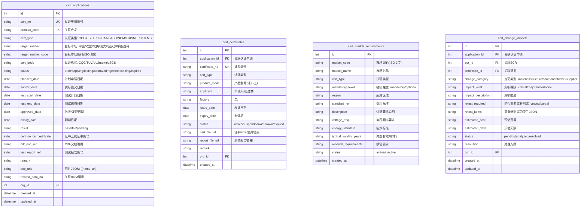
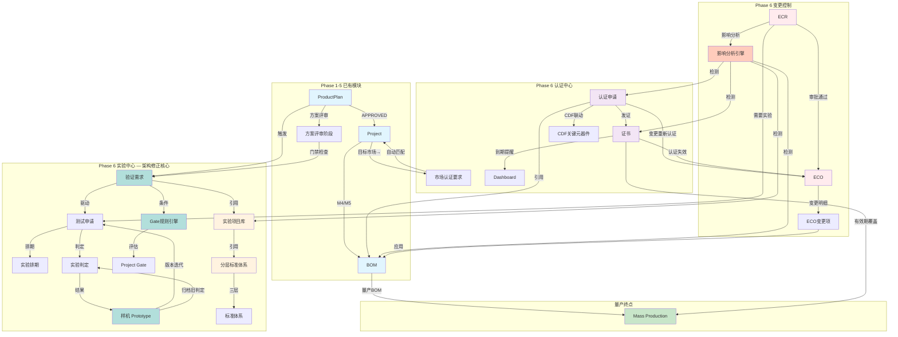

# ROS Phase 6 详细设计规划 — 研发数字主线（Digital Thread）

> **编写人**：AI-A（资深PLM架构师）
> **版本**：v2.0
> **日期**：2026-06-24
> **状态**：架构修正版（基于系统架构师评审意见）

---

## 目录

1. [总体架构概述](#1-总体架构概述)
2. [模块1：实验中心（Test Center）](#2-模块1实验中心test-center)
3. [模块2：认证中心（Certification Center）](#3-模块2认证中心certification-center)
4. [模块3：变更控制中心（ECR/ECO）](#4-模块3变更控制中心ecreco)
5. [模块间集成点 — 数字主线](#5-模块间集成点--数字主线)
6. [实施顺序建议](#6-实施顺序建议)
7. [与现有系统的集成方式](#7-与现有系统的集成方式)

---

## 1. 总体架构概述

### 1.1 数字主线全景

```
┌─────────────────────────────────────────────────────────────────────────┐
│                          数字主线（Digital Thread）                         │
└─────────────────────────────────────────────────────────────────────────┘

ProductPlan ──► Verification Requirement ──► Project ──► Prototype ──► Test Center
    │                    (验证需求)                  (样机)        (实验中心)
    │                       │                         │               │
    │            ┌──────────┘                         │               │
    │            ▼                                    ▼               │
    │     Gate Rule Engine ◄───────────────── Prototype Judgment       │
    │     (可配置Gate规则)                        (样机版本判定)         │
    │            │                                                    │
    │            ▼                                                    │
    │     Certification Center ──► ECR/ECO ──► Mass Production          │
    │     (认证中心)              (变更控制)       (量产)               │
    │            │                │                                    │
    │            │    ┌───────────┘                                    │
    │            │    ▼                                                │
    │            └──► CDF (关键元器件清单) ◄───── 认证失效自动识别        │
    │                                                                  │
    └─── 验证需求驱动实验 ──► 方案评审门禁 ──► Gate 条件自动判定          │
```

### 1.2 三个模块在现有系统中的位置

| 模块 | 现有基础 | Phase 6 增强目标 |
|------|---------|-----------------|
| 实验中心 | `TestRequest` + `TestResult` + `MQVerification` | **以验证需求(Verification Requirement)为中心驱动**，实验项目库、方案管理、排期执行、判定规则、**分层标准库**、**样机管理(Prototype)**、**Gate规则引擎**、与ProductPlan方案评审绑定 |
| 认证中心 | `Certification` + `Prototype` | 全生命周期(申请→测试→发证→维护→到期)、市场匹配(CDF联动)、变更重新认证 |
| 变更控制 | `ECR` + `ECN` | ECR→ECO全流程、影响分析引擎、认证失效自动识别、与BOM/认证数据关联 |

### 1.3 新增/变更的表一览

| 新表 | 所属模块 | 说明 |
|------|---------|------|
| `verification_requirements` | 实验中心 | **验证需求主表（核心新增）** |
| `test_libraries` | 实验中心 | 实验项目库主表 |
| `test_plan_items` | 实验中心 | 实验方案条目 |
| `test_schedules` | 实验中心 | 实验排期 |
| `test_judgments` | 实验中心 | 实验判定记录 |
| `prototypes` | 实验中心 | **样机管理（关键新增）** |
| `gate_rules` | 实验中心 | **Gate规则引擎（新增）** |
| `standard_systems` | 实验中心 | **标准体系分层（新增，替代原平铺test_standards）** |
| `standards` | 实验中心 | **具体标准（新增）** |
| `test_standard_mappings` | 实验中心 | 实验-标准多对多关联（新增，替代test_library_standards） |
| `product_plan_test_bindings` | 实验中心 | ProductPlan方案评审与实验绑定 |
| `cert_applications` | 认证中心 | 认证申请表（增强版Certification） |
| `cert_certificates` | 认证中心 | 证书管理 |
| `cert_market_requirements` | 认证中心 | 目标市场认证要求 |
| `cert_change_impacts` | 认证中心 | 变更认证影响分析记录 |
| `eco_items` | 变更控制 | ECO变更明细（BOM变更行） |
| `eco_impact_analyses` | 变更控制 | 变更影响分析记录 |
| `eco_cert_impact_results` | 变更控制 | 认证失效自动识别结果 |
| `ecr_test_bindings` | 变更控制 | ECR与实验/认证的关联 |

---

## 2. 模块1：实验中心（Test Center）

### 2.1 数据模型

#### 2.1.1 ER 图

```mermaid
erDiagram
    verification_requirements {
        int id PK
        string requirement_code UK "VR-2026-0001"
        string name "验证需求名称"
        string category "性能/能效/噪音风量/凝露/潮态/安全"
        string source "来源: product_plan/project/cert/eco"
        int source_id "来源ID"
        string requirement_description "需求描述(如: APF ≥ 5.20)"
        string acceptance_criteria "允收准则"
        string status "draft/active/completed/obsoleted"
        int org_id FK
        datetime created_at
        datetime updated_at
    }

    prototypes {
        int id PK
        string prototype_no UK "样机编号: PR-2026-0001"
        int project_id FK
        string prototype_type "类型: hand_sample/cert_sample/pilot_run/mass_production"
        string version "版本: V1.0/V2.0"
        string status "planning/building/testing/completed"
        string bom_ref "关联BOM版本"
        datetime planned_date
        datetime actual_date
        string result "结论: pass/fail/conditional"
        int org_id FK
        datetime created_at
        datetime updated_at
    }

    gate_rules {
        int id PK
        string name "规则名称"
        string gate_code "M4/M5/M6"
        string product_line "适用产品线"
        string customer "适用客户(留空=通用)"
        json required_checks "所需检查项: {vr_types, prototype_types, ...}"
        bool all_pass "是否全部必须通过"
        bool auto_block "不符合时自动阻塞Gate"
        string status "active/inactive"
        int org_id FK
        datetime created_at
        datetime updated_at
    }

    test_libraries {
        int id PK
        string library_code UK "实验项目编号"
        string name "实验项目名称"
        string category "类别: 性能/能效/噪音风量/凝露/潮态/安全/可靠性/EMC/寿命"
        string description "实验描述"
        string standard_refs "引用标准列表 JSON"
        string test_method "测试方法说明"
        float typical_duration_hours "典型耗时(小时)"
        string sample_requirements "样机要求"
        string acceptance_criteria "判定标准/允收准则"
        string status "active/inactive"
        int org_id FK "多租户"
        datetime created_at
        datetime updated_at
    }

    standard_systems {
        int id PK
        string code UK "标准体系编码: iec/iso/gb/en/ahri/jis"
        string name "标准体系名称"
        string level "层级: international/national/customer"
        string description "描述"
        int org_id FK
        datetime created_at
    }

    standards {
        int id PK
        string standard_code UK "标准编号: IEC 60335-2-40, GB/T 7725"
        string standard_name "标准名称"
        int system_id FK "所属标准体系"
        string issuing_body "发布机构"
        string region "适用区域: 中国/欧盟/北美/澳洲/中东/东南亚"
        string version "版本号"
        date effective_date "生效日期"
        string file_url "标准文档链接"
        string status "active/obsolete"
        int org_id FK
        datetime created_at
    }

    test_standard_mappings {
        int id PK
        int library_id FK "关联实验项目库"
        int standard_id FK "关联标准"
        string requirement_level "要求等级: mandatory/optional/reference"
    }

    test_plan_items {
        int id PK
        int test_request_id FK "关联测试申请(兼容旧表)"
        int library_id FK "关联实验项目库"
        int verification_requirement_id FK "关联验证需求(可选)"
        int standard_id FK "关联标准"
        string test_parameter "测试参数名称"
        string standard_value "标准值(上限)"
        string standard_value_lower "标准值(下限)"
        string unit "单位"
        string test_condition "测试条件(温度/湿度/电压等)"
        string sample_preparation "样机准备要求"
        int seq "排序"
        int org_id FK
        datetime created_at
    }

    test_schedules {
        int id PK
        int test_request_id FK "关联测试申请"
        int resource_id "实验资源/设备ID"
        string resource_name "实验设备/实验室名称"
        date scheduled_date "排期日期"
        string time_slot "时段: morning/afternoon/full_day"
        string assigned_to "实验负责人"
        string status "scheduled/in_progress/completed/cancelled"
        string remark
        int org_id FK
        datetime created_at
    }

    test_judgments {
        int id PK
        int test_request_id FK "关联测试申请"
        int test_result_id FK "关联测试结果明细"
        int prototype_id FK "关联样机(可选，判定结果跟样机版本走)"
        string judgment_type "判定类型: performance/energy/noise/condensation/moisture/safety"
        string judgment_rule "判定规则 JSON: {param, operator, threshold, unit}"
        string actual_value "实际值"
        string result "pass/fail/conditional_pass"
        string conclusion "判定结论描述"
        string risk_level "风险等级: low/medium/high/critical"
        string judged_by "判定人"
        datetime judged_at
        int org_id FK
        datetime created_at
    }

    product_plan_test_bindings {
        int id PK
        string product_plan_id FK "关联ProductPlan"
        int verification_requirement_id FK "关联验证需求"
        int library_id FK "关联实验项目库"
        int standard_id FK "关联标准"
        string binding_type "绑定类型: pre_approval(评审前必过)/gate_condition(Gate条件)/optional"
        string gate_code "关联Gate: M4/M5/M6"
        string pass_requirement "通过要求: all_pass/critical_pass/ng_threshold"
        int max_ng_count "最大允许不合格项数"
        string status "active/inactive"
        int org_id FK
        datetime created_at
    }
```



#### 2.1.2 实体关系说明

| 实体 | 关联 | 说明 |
|------|------|------|
| `verification_requirements` | 1:N → `product_plan_test_bindings` | 一个验证需求可被多个Plan绑定引用 |
| `verification_requirements` | 1:N → `test_plan_items` | 一个验证需求驱动多个实验方案条目 |
| `verification_requirements` | 1:N → `gate_rules` | Gate规则引用验证需求作为通过条件 |
| `prototypes` | N:1 → `projects` | 样机归属项目 |
| `prototypes` | 1:N → `test_requests` | 一个样机对应多次测试申请 |
| `prototypes` | 1:N → `test_judgments` | 判定结果附着在样机版本上 |
| `test_libraries` | 1:N → `test_plan_items` | 一个实验项目库条目可以被多个测试方案引用 |
| `test_libraries` | N:M → `standards` | 通过 `test_standard_mappings` 关联 |
| `standard_systems` | 1:N → `standards` | 标准体系包含多个具体标准 |
| `standards` | 1:N → `test_plan_items` | 一个标准可被多个实验方案使用 |
| `test_plan_items` | N:1 → `test_requests` | 实验方案条目归属测试申请（兼容现有 `TestRequest`） |
| `test_judgments` | 1:1 → `test_results` | 判定记录对应一个测试结果明细 |
| `test_judgments` | N:1 → `prototypes` | 判定结果跟随样机版本 |
| `test_schedules` | N:1 → `test_requests` | 一个测试申请可多次排期 |
| `product_plan_test_bindings` | N:1 → `product_plans` | 绑定到产品策划 |
| `product_plan_test_bindings` | N:1 → `verification_requirements` | 绑定验证需求 |
| `gate_rules` | N:1 → `project_gates` | Gate规则匹配到具体Gate |

### 2.2 API 端点设计

#### 2.2.1 验证需求（Verification Requirement）— 新增

| 方法 | 路径 | 说明 | 权限 |
|------|------|------|------|
| GET | `/api/v1/verification-requirements` | 列表查询（支持category/source/status筛选） | tests |
| GET | `/api/v1/verification-requirements/{id}` | 详情（含关联实验、Gate条件） | tests |
| POST | `/api/v1/verification-requirements` | 创建验证需求 | admin/rd_director/systems_engineer |
| PUT | `/api/v1/verification-requirements/{id}` | 更新验证需求 | admin/rd_director/systems_engineer |
| PATCH | `/api/v1/verification-requirements/{id}/status` | 状态变更（draft→active→completed→obsoleted） | systems_engineer |
| DELETE | `/api/v1/verification-requirements/{id}` | 删除（仅draft状态） | admin |
| GET | `/api/v1/verification-requirements/{id}/compliance` | 检查验证需求合规状态（关联实验是否全部通过） | pm/systems_engineer |

#### 2.2.2 实验项目库（Test Library）

| 方法 | 路径 | 说明 | 权限 |
|------|------|------|------|
| GET | `/api/v1/test-libraries` | 列表查询（支持category/status筛选） | tests |
| GET | `/api/v1/test-libraries/{id}` | 详情（含关联标准、历史判定） | tests |
| POST | `/api/v1/test-libraries` | 创建实验项目 | admin/rd_director/systems_engineer |
| PUT | `/api/v1/test-libraries/{id}` | 更新实验项目 | admin/rd_director/systems_engineer |
| DELETE | `/api/v1/test-libraries/{id}` | 删除（软删除） | admin |
| POST | `/api/v1/test-libraries/{id}/standards` | 关联标准 | systems_engineer |
| DELETE | `/api/v1/test-libraries/{id}/standards/{sid}` | 移除标准关联 | systems_engineer |

#### 2.2.3 标准体系与标准（Standard System & Standards）— 重构

| 方法 | 路径 | 说明 | 权限 |
|------|------|------|------|
| GET | `/api/v1/standard-systems` | 标准体系列表（按层级分组: international/national/customer） | tests |
| GET | `/api/v1/standard-systems/{id}` | 体系详情（含下属标准列表） | tests |
| POST | `/api/v1/standard-systems` | 创建标准体系 | admin/systems_engineer |
| PUT | `/api/v1/standard-systems/{id}` | 更新标准体系 | admin/systems_engineer |
| GET | `/api/v1/standards` | 标准列表（支持system_id/region/status筛选） | tests |
| GET | `/api/v1/standards/{id}` | 标准详情 | tests |
| POST | `/api/v1/standards` | 创建标准 | admin/systems_engineer |
| PUT | `/api/v1/standards/{id}` | 更新标准 | admin/systems_engineer |
| POST | `/api/v1/standards/{id}/obsolete` | 废止标准 | admin |
| GET | `/api/v1/test-libraries/{library_id}/standards-mapping` | 获取实验的关联标准映射 | tests |
| POST | `/api/v1/test-libraries/{library_id}/standards-mapping` | 添加标准映射（含要求等级） | systems_engineer |

#### 2.2.4 样机管理（Prototype）— 新增

| 方法 | 路径 | 说明 | 权限 |
|------|------|------|------|
| GET | `/api/v1/prototypes` | 样机列表（支持project_id/type/status筛选） | tests |
| GET | `/api/v1/prototypes/{id}` | 样机详情（含关联测试请求、判定历史） | tests |
| POST | `/api/v1/prototypes` | 创建样机 | pm/systems_engineer |
| PUT | `/api/v1/prototypes/{id}` | 更新样机 | pm/systems_engineer |
| PATCH | `/api/v1/prototypes/{id}/status` | 状态变更（planning→building→testing→completed） | systems_engineer |
| DELETE | `/api/v1/prototypes/{id}` | 删除（软删除） | admin |
| GET | `/api/v1/projects/{project_id}/prototypes` | 项目的样机时间线 | pm/systems_engineer |
| GET | `/api/v1/prototypes/{id}/judgment-summary` | 样机判定汇总（所有关联实验的判定概览） | tests |

#### 2.2.5 实验排期（Test Schedule）

| 方法 | 路径 | 说明 | 权限 |
|------|------|------|------|
| GET | `/api/v1/test-schedules` | 排期列表（支持日期范围/资源/状态筛选，日历视图用） | tests |
| GET | `/api/v1/test-schedules/my` | 我的实验排期 | tests |
| POST | `/api/v1/test-schedules` | 创建排期 | systems_engineer |
| PUT | `/api/v1/test-schedules/{id}` | 更新排期 | systems_engineer |
| PATCH | `/api/v1/test-schedules/{id}/status` | 变更状态（开始/完成/取消） | systems_engineer |

#### 2.2.6 实验判定（Test Judgment）

| 方法 | 路径 | 说明 | 权限 |
|------|------|------|------|
| GET | `/api/v1/test-requests/{rid}/judgments` | 获取测试申请的判定列表 | tests |
| POST | `/api/v1/test-requests/{rid}/judgments` | 提交判定（可指定prototype_id关联样机版本） | quality_engineer/systems_engineer |
| PUT | `/api/v1/test-requests/{rid}/judgments/{jid}` | 更新判定 | quality_engineer |
| PUT | `/api/v1/test-requests/{rid}/batch-judge` | 批量判定（一次判定多个测试项） | quality_engineer |
| GET | `/api/v1/prototypes/{pid}/judgments` | 获取指定样机的所有判定（样机版本判定总览） | tests |
| POST | `/api/v1/prototypes/{pid}/archive-judgments` | 样机版本升级归档旧判定（V1.0→V2.0后调用） | systems_engineer |

#### 2.2.7 Gate 规则引擎（Gate Rule）— 新增

| 方法 | 路径 | 说明 | 权限 |
|------|------|------|------|
| GET | `/api/v1/gate-rules` | 规则列表（支持gate_code/product_line/customer筛选） | tests |
| GET | `/api/v1/gate-rules/{id}` | 规则详情 | tests |
| POST | `/api/v1/gate-rules` | 创建Gate规则 | admin/rd_director/systems_engineer |
| PUT | `/api/v1/gate-rules/{id}` | 更新规则 | admin/rd_director/systems_engineer |
| PATCH | `/api/v1/gate-rules/{id}/status` | 启用/停用规则 | admin/rd_director |
| DELETE | `/api/v1/gate-rules/{id}` | 删除规则 | admin |
| POST | `/api/v1/gate-rules/evaluate` | **执行规则评估**（传入project_id + gate_code，返回通过/阻塞及原因） | systems_engineer |
| GET | `/api/v1/projects/{project_id}/gate-rules-status` | 查看项目所有Gate规则状态（哪些已满足，哪些阻塞） | pm |

#### 2.2.8 ProductPlan 实验绑定

| 方法 | 路径 | 说明 | 权限 |
|------|------|------|------|
| GET | `/api/v1/product-plans/{plan_id}/verification-requirements` | 获取策划关联的验证需求 | pm |
| POST | `/api/v1/product-plans/{plan_id}/verification-requirements` | 绑定验证需求到策划 | pm/systems_engineer |
| DELETE | `/api/v1/product-plans/{plan_id}/verification-requirements/{vrid}` | 移除验证需求绑定 | pm |
| GET | `/api/v1/product-plans/{plan_id}/test-bindings` | 获取策划关联的实验要求（向后兼容，从VR推导） | pm |
| POST | `/api/v1/product-plans/{plan_id}/test-bindings` | 绑定实验要求到策划（向后兼容） | pm/systems_engineer |
| GET | `/api/v1/product-plans/{plan_id}/test-compliance` | 检查策划实验合规状态（门禁检查） | pm |

#### 2.2.9 现有 Test Request API 增强

| 方法 | 路径 | 说明 | 增强点 |
|------|------|------|--------|
| POST | `/api/v1/tests` | 创建测试申请 | 增加 `library_id`、`prototype_id`、`verification_requirement_id` |
| GET | `/api/v1/tests/{rid}` | 详情 | 增加验证需求、样机、计划项、排期、判定嵌套 |
| PATCH | `/api/v1/tests/{rid}` | 更新状态 | 完成后自动触发判定引擎 |

### 2.3 前端页面规划

#### 2.3.1 页面结构

```
views/tests/ (增强现有)
├── VerificationRequirementView.vue  ← 验证需求管理（新增，核心页面）
├── PrototypeListView.vue            ← 样机管理（新增）
├── PrototypeDetailView.vue          ← 样机详情（含判定汇总）（新增）
├── TestLibraryView.vue              ← 实验项目库管理
├── StandardSystemView.vue           ← 标准体系管理（新增，替代平铺标准管理）
├── TestScheduleCalendar.vue         ← 实验排期日历
├── TestJudgmentView.vue             ← 实验判定看板
├── GateRuleView.vue                 ← Gate规则引擎（新增）
├── TestRequestListView.vue          ← 测试申请列表（增强）
├── TestRequestDetailView.vue        ← 测试申请详情（增强，含验证需求+样机+排期+判定）
└── ProductPlanTestCheck.vue         ← 策划实验合规检查（增强，基于VR）
```

#### 2.3.2 核心组件拆分

| 组件 | 所属页面 | 功能 |
|------|---------|------|
| `VerificationReqForm.vue` | VerificationRequirementView | 验证需求CRUD表单（含来源选择器） |
| `VerificationReqTimeline.vue` | VerificationRequirementView | 验证需求生命周期时间线（VR→实验→判定） |
| `PrototypeTimeline.vue` | PrototypeDetailView | 样机版本时间线（手板→首样→认证样机→量产样机） |
| `PrototypeJudgmentSummary.vue` | PrototypeDetailView | 样机判定汇总面板（通过/失败/条件通过） |
| `TestLibraryForm.vue` | TestLibraryView | 实验项目CRUD表单 |
| `StandardSystemTree.vue` | StandardSystemView | 标准体系树（国际→国家→客户 三级展开） |
| `StandardSelector.vue` | VerificationReqForm/PlanBind | 标准选择器（按体系/层级筛选） |
| `TestPlanBuilder.vue` | TestRequestDetail | 实验方案构建器（从实验库拖拽，关联VR） |
| `ScheduleCalendar.vue` | TestScheduleCalendar | 甘特图/日历排期组件 |
| `JudgePanel.vue` | TestJudgmentView | 判定面板（含标准值对照+样机版本关联） |
| `BatchJudgeDialog.vue` | TestJudgmentView | 批量判定弹窗 |
| `GateRuleForm.vue` | GateRuleView | Gate规则配置表单（JSON required_checks编辑器） |
| `GateRuleEvalResult.vue` | GateRuleView | 规则评估结果展示（绿/黄/红状态） |
| `ComplianceChecklist.vue` | ProductPlanTestCheck | 合规检查清单（基于VR，绿/黄/红状态） |

#### 2.3.3 页面路由

```typescript
// router/index.ts — Phase 6 新增/修改路由
{
  path: 'tests/verification-requirements',
  name: 'VerificationRequirements',
  component: () => import('@/views/tests/VerificationRequirementView.vue'),
  meta: { menu: 'tests', title: '验证需求' }
},
{
  path: 'tests/prototypes',
  name: 'Prototypes',
  component: () => import('@/views/tests/PrototypeListView.vue'),
  meta: { menu: 'tests', title: '样机管理' }
},
{
  path: 'tests/prototypes/:id',
  name: 'PrototypeDetail',
  component: () => import('@/views/tests/PrototypeDetailView.vue'),
  meta: { menu: 'tests', title: '样机详情' }
},
{
  path: 'tests/library',
  name: 'TestLibrary',
  component: () => import('@/views/tests/TestLibraryView.vue'),
  meta: { menu: 'tests', title: '实验项目库' }
},
{
  path: 'tests/standards',
  name: 'TestStandards',
  component: () => import('@/views/tests/StandardSystemView.vue'),
  meta: { menu: 'tests', title: '标准体系' }
},
{
  path: 'tests/schedule',
  name: 'TestSchedule',
  component: () => import('@/views/tests/TestScheduleCalendar.vue'),
  meta: { menu: 'tests', title: '实验排期' }
},
{
  path: 'tests/judgments',
  name: 'TestJudgments',
  component: () => import('@/views/tests/TestJudgmentView.vue'),
  meta: { menu: 'tests', title: '实验判定' }
},
{
  path: 'tests/gate-rules',
  name: 'GateRules',
  component: () => import('@/views/tests/GateRuleView.vue'),
  meta: { menu: 'tests', title: 'Gate规则引擎' }
},
{
  path: 'pm/:id/test-check',
  name: 'ProductPlanTestCheck',
  component: () => import('@/views/tests/ProductPlanTestCheck.vue'),
  meta: { menu: 'pm', title: '实验合规检查' }
}
```

---

## 3. 模块2：认证中心（Certification Center）

### 3.1 数据模型

#### 3.1.1 ER 图



#### 3.1.2 实体关系说明

| 实体 | 关联 | 说明 |
|------|------|------|
| `cert_applications` | 1:1 → `products` | 每个认证申请针对一个产品 |
| `cert_applications` | 1:N → `cert_certificates` | 一个申请可能获得多个证书（多型号覆盖） |
| `cert_applications` | 1:N → `cert_change_impacts` | 变更影响分析 |
| `cert_certificates` | 1:N → `parts` | 证书关联的CDF物料 |
| `cert_market_requirements` | — | 配置表，用于自动匹配目标市场认证要求 |
| `cert_change_impacts` | N:1 → `ecr` | 关联到变更请求 |

### 3.2 API 端点设计

#### 3.2.1 认证申请

| 方法 | 路径 | 说明 | 权限 |
|------|------|------|------|
| GET | `/api/v1/cert-applications` | 列表（支持cert_type/status/market筛选） | certifications |
| GET | `/api/v1/cert-applications/{id}` | 详情（含证书列表+CDF物料） | certifications |
| POST | `/api/v1/cert-applications` | 创建认证申请 | systems_engineer |
| PUT | `/api/v1/cert-applications/{id}` | 更新 | systems_engineer |
| PATCH | `/api/v1/cert-applications/{id}/status` | 状态变更 → 状态机 | quality_engineer |
| POST | `/api/v1/cert-applications/{id}/submit` | 提交申请（draft→applying） | systems_engineer |
| DELETE | `/api/v1/cert-applications/{id}` | 删除（仅draft状态） | admin |

#### 3.2.2 证书管理

| 方法 | 路径 | 说明 | 权限 |
|------|------|------|------|
| GET | `/api/v1/cert-certificates` | 证书列表（支持status/cert_type筛选） | certifications |
| GET | `/api/v1/cert-certificates/{id}` | 证书详情 | certifications |
| POST | `/api/v1/cert-applications/{aid}/certificates` | 为申请添加证书 | quality_engineer |
| PUT | `/api/v1/cert-certificates/{id}` | 更新证书 | quality_engineer |
| PATCH | `/api/v1/cert-certificates/{id}/status` | 证书状态变更（active→expired等） | quality_engineer |
| GET | `/api/v1/cert-certificates/expiring-soon` | 即将到期提醒（30/60/90天） | certifications |

#### 3.2.3 目标市场认证要求

| 方法 | 路径 | 说明 | 权限 |
|------|------|------|------|
| GET | `/api/v1/cert-market-requirements` | 市场认证要求列表 | certifications |
| GET | `/api/v1/cert-market-requirements/{market_code}` | 指定市场的所有认证要求 | certifications |
| POST | `/api/v1/cert-market-requirements` | 创建市场认证要求 | admin |
| PUT | `/api/v1/cert-market-requirements/{id}` | 更新 | admin |
| POST | `/api/v1/projects/{project_id}/auto-match-certs` | **根据项目目标市场自动匹配所需认证** | pm/systems_engineer |

#### 3.2.4 认证影响分析

| 方法 | 路径 | 说明 | 权限 |
|------|------|------|------|
| GET | `/api/v1/cert-change-impacts` | 变更影响分析列表 | certifications |
| POST | `/api/v1/cert-change-impacts/analyze` | **自动分析变更对认证的影响** | systems_engineer |
| GET | `/api/v1//ecr/{ecr_id}/cert-impacts` | 查看指定ECR的认证影响 | certifications |
| PUT | `/api/v1/cert-change-impacts/{id}` | 更新处理方案 | quality_engineer |

#### 3.2.5 现有 Certification API 增强

增强 `/api/v1/certifications` — 增加 `cert_goal`（从Project的cert_goal自动带入）、市场匹配建议、到期提醒推送。

### 3.3 前端页面规划

#### 3.3.1 页面结构

```
views/certifications/ (增强)
├── CertApplicationListView.vue    ← 认证申请列表（增强）
├── CertApplicationDetailView.vue  ← 认证申请详情（含进度时间线）
├── CertCertificateListView.vue    ← 证书列表（新增）
├── CertCertificateDetailView.vue  ← 证书详情（含到期倒计时）
├── CertMarketRequirementView.vue  ← 目标市场认证要求（新增）
├── CertImpactAnalysisView.vue     ← 变更认证影响（新增）
└── CertDashboardView.vue          ← 认证仪表盘（新增，到期看板）
```

#### 3.3.2 核心组件拆分

| 组件 | 所属页面 | 功能 |
|------|---------|------|
| `CertTimeline.vue` | CertApplicationDetail | 认证进度时间线（申请→测试→批准→发证） |
| `CertStatusBadge.vue` | 全局 | 认证状态徽章（含倒计时） |
| `ExpiringCertAlert.vue` | CertDashboardView | 到期提醒列表（红/黄/绿色） |
| `MarketCertPanel.vue` | CertApplicationForm | 目标市场认证要求面板（与CDF联动） |
| `ImpactAnalysisResult.vue` | CertImpactAnalysisView | 影响分析结果展示（含重新测试清单） |
| `CertSelector.vue` | 全局组件 | 认证选择器（用于ECR影响分析关联） |

#### 3.3.3 页面路由

```typescript
// 新增路由
{
  path: 'certs/certificates',
  name: 'CertCertificates',
  component: () => import('@/views/certifications/CertCertificateListView.vue'),
  meta: { menu: 'certifications', title: '证书管理' }
},
{
  path: 'certs/certificates/:id',
  name: 'CertCertificateDetail',
  component: () => import('@/views/certifications/CertCertificateDetailView.vue'),
  meta: { menu: 'certifications', title: '证书详情' }
},
{
  path: 'certs/market-requirements',
  name: 'CertMarketRequirements',
  component: () => import('@/views/certifications/CertMarketRequirementView.vue'),
  meta: { menu: 'certifications', title: '市场认证要求' }
},
{
  path: 'certs/impact-analysis',
  name: 'CertImpactAnalysis',
  component: () => import('@/views/certifications/CertImpactAnalysisView.vue'),
  meta: { menu: 'certifications', title: '认证影响分析' }
},
{
  path: 'certs/dashboard',
  name: 'CertDashboard',
  component: () => import('@/views/certifications/CertDashboardView.vue'),
  meta: { menu: 'certifications', title: '认证仪表盘' }
}
```

---

## 4. 模块3：变更控制中心（ECR/ECO）

### 4.1 数据模型

#### 4.1.1 ER 图

```mermaid
erDiagram
    ECR {
        int id PK "现有表增强"
        string ecr_no UK "ECR编号"
        string title "标题"
        string product_code "关联产品"
        string change_type "变更类型: 结构/系统/电控/物料/BOM/工艺/包装"
        string trigger "触发源: 品质/降本/认证/工艺/供应链/客户需求"
        string urgency "紧急程度: routine/urgent/emergency"
        string status "draft/submitted/impact_analyzing/impact_analyzed/approved/rejected/eco_created/implemented"
        string description "变更描述"
        string reason "变更原因"
        string impact_analysis "影响分析文本"
        string submitted_by "提交人"
        string approved_by "批准人"
        int org_id FK
        datetime created_at
        datetime updated_at
    }

    ECO {
        int id PK "现有表增强"
        string eco_no UK "ECO编号"
        int ecr_id FK "关联ECR"
        string title "标题"
        string product_code "关联产品"
        int target_bom_id FK "目标BOM"
        string change_scope "变更范围描述"
        string status "draft/released/implemented/closed"
        date effective_date "生效日期"
        string implementer "实施人"
        string approval_summary "审批摘要"
        int org_id FK
        datetime created_at
        datetime updated_at
    }

    eco_items {
        int id PK
        int eco_id FK "关联ECO"
        string change_operation "操作: add/remove/replace/modify_parameter"
        string part_no "物料编码"
        string part_name "物料名称"
        string old_value "旧值"
        string new_value "新值"
        string position_no "位置号"
        string change_reason "变更原因"
        int seq "顺序"
        int org_id FK
        datetime created_at
    }

    eco_impact_analyses {
        int id PK
        int ecr_id FK "关联ECR"
        string impact_category "影响类别: performance/safety/cost/schedule/supply/certification/production"
        string impact_level "影响等级: critical/major/minor/none"
        string impact_description "影响描述"
        string affected_object "受影响对象: BOM项/产品/认证/供应商/模具"
        string affected_id "受影响对象ID"
        string mitigation "缓解措施/建议"
        string analyzed_by "分析人"
        datetime analyzed_at
        int org_id FK
        datetime created_at
    }

    eco_cert_impact_results {
        int id PK
        int ecr_id FK "关联ECR"
        int cert_id FK "关联认证申请/证书"
        string impact_type "影响类型: direct(证书直接涉及)/indirect(CDF物料变更)"
        string impact_result "影响结果: cert_invalid/retest_required/redeclare/partial_update/no_impact"
        string affected_items "受影响的具体项JSON"
        string required_actions "需执行的动作: 重新认证/补充测试/更新报告/修改标签"
        string suggestion "建议"
        string is_accepted "是否接受建议: true/false/null"
        int org_id FK
        datetime created_at
    }

    ecr_test_bindings {
        int id PK
        int ecr_id FK "关联ECR"
        string test_type "测试类型: performance/energy/safety/emc/life/reliability"
        int test_library_id FK "关联实验项目库"
        int test_request_id FK "关联测试申请(创建后)"
        string binding_reason "绑定原因: impact_analysis"
        string status "pending/requested/testing/done"
        datetime created_at
    }
```



#### 4.1.2 ECR 状态机增强

```
     ┌──────────┐
     │  draft   │
     └────┬─────┘
          │ submit
          ▼
     ┌──────────┐
     │ submitted│───→ impact_analyzing (自动触发影响分析引擎)
     └────┬─────┘
          │ analyze_complete
          ▼
    ┌──────────────┐
    │impact_analyzed│ ← 影响分析完成，等待审批
    └──────┬───────┘
           │ approve / reject
           ├──────────────┐
           ▼              ▼
    ┌──────────┐   ┌──────────┐
    │ approved │   │ rejected │
    └────┬─────┘   └──────────┘
         │ create_eco
         ▼
    ┌──────────┐
    │eco_created│
    └──────────┘
```

#### 4.1.3 ECO 状态机

```
draft → released → implemented → closed
                  ↘ cancelled
```

### 4.2 API 端点设计

#### 4.2.1 ECR 增强

| 方法 | 路径 | 说明 | 权限 |
|------|------|------|------|
| GET | `/api/v1/ecrs` | 列表（增强筛选：urgency/trigger/status） | changes |
| POST | `/api/v1/ecrs` | 创建ECR（增强字段） | systems_engineer |
| GET | `/api/v1/ecrs/{id}` | 详情（含影响分析、关联测试、认证影响） | changes |
| PUT | `/api/v1/ecrs/{id}` | 更新 | systems_engineer |
| PATCH | `/api/v1/ecrs/{id}/status` | **状态转移（含自动触发影响分析）** | systems_engineer |
| POST | `/api/v1/ecrs/{id}/submit` | 提交审核 | systems_engineer |
| POST | `/api/v1/ecrs/{id}/approve` | 批准（→ approved 并建议创建ECO） | rd_director/general_manager |
| POST | `/api/v1/ecrs/{id}/reject` | 驳回 | rd_director/general_manager |
| POST | `/api/v1/ecrs/{id}/create-eco` | **从ECR创建ECO**（自动带入变更数据） | systems_engineer |

#### 4.2.2 变更影响分析（新增）

| 方法 | 路径 | 说明 | 权限 |
|------|------|------|------|
| POST | `/api/v1/ecrs/{id}/run-impact-analysis` | **运行影响分析引擎**（全自动） | systems_engineer |
| GET | `/api/v1/ecrs/{id}/impact-analyses` | 获取影响分析结果列表 | changes |
| PUT | `/api/v1/ecrs/{id}/impact-analyses/{iaid}` | 更新/修正影响分析 | systems_engineer |
| POST | `/api/v1/ecrs/{id}/analyze-cert-impact` | **运行认证影响分析**（自动检测认证失效） | systems_engineer |
| GET | `/api/v1/ecrs/{id}/cert-impacts` | 获取认证影响分析结果 | changes |

#### 4.2.3 ECO（增强）

| 方法 | 路径 | 说明 | 权限 |
|------|------|------|------|
| GET | `/api/v1/ecos` | 列表 | changes |
| POST | `/api/v1/ecos` | 创建ECO（可独立或从ECR生成） | systems_engineer |
| GET | `/api/v1/ecos/{id}` | 详情（含BOM变更明细） | changes |
| PUT | `/api/v1/ecos/{id}` | 更新 | systems_engineer |
| PATCH | `/api/v1/ecos/{id}/status` | 状态变更 | systems_engineer/quality_engineer |
| POST | `/api/v1/ecos/{id}/release` | 发布ECO（draft→released） | rd_director |
| POST | `/api/v1/ecos/{id}/implement` | 实施ECO（released→implemented） | systems_engineer |

#### 4.2.4 ECO 变更明细

| 方法 | 路径 | 说明 | 权限 |
|------|------|------|------|
| GET | `/api/v1/ecos/{id}/items` | 获取ECO变更明细 | changes |
| POST | `/api/v1/ecos/{id}/items` | 添加变更条目 | systems_engineer |
| PUT | `/api/v1/ecos/{id}/items/{item_id}` | 更新变更条目 | systems_engineer |
| DELETE | `/api/v1/ecos/{id}/items/{item_id}` | 删除变更条目 | systems_engineer |
| POST | `/api/v1/ecos/{id}/apply-to-bom` | **将ECO变更应用到BOM**（自动更新BOM树） | systems_engineer |

#### 4.2.5 认证失效预检（新增核心API）

| 方法 | 路径 | 说明 | 权限 |
|------|------|------|------|
| POST | `/api/v1/ecrs/{id}/auto-detect-cert-invalidation` | **自动检测：变更导致哪些认证失效** | systems_engineer |
| GET | `/api/v1/parts/{part_no}/cert-coverage` | 查看物料的认证覆盖情况 | certifications |

### 4.3 前端页面规划

#### 4.3.1 页面结构

```
views/changes/ (增强)
├── ECRListView.vue             ← ECR列表（增强，含影响分析状态列）
├── ECRDetailView.vue           ← ECR详情（增强，影响分析面板+认证影响）
├── ECOListView.vue             ← ECO列表（增强）
├── ECODetailView.vue           ← ECO详情（含BOM变更对比）
├── ImpactAnalysisView.vue      ← 影响分析看板（新增）
├── CertImpactView.vue          ← 认证影响看板（新增）
└── ChangeDashboardView.vue     ← 变更控制仪表盘（新增）
```

#### 4.3.2 核心组件拆分

| 组件 | 所属页面 | 功能 |
|------|---------|------|
| `ECRSidebar.vue` | ECRDetailView | ECR状态流侧边栏 |
| `ImpactAnalysisPanel.vue` | ImpactAnalysisView | 影响分析结果面板 |
| `BOMChangeDiff.vue` | ECODetailView | BOM变更对比（红/绿差异） |
| `CertImpactMatrix.vue` | CertImpactView | 认证影响矩阵（变更项×认证类型） |
| `CertInvalidationAlert.vue` | CertImpactView | 认证失效告警组件 |
| `ChangeTimeline.vue` | ChangeDashboardView | 变更时间线（ECR→ECO→实施） |
| `EcoBomApplyDialog.vue` | ECODetailView | ECO应用到BOM确认弹窗 |

#### 4.3.3 页面路由

```typescript
{
  path: 'changes/impact-analysis',
  name: 'ImpactAnalysis',
  component: () => import('@/views/changes/ImpactAnalysisView.vue'),
  meta: { menu: 'changes', title: '影响分析' }
},
{
  path: 'changes/cert-impact',
  name: 'CertImpact',
  component: () => import('@/views/changes/CertImpactView.vue'),
  meta: { menu: 'changes', title: '认证影响' }
},
{
  path: 'changes/dashboard',
  name: 'ChangeDashboard',
  component: () => import('@/views/changes/ChangeDashboardView.vue'),
  meta: { menu: 'changes', title: '变更仪表盘' }
}
```

---

## 5. 模块间集成点 — 数字主线

### 5.1 集成全景图



### 5.2 核心集成点详解

#### 集成点①：ProductPlan → 验证需求 → 实验中心（方案评审门禁）

**触发时机**：ProductPlan 方案评审阶段（`tech_input` → `project_init`）

**流程**：
1. 产品经理在 ProductPlan 中定义产品需求参数（如 APF ≥ 5.20，噪音 ≤ 38dB）
2. 方案评审触发创建 **Verification Requirement（验证需求）**，自动从产品需求推导
3. 验证需求条目驱动实验方案创建（`test_plan_items` 关联 `verification_requirement_id`）
4. 当方案评审提交时，系统自动检查关联的验证需求对应的实验判定是否全部通过
5. 若有未通过或未完成的实验 → 阻止评审通过，提示不达标项
6. 所有必过实验判定为 `pass` → 允许方案评审进入下一步

**数据流**：
```
ProductPlan.tech_input
    → 读取产品需求参数
    → 自动生成/关联 Verification Requirements
    → GET /product-plans/{id}/test-compliance
    → 遍历 verification_requirements → product_plan_test_bindings
    → 检查 test_judgments 中对应结果
    → 返回 { compliant: bool, failed_items: [...] }
```

**事件**：
```python
# 新增事件类型
EventTypes.PLAN_TECH_INPUT_CHECK = "plan.tech_input_check"
# 事件处理器：on_tech_input_check 自动检查实验合规
```

#### 集成点②：Project → Prototype → Gate 规则引擎

**触发时机**：Project Gate 点亮前（M4 模具评审、M5 工程样机、M6 试产）

**流程**：
1. Project 创建后，按研发阶段生成 Prototype（样机）实例（手板→首样→认证样机→量产样机）
2. 每个 Prototype 版本承载对应批次的测试申请和判定结果
3. Gate 条件不再硬编码，而是通过 **Gate Rule Engine** 动态评估
4. Gate Rule 根据 `product_line` + `customer` + `gate_code` 匹配规则
5. 规则检查：
   - 必需的验证需求（VR Types）是否全部通过
   - 必需的样机类型（Prototype Types）是否已完成测试
   - 相关实验判定是否全部通过
6. 不符合条件 → Gate 自动阻塞，Dash-board 显示阻塞原因

**数据流**：
```
ProjectGate M5 点亮
    → POST /api/v1/gate-rules/evaluate
    → 参数: { project_id, gate_code: "M5" }
    → 匹配 active 的 gate_rules (按 product_line + customer)
    → 遍历 required_checks:
        → 检查 verification_requirements 对应实验判定
        → 检查 prototypes 对应状态和结果
    → 返回 { pass: bool, blocked_reasons: [...] }
    → 若 auto_block=true 且 fail → Gate 状态 = "blocked"
    → Dashboard 风险看板显示阻塞原因
```

**Gate Rule 配置示例**：
```json
{
  "gate_code": "M5",
  "product_line": "split_ac",
  "customer": "xiaomi",
  "required_verification_requirements": ["PERFORMANCE", "NOISE", "CONDENSATION"],
  "required_prototype_types": ["cert_sample"],
  "all_pass": true,
  "auto_block": true
}
```

#### 集成点③：认证中心 → 实验中心（认证测试）

**触发时机**：认证申请提交后（`testing` 阶段）

**流程**：
1. 认证申请进入 testing 阶段时，自动创建对应的测试申请
2. 测试申请引用认证标准中的实验项目，同时关联 **样机（Prototype）** 版本
3. 测试完成后，结果回流到认证申请的 `result`，同时回填到 Prototype 的判定汇总
4. 认证样机版本的判定结果决定了认证是否可进入下一阶段

**数据流**：
```
CertApplication.testing
    → 根据 cert_type 自动匹配实验项目 + 关联认证样机 prototype
    → 创建 TestRequest（带 prototype_id）
    → TestRequest.done → 判定结果回填 CertApplication.result
    → 判定结果同时写入 Prototype.judgment_summary
```

#### 集成点④：ECR/ECO → 认证中心（认证失效自动识别）

**触发时机**：ECR 提交后，影响分析阶段

**这是 Phase 6 最关键的数字主线打通点。**

**逻辑**：
1. ECR 变更的物料/部件与认证证书中的 CDF 清单交叉比对
2. 若变更物料在 CDF 清单中 → 自动标记该认证需重新测试
3. 若变更涉及安全件/EMC件/能效件 → 标记对应认证失效
4. 输出：`eco_cert_impact_results` 表记录

**自动识别规则**：
```
规则1: 变更物料 part_no 在 cert_certificates.cdf_doc_ref 中
       → 影响等级 = critical → retest_required = yes

规则2: 变更物料 is_cdf_item = true 且 cdf_type in ('安全件','EMC件')
       → 影响等级 = major → retest_required = partial

规则3: 变更涉及市场认证标记 market_cert_marks
       → 对应 cert_type 的认证需要重新申报

规则4: 变更物料制造商/供应商变更 (part_avl)
       → 认证需要 update 或 redeclare
```

**数据流**：
```
ECR.submitted → 触发事件
    → on_ecr_submitted 处理器
    → 调用 ECR/{id}/auto-detect-cert-invalidation
    → 查询 affected BOM items 的 parts
    → 交叉匹配 cert_certificates + cert_change_impacts
    → 输出 eco_cert_impact_results
    → 更新 ECR.impact_analysis
    → Dashboard 风险看板显示认证失效告警
```

#### 集成点⑤：ECO → BOM（变更应用）

**触发时机**：ECO 发布后，实施阶段

**流程**：
1. ECO 的 `eco_items` 包含 BOM 变更明细（add/remove/replace）
2. 实施时，系统自动将变更应用到 BOM
3. BOM 版本号升级（V1.0 → V1.1）
4. 更新 BOM 的状态为 revised

**数据流**：
```
ECO.released → 实施
    → POST /ecos/{id}/apply-to-bom
    → 遍历 eco_items
    → 更新 bom_items（add/remove/modify）
    → BOM.version +1
    → BOM.status = "revised"
```

#### 集成点⑥：CDF 联动（贯穿三模块）

**背景**：CDF（关键元器件清单）已经在 `parts` 表中通过 `is_cdf_item`、`cdf_type`、`cdf_cert_no`、`cdf_expiry_date` 标记。

**CDF 在数字主线中的角色**：
```
实验中心 → 测试 CDF 物料 → 判定通过
    ↓
认证中心 ← CDF 物料作为认证依据
    ↓
ECR/ECO → CDF 物料变更 → 自动检测认证失效
```

**实现**：
1. 实验中心：MQ 验证流程中，CDF 物料自动标记为 high priority
2. 认证中心：认证申请时，自动提取 BOM 中的 CDF 物料
3. ECR/ECO：变更涉及 CDF 物料时，自动触发认证影响分析

#### 集成点⑦：Dashboard 风险看板增强

在现有 Dashboard 基础上，增加以下风险卡片：

| 卡片 | 数据来源 | 刷新时机 |
|------|---------|---------|
| "验证需求未完成" | `verification_requirements.status != completed` | 验证需求状态变更后 |
| "样机判定异常" | `prototypes.result = fail` | 实验判定后 |
| "Gate 阻塞（规则未满足）" | `gate_rules.evaluate()` 返回 fail | Gate 点亮前 |
| "实验合规红灯" | `product_plan_test_bindings` + `test_judgments` | 实验判定后 |
| "认证即将到期" | `cert_certificates.expiry_date` | 每日定时任务 |
| "认证失效风险" | `eco_cert_impact_results` | ECR 影响分析后 |
| "待实施 ECO" | `ECO.status = released` | ECO 发布后 |

### 5.3 事件驱动集成（Event Bus 增强）

在现有 `EventTypes` 基础上，Phase 6 新增事件类型：

```python
# 实验中心事件 — 验证需求驱动
EventTypes.VR_CREATED = "vr.created"                 # 验证需求创建
EventTypes.VR_COMPLETED = "vr.completed"              # 验证需求完成
EventTypes.TEST_SUBMITTED = "test.submitted"
EventTypes.TEST_JUDGED = "test.judged"                # 实验判定完成
EventTypes.TEST_COMPLIANCE_CHECK = "test.compliance_check"

# 样机事件
EventTypes.PROTOTYPE_CREATED = "prototype.created"    # 样机创建
EventTypes.PROTOTYPE_COMPLETED = "prototype.completed" # 样机完成（含判定）
EventTypes.PROTOTYPE_VERSION_UPGRADED = "prototype.version_upgraded"  # 样机版本升级

# Gate 规则引擎事件
EventTypes.GATE_RULE_EVALUATED = "gate_rule.evaluated"   # Gate规则评估
EventTypes.GATE_BLOCKED = "gate_rule.blocked"             # Gate阻塞

# 认证中心事件
EventTypes.CERT_APPLIED = "cert.applied"           # 认证申请提交
EventTypes.CERT_APPROVED = "cert.approved"         # 认证批准
EventTypes.CERT_EXPIRING = "cert.expiring"         # 认证即将到期
EventTypes.CERT_INVALIDATED = "cert.invalidated"   # 认证失效

# 变更控制事件
EventTypes.ECR_SUBMITTED = "ecr.submitted"
EventTypes.ECR_IMPACT_ANALYZED = "ecr.impact_analyzed"
EventTypes.ECR_APPROVED = "ecr.approved"
EventTypes.ECO_RELEASED = "eco.released"
EventTypes.ECO_IMPLEMENTED = "eco.implemented"
EventTypes.CERT_IMPACT_DETECTED = "cert.impact_detected"
```

---

## 6. 实施顺序建议

### 6.1 建议顺序

```
Phase 6 实施路线图（建议总周期 10-12 周）

第1-3周                                  第4-5周                            第6-8周                             第9-12周
┌─────────────────────┐      ┌──────────────────────┐      ┌──────────────────────┐      ┌─────────────────────┐
│    S1: 实验中心      │      │    S2: 变更控制中心    │      │    S3: 认证中心       │      │    S4: 数字主线集成   │
│    (架构修正核心)     │      │    (基础+影响分析)     │      │    (全生命周期)       │      │    (打通+优化)       │
├─────────────────────┤      ├──────────────────────┤      ├──────────────────────┤      ├─────────────────────┤
│ • 验证需求 VR CRUD   │      │ • ECR 增强(impact)   │      │ • 认证申请增强       │      │ • VR+实验绑定+门禁  │
│ • 分层标准体系       │      │ • ECO 增强(items)    │      │ • 证书管理           │      │ • Gate规则引擎集成  │
│   (standard_systems/ │      │ • 变更影响分析引擎    │      │ • 目标市场认证要求    │      │ • 样机版本归档判定  │
│    standards)        │      │   (性能/成本/项目)    │      │ • CDF自动提取        │      │ • 认证失效自动识别  │
│ • 样机管理 Prototype │      │ • 影响分析API         │      │ • 到期提醒机制       │      │ • ECO→BOM自动应用  │
│ • 实验项目库         │      │ • ECO→BOM变更明细    │      │                      │      │ • Dashboard看板    │
│ • 实验排期           │      │                      │      │                      │      │ • 事件总线集成     │
│ • 实验判定           │      │                      │      │                      │      │ • 全链路测试       │
│ • Gate规则引擎       │      │                      │      │                      │      │                    │
│                      │      │                      │      │                      │      │                    │
└─────────────────────┘      └──────────────────────┘      └──────────────────────┘      └─────────────────────┘

                                     ┌───────────────────────────────────────────────────────┐
                                     │ 并行工作：                                               │
                                     │ • 前端页面开发跟随后端 Sprint 节奏                        │
                                     │ • 每个Sprint结束时进行集成测试                             │
                                     │ • 文档随代码同步更新                                     │
                                     └───────────────────────────────────────────────────────┘
```

### 6.2 为什么先做实验中心？

| 原因 | 说明 |
|------|------|
| **依赖最少** | 实验中心可以独立运行，不依赖认证和变更模块，但认证和变更都依赖实验数据 |
| **ProductPlan 联动需求最急** | 现有 ProductPlan 方案评审缺少验证需求驱动门禁，是最常见的业务阻塞点 |
| **数据基础** | 验证需求和实验判定结果是认证中心和变更控制中心的基础输入 |
| **样机管理是研发核心** | Prototype 将项目和实验连接起来，是数字主线的关键链环节 |
| **快速见效** | 实验项目库+标准体系+排期是相对独立的 CRUD，可在1-2周内交付核心功能 |

### 6.3 各 Sprint 依赖关系

```
S1 (实验中心+VR+样机+Gate规则) ────→ S2 (变更控制) ────→ S4 (数字主线集成)
       │                                         ↑
       └─────────────────────────────────────────┘
                              ↑
                    S3 (认证中心) ──→ 可并行于 S2
```

- **S1** 无外部依赖，可最先启动
- **S2** 依赖 S1 的实验数据（影响分析需要引用实验判定+样机结果），但可部分并行
- **S3** 可与 S2 并行开发，依赖 S1 的测试能力
- **S4** 依赖 S1+S2+S3 全部完成，是最后的集成阶段

### 6.4 风险提示

| 风险 | 概率 | 影响 | 缓解措施 |
|------|------|------|---------|
| 验证需求与现有业务流衔接需重新协调 | 中 | 高 | 与业务方对齐「产品需求→验证需求→实验方案」新流程，先走最小可行版本 |
| 样机版本升级导致旧判定归档规则复杂 | 中 | 中 | 先实现手动归档，后续迭代自动归档逻辑 |
| 认证失效规则复杂，业务人员难以定义 | 中 | 高 | 先实现基础规则（CDF匹配+证书到期），复杂规则后续迭代 |
| 现有 TestRequest 数据兼容 | 低 | 中 | 数据迁移脚本 + 向后兼容API（prototype_id/verification_requirement_id 可选） |
| ECO→BOM自动应用与现有BOM版本管理冲突 | 中 | 高 | 增加BOM版本锁机制，实施前强制审批 |
| 多租户数据隔离影响影响分析引擎 | 低 | 中 | 所有查询带 org_id 过滤 |

---

## 7. 与现有系统的集成方式

### 7.1 ProductPlan 集成

| 现有实体 | 集成方式 | 新增关联 |
|---------|---------|---------|
| `ProductPlan` (product_plan.py) | **产品需求→验证需求**：方案评审时触发创建 `verification_requirements` | 新增外键 `product_plan_id` 到 `verification_requirements`（通过 source/source_id） |
| `ProductPlanStage` | 方案评审阶段（tech_input/project_init）自动触发**验证需求检查** | 在 `tech_input → project_init` 转换中插入 VR 合规检查钩子 |
| `ProductPlan.cost_target` | 实验费用可回写到成本目标 | 在实验创建时可选关联成本项 |
| `ProductPlan` (向后兼容) | 原有 `product_plan_test_bindings` 逻辑保留 | 新数据通过 `verification_requirements` 推导 |

**代码集成点**：
```python
# product_plan.py 模型 — 新增验证需求关联
verification_requirements = relationship(
    "VerificationRequirement",
    primaryjoin="and_(VerificationRequirement.source=='product_plan', "
                "VerificationRequirement.source_id==ProductPlan.id)",
    viewonly=True
)

# pm_proposal_api.py 中
# 方案评审提交前钩子 — 基于VR检查
def _check_vr_compliance_before_approval(plan_id: str) -> dict:
    \"\"\"在方案评审提交前检查验证需求合规状态\"\"\"
    vrs = db.query(VerificationRequirement).filter(
        VerificationRequirement.source == "product_plan",
        VerificationRequirement.source_id == plan_id
    ).all()
    failed = []
    for vr in vrs:
        if vr.status != "completed":
            failed.append({"vr_code": vr.requirement_code, "reason": "验证需求未完成"})
        else:
            # 检查关联的实验判定
            bindings = db.query(ProductPlanTestBinding).filter(
                ProductPlanTestBinding.verification_requirement_id == vr.id
            ).all()
            for b in bindings:
                if not _is_test_passed(b):
                    failed.append({"vr_code": vr.requirement_code, "reason": f"实验{b.library_id}未通过"})
    return {"compliant": len(failed) == 0, "failed_items": failed}
```

### 7.2 Project（项目）集成

| 现有实体 | 集成方式 | 新增关联 |
|---------|---------|---------|
| `Project` (project.py) | **Project→Prototype**：项目进程中自动生成样机实例 | `prototypes.project_id` FK → `Project.id` |
| `Project.cert_requirements` | 目标市场→自动匹配认证要求 | 调用 `POST /projects/{id}/auto-match-certs` |
| `ProjectGate` | **Gate 规则引擎**：M4/M5/M6 Gate 点亮前通过 `gate_rules` 动态评估 | `gate_rules` 表配置规则，`POST /api/v1/gate-rules/evaluate` 评估 |
| `ProjectGate` (向后兼容) | 原有 `pass_conditions` 保留 | 新逻辑优先使用 Gate Rule Engine，旧条件作为 fallback |

**代码集成点**：
```python
# project.py Gate 点亮逻辑增强 — 使用 Gate Rule Engine
def _can_light_gate(project_id: int, gate_code: str) -> dict:
    \"\"\"使用 Gate Rule Engine 检查Gate能否点亮\"\"\"
    # 优先使用 Gate Rule Engine
    result = _evaluate_gate_rules(project_id, gate_code)
    if result["rule_matched"]:
        return {"pass": result["pass"], "reasons": result.get("blocked_reasons", [])}
    
    # fallback: 原有 pass_conditions 逻辑
    gate = db.query(ProjectGate).filter(
        ProjectGate.project_id == project_id,
        ProjectGate.gate_code == gate_code
    ).first()
    conditions = gate.pass_conditions  # JSON
    for cond in conditions:
        if cond["type"] == "test_judgment":
            judgment = db.query(TestJudgment).filter_by(
                test_result_id=cond["result_id"]
            ).first()
            if not judgment or judgment.result != "pass":
                return {"pass": False, "reason": f"实验{cond['test_name']}未通过"}
    return {"pass": True}


def _evaluate_gate_rules(project_id: int, gate_code: str) -> dict:
    \"\"\"调用 Gate Rule Engine 评估\"\"\"
    project = db.query(Project).filter(Project.id == project_id).first()
    # 匹配规则
    rule = db.query(GateRule).filter(
        GateRule.gate_code == gate_code,
        GateRule.status == "active",
        (GateRule.product_line == project.product_line) | (GateRule.product_line == ""),
        (GateRule.customer == project.customer) | (GateRule.customer == "" | GateRule.customer.is_(None))
    ).first()
    
    if not rule:
        return {"rule_matched": False}
    
    checks = rule.required_checks  # JSON
    blocked_reasons = []
    
    # 检查必需的验证需求类型
    for vr_type in checks.get("required_verification_requirements", []):
        vrs = db.query(VerificationRequirement).filter(
            VerificationRequirement.source == "project",
            VerificationRequirement.source_id == project_id,
            VerificationRequirement.category == vr_type
        ).all()
        for vr in vrs:
            if vr.status != "completed":
                blocked_reasons.append(f"验证需求 {vr.requirement_code} ({vr_type}) 未完成")
    
    # 检查必需的样机类型
    for pt_type in checks.get("required_prototype_types", []):
        proto = db.query(Prototype).filter(
            Prototype.project_id == project_id,
            Prototype.prototype_type == pt_type,
            Prototype.result == "pass"
        ).first()
        if not proto:
            blocked_reasons.append(f"必需的样机类型 {pt_type} 未通过")
    
    if rule.all_pass and blocked_reasons:
        if rule.auto_block:
            # 自动阻塞 Gate
            gate = db.query(ProjectGate).filter(
                ProjectGate.project_id == project_id,
                ProjectGate.gate_code == gate_code
            ).first()
            if gate:
                gate.status = "blocked"
                db.commit()
        return {"rule_matched": True, "pass": False, "blocked_reasons": blocked_reasons}
    
    return {"rule_matched": True, "pass": True}
```

### 7.3 BOM 集成

| 现有实体 | 集成方式 | 新增关联 |
|---------|---------|---------|
| `BOM` (bom.py) | ECO 变更应用到 BOM | `eco_items` → `bom_items` 映射 |
| `BOMItem` | 变更影响分析遍历 BOM 树 | 影响分析引擎通过 `BOMItem.part_no` 查询 `Part` |
| `Part` (CDF标记) | 认证影响分析的核心输入 | `Part.is_cdf_item` + `Part.cdf_cert_no` → 匹配 `cert_certificates` |
| `PartAVL` | 供应商变更触发认证影响 | 供应商变更 → 标记 `eco_cert_impact_results` |
| `Part.market_cert_marks` | 物料市场认证标记反向匹配 | 变更物料 → 读取 market_cert_marks → 匹配 cert_type |
| `Prototype.bom_ref` | 样机关联BOM版本 | 样机创建时指定关联的 BOM 版本号 |

**代码集成点**：
```python
# 影响分析引擎核心逻辑
def _analyze_bom_impact(ecr_id: int, db: Session) -> list[eco_impact_analyses]:
    \"\"\"遍历 BOM 分析变更影响\"\"\"
    ecr = db.query(ECR).filter(ECR.id == ecr_id).first()
    bom = db.query(BOM).filter(BOM.product_code == ecr.product_code).first()
    
    # 遍历 ECO 变更项
    for eco_item in eco_items:
        part = db.query(Part).filter(Part.part_no == eco_item.part_no).first()
        
        # 检查 CDF 影响
        if part and part.is_cdf_item:
            _check_cdf_cert_impact(ecr_id, part, db)
        
        # 检查市场认证标记
        if part and part.market_cert_marks:
            _check_market_cert_impact(ecr_id, part, db)
        
        # 检查 MQ 验证需重新执行
        if part and part.mq_required:
            _auto_create_mq_verification(ecr, part, db)
        
        # 检查样机 BOM 版本影响
        if part:
            _check_prototype_bom_impact(ecr_id, part, db)
```

### 7.4 Dashboard / 风险看板集成

| 现有组件 | 增强内容 |
|---------|---------|
| 事件时间线 | 增加验证需求、样机、Gate规则、实验判定、认证到期、ECR/ECO 事件类型 |
| 风险看板 | 增加「验证需求未完成」「样机判定异常」「Gate阻塞」「认证失效风险」「实验合规红灯」「待实施ECO」卡片 |
| 预警系统 | 新增预警规则：验证需求逾期、样机判定NG、认证30天到期、实验NG超阈值、ECR待审批超期 |

**新预警规则**：

| 规则 | 条件 | 触发动作 |
|------|------|---------|
| 验证需求逾期 | `verification_requirements.status = active` 超过计划日期 | 通知产品经理 + 系统工程师 |
| 样机判定NG | `prototypes.result = fail` | Dashboard 红色告警 + 通知项目经理 |
| Gate 阻塞 | `gate_rules.evaluate()` 返回 blocked | 通知项目经理 + 相关工程师 |
| 认证到期预警 | `cert_certificates.expiry_date < 30天` | 站内通知 + 邮件 |
| 认证失效预警 | `eco_cert_impact_results.impact_result = cert_invalid` | Dashboard 红色告警 + 通知责任人 |
| 实验NG预警 | `test_judgments.result = fail` 且绑定 ProductPlan | 通知产品经理 |
| ECO实施滞后 | `ECO.status = released` 超过7天未implemented | 通知项目经理 |

### 7.5 RBAC 权限扩展

Phase 6 在现有 13 角色基础上，新增/扩展菜单权限：

```python
# core/permissions.py 新增菜单
MENU_PERMISSIONS = {
    "tests":           ["admin", "general_manager", "rd_director", "systems_engineer", "quality_engineer", "test_engineer"],
    "certifications":  ["admin", "general_manager", "rd_director", "systems_engineer", "quality_engineer", "cert_engineer"],
    "changes":         ["admin", "general_manager", "rd_director", "systems_engineer", "quality_engineer", "process_engineer"],
    
    # Phase 6 新增子菜单
    "verification_requirements": ["admin", "general_manager", "rd_director", "systems_engineer", "pm"],
    "prototypes":      ["admin", "general_manager", "rd_director", "systems_engineer", "pm", "test_engineer"],
    "gate_rules":      ["admin", "general_manager", "rd_director", "systems_engineer"],
    "test_library":    ["admin", "general_manager", "rd_director", "systems_engineer", "test_engineer"],
    "test_standards":  ["admin", "general_manager", "systems_engineer", "quality_engineer", "test_engineer"],
    "test_schedule":   ["admin", "general_manager", "systems_engineer", "test_engineer"],
    "test_judgment":   ["admin", "general_manager", "quality_engineer", "test_engineer"],
    "cert_certificates": ["admin", "general_manager", "rd_director", "cert_engineer"],
    "cert_market":     ["admin", "general_manager", "cert_engineer"],
    "cert_impact":     ["admin", "general_manager", "systems_engineer", "cert_engineer"],
    "change_impact":   ["admin", "general_manager", "rd_director", "systems_engineer"],
}
```

### 7.6 数据库迁移策略

Phase 6 数据库变更采用增量迁移（不破坏现有表结构）：

```
migrations/
├── versions/
│   ├── xxxx_phase6_verification_requirements.py  # 验证需求新表
│   ├── xxxx_phase6_prototypes.py                 # 样机新表
│   ├── xxxx_phase6_gate_rules.py                 # Gate规则新表
│   ├── xxxx_phase6_standard_systems.py           # 标准体系分层（替代平铺）
│   ├── xxxx_phase6_test_center.py                # 实验中心新表（兼容旧表）
│   ├── xxxx_phase6_cert_center.py                # 认证中心新表
│   ├── xxxx_phase6_eco_enhance.py                # ECR/ECO 增强
│   ├── xxxx_phase6_integration.py                # 集成表（product_plan_test_bindings等）
│   └── xxxx_phase6_data_migration.py             # 现有数据迁移（如有）
```

**关键兼容原则**：
1. 不删除/重命名现有表字段，只增加新字段
2. 现有 `TestRequest` 等表添加可选 FK（`prototype_id`、`verification_requirement_id`），不影响现有数据
3. 旧 `test_standards` 表保留作为数据源，新数据写入 `standard_systems` + `standards`；通过数据迁移脚本将旧数据导入新表
4. 旧 `product_plan_test_bindings` 逻辑保留向后兼容，新数据建议通过 `verification_requirements` 体系创建
5. 现有 `Certification`、`ECR`、`ECN` 表保持兼容
6. 新功能使用新表，旧数据通过 `created_at` 等字段关联
7. 现有 API 路径不变，新增 API 使用独立路由

---

## 附录 A：文件变更清单

| 操作 | 文件路径 | 说明 |
|------|---------|------|
| 新增 | `backend/app/models/verification_requirement.py` | 验证需求模型（verification_requirements） |
| 新增 | `backend/app/models/prototype.py` | 样机模型（prototypes） |
| 新增 | `backend/app/models/gate_rule.py` | Gate规则引擎模型（gate_rules） |
| 新增 | `backend/app/models/standard_system.py` | 标准体系分层模型（standard_systems, standards, test_standard_mappings） |
| 新增 | `backend/app/models/test_center.py` | 实验中心新模型（test_libraries, test_plan_items, test_schedules, test_judgments, product_plan_test_bindings） |
| 新增 | `backend/app/models/cert_center.py` | 认证中心新模型（cert_applications, cert_certificates, cert_market_requirements, cert_change_impacts） |
| 新增 | `backend/app/models/change_control.py` | 变更控制新模型（eco_items, eco_impact_analyses, eco_cert_impact_results, ecr_test_bindings） |
| 修改 | `backend/app/models/test.py` | ECR/ECO 表增强（添加字段：urgency, trigger, impact_analysis 等） |
| 新增 | `backend/app/api/verification_requirements.py` | 验证需求 API |
| 新增 | `backend/app/api/prototypes.py` | 样机管理 API |
| 新增 | `backend/app/api/gate_rules.py` | Gate规则引擎 API |
| 新增 | `backend/app/api/test_center.py` | 实验中心 API（实验库、标准体系、排期、判定、绑定） |
| 新增 | `backend/app/api/cert_center.py` | 认证中心 API（申请增强、证书管理、市场要求、影响分析） |
| 新增 | `backend/app/api/change_control.py` | 变更控制 API（影响分析引擎、认证失效检测、ECO→BOM应用） |
| 修改 | `backend/app/api/tests.py` | 增强现有测试API（关联验证需求、样机、实验库、排期、判定） |
| 修改 | `backend/app/api/certifications.py` | 增强现有认证API（市场匹配、到期提醒） |
| 新增 | `backend/app/services/impact_analysis.py` | 变更影响分析引擎（核心算法） |
| 新增 | `backend/app/services/cert_impact_engine.py` | 认证失效自动识别引擎 |
| 新增 | `backend/app/services/gate_rule_engine.py` | Gate规则评估引擎 |
| 新增 | `backend/app/services/vr_compliance_service.py` | 验证需求合规检查服务 |
| 修改 | `backend/app/services/events.py` | 新增 Phase 6 事件类型和处理器 |
| 修改 | `backend/app/schemas/__init__.py` | 新增所有 Phase 6 Pydantic schema |
| 新增 | `frontend/src/views/tests/VerificationRequirementView.vue` | 验证需求管理页面 |
| 新增 | `frontend/src/views/tests/PrototypeListView.vue` | 样机管理列表页面 |
| 新增 | `frontend/src/views/tests/PrototypeDetailView.vue` | 样机详情页面 |
| 新增 | `frontend/src/views/tests/StandardSystemView.vue` | 标准体系页面（三层树） |
| 新增 | `frontend/src/views/tests/GateRuleView.vue` | Gate规则引擎页面 |
| 新增 | `frontend/src/views/tests/TestLibraryView.vue` | 实验项目库页面 |
| 新增 | `frontend/src/views/tests/TestScheduleCalendar.vue` | 实验排期日历 |
| 新增 | `frontend/src/views/tests/TestJudgmentView.vue` | 实验判定看板 |
| 新增 | `frontend/src/views/certifications/CertCertificateListView.vue` | 证书管理列表 |
| 新增 | `frontend/src/views/certifications/CertImpactAnalysisView.vue` | 认证影响分析 |
| 新增 | `frontend/src/views/certifications/CertDashboardView.vue` | 认证仪表盘 |
| 新增 | `frontend/src/views/changes/ImpactAnalysisView.vue` | 影响分析看板 |
| 新增 | `frontend/src/views/changes/CertImpactView.vue` | 认证影响看板 |
| 新增 | `frontend/src/views/changes/ChangeDashboardView.vue` | 变更仪表盘 |
| 修改 | `frontend/src/router/index.ts` | 新增路由 |
| 修改 | `frontend/src/types/roles.ts` | 新增菜单权限配置 |
| 新增 | `migrations/versions/xxxx_phase6_*.py` | 数据库迁移脚本 |

## 附录 B：影响分析引擎伪代码

```python
# backend/app/services/impact_analysis.py

def run_full_impact_analysis(ecr_id: int, db: Session) -> dict:
    """
    完整影响分析入口
    
    Returns: {
        performance_impacts: [...],
        cert_impacts: [...],
        cost_impacts: {...},
        schedule_impacts: {...},
        production_impacts: [...]
    }
    """
    ecr = db.query(ECR).filter(ECR.id == ecr_id).first()
    
    # 1. 获取变更物料列表（从ECO items或ECR描述中解析）
    changed_parts = _extract_changed_parts(ecr, db)
    
    # 2. 性能影响分析
    perf_impacts = _analyze_performance_impact(changed_parts, db)
    
    # 3. 认证影响分析 → 委托给 cert_impact_engine
    cert_impacts = _analyze_cert_impact(changed_parts, ecr.product_code, db)
    
    # 4. 成本影响分析
    cost_impact = _analyze_cost_impact(changed_parts, db)
    
    # 5. 项目进度影响
    schedule_impact = _analyze_schedule_impact(ecr, changed_parts, db)
    
    # 6. 批量写入 eco_impact_analyses 表
    _save_impact_results(ecr_id, perf_impacts, cert_impacts, cost_impact, schedule_impact, db)
    
    # 7. 检查是否需要创建实验
    _auto_create_tests_from_impact(ecr_id, changed_parts, db)
    
    return {
        "performance": perf_impacts,
        "certification": cert_impacts,
        "cost": cost_impact,
        "schedule": schedule_impact,
        "test_required": len(_get_pending_tests(ecr_id, db))
    }
```

## 附录 C：认证失效自动识别引擎伪代码

```python
# backend/app/services/cert_impact_engine.py

def auto_detect_cert_invalidation(ecr_id: int, db: Session) -> list[dict]:
    """
    自动检测变更导致的认证失效
    
    Returns: [{
        cert_id, cert_no, cert_type, target_market,
        impact_result: cert_invalid/retest_required/redeclare/no_impact,
        affected_items: [...],
        required_actions: [...],
        suggestion: "..."
    }]
    """
    ecr = db.query(ECR).filter(ECR.id == ecr_id).first()
    changed_parts = _extract_changed_parts(ecr, db)
    
    # 查询该产品的所有认证
    certs = db.query(Certification).filter(
        Certification.product_code == ecr.product_code,
        Certification.status.in_(["approved", "submitted"])
    ).all()
    
    results = []
    for cert in certs:
        impact = _analyze_single_cert(cert, changed_parts, db)
        results.append(impact)
        
        # 写入 eco_cert_impact_results
        record = EcoCertImpactResult(
            ecr_id=ecr_id,
            cert_id=cert.id,
            **impact
        )
        db.add(record)
    
    db.commit()
    
    # 如有认证失效，触发告警事件
    if any(r["impact_result"] == "cert_invalid" for r in results):
        from app.services.events import bus, EventTypes
        bus.emit(EventTypes.CERT_INVALIDATED, ecr_id=ecr_id, product_code=ecr.product_code)
    
    return results


def _analyze_single_cert(cert: Certification, changed_parts: list[Part], db: Session) -> dict:
    """分析单个认证是否受变更影响"""
    
    for part in changed_parts:
        # 规则1: CDF物料变更 → 证书失效
        if part.is_cdf_item and part.cdf_cert_no == cert.cert_no:
            return {
                "impact_type": "direct",
                "impact_result": "cert_invalid",
                "affected_items": [part.part_no],
                "required_actions": ["重新认证", "更新CDF清单"],
                "suggestion": f"CDF物料{part.part_no}变更，认证{cert.cert_no}需要重新申请"
            }
        
        # 规则2: 安全件/EMC件变更 → 需重新测试
        if part.is_cdf_item and part.cdf_type in ("安全件", "EMC件"):
            return {
                "impact_type": "indirect",
                "impact_result": "retest_required",
                "affected_items": [part.part_no],
                "required_actions": ["补充安全/EMC测试"],
                "suggestion": f"安全/EMC物料{part.part_no}变更，建议安排相关测试"
            }
        
        # 规则3: 物料市场认证标记变更
        if part.market_cert_marks:
            marks = json.loads(part.market_cert_marks)
            if marks.get(cert.cert_type) == True:
                return {
                    "impact_type": "indirect",
                    "impact_result": "redeclare",
                    "affected_items": [part.part_no],
                    "required_actions": ["更新认证报告", "重新申报"],
                    "suggestion": f"物料{part.part_no}涉及{cert.cert_type}认证，需要更新申报"
                }
    
    return {
        "impact_type": "none",
        "impact_result": "no_impact",
        "affected_items": [],
        "required_actions": [],
        "suggestion": "变更不涉及该认证"
    }
```

---

> **文档结束** — 本设计文档是架构修正版（v2.0），基于系统架构师 2026-06-24 评审意见，对 Phase 6 原设计进行了四项核心修正：① 以 Verification Requirement 替代 Test Library 作为实验中心核心；② 标准库分层设计；③ 增加 Prototype 样机主线实体；④ 增加 Gate Rule Engine。建议在评审通过后，按 S1→S2→S3→S4 顺序实施，每个 Sprint 结束时进行集成测试验证数字主线连通性。
