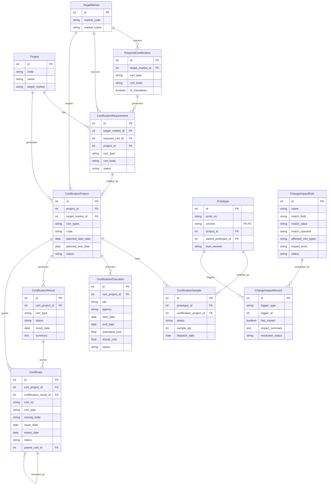

# ROS Phase 6 S2 — 认证中心（Certification Center）

> 架构版本: v1.0  
> 基于: S1 (VR/Prototype/GateRule/TargetMarket ✅)  
> 文档日期: 2026-06-24

---

## 目录

1. [Domain Model（领域模型）](#1-domain-model领域模型)
2. [Workflow Design（工作流设计）](#2-workflow-design工作流设计)
3. [Change Impact Engine（变更影响引擎设计）](#3-change-impact-engine变更影响引擎设计)
4. [Integration Design（集成设计）](#4-integration-design集成设计)
5. [API 列表](#5-api-列表)
6. [UI Page Design（前端页面设计）](#6-ui-page-design前端页面设计)
7. [Migration Strategy（迁移策略）](#7-migration-strategy迁移策略)
8. [Task Breakdown（开发任务分解）](#8-task-breakdown开发任务分解)

---

## 1. Domain Model（领域模型）

### 1.1 核心实体总览

S2 认证中心引入 **6 个新实体** + **1 个引擎**，与 S1 已有实体深度集成：

```
S1 已有:  TargetMarket  →  RequiredCertification
           Project      →  Prototype(P0-P3版本树)
           VerificationRequirement
           GateRule / GateRuleItem
           Part(CDF标记)

S2 新增:  CertificationRequirement  (从 TargetMarket 自动生成)
           CertificationProject     (Project × TargetMarket 组合)
           CertificationSample      (挂载到 Prototype)
           CertificationExecution   (实验室执行记录)
           CertificationResult      (认证结果)
           Certificate              (证书生命周期)
           ChangeImpactRule         (可配置变更影响规则)
           ChangeImpactRecord       (影响分析日志)
```

### 1.2 SQLAlchemy 模型定义

#### 1.2.1 CertificationRequirement（认证需求）

```python
class CertificationRequirement(Base):
    """认证需求 — 从 TargetMarket 自动生成，不可手动创建"""
    __tablename__ = "certification_requirements"

    id = Column(Integer, primary_key=True, index=True, autoincrement=True)
    
    # 来源追踪：从 TargetMarket.RequiredCertification 自动生成
    target_market_id = Column(Integer, ForeignKey("target_markets.id"), nullable=False, 
                              comment="关联目标市场")
    required_cert_id = Column(Integer, ForeignKey("required_certifications.id"), nullable=True,
                              comment="关联 RequiredCertification（溯源）")
    project_id = Column(Integer, ForeignKey("projects.id"), nullable=False,
                        comment="关联项目")
    
    # 认证信息
    cert_type = Column(String(20), nullable=False, 
                       comment=f"认证类型: CECBULSAA 等")
    cert_body = Column(String(100), nullable=True, comment="认证机构")
    is_mandatory = Column(Boolean, default=True, comment="是否强制")
    
    # 状态：pending / in_progress / satisfied / waived / expired
    status = Column(String(20), nullable=False, default="pending",
                    comment="状态")
    
    # 来源说明
    source_type = Column(String(30), nullable=False, default="target_market",
                         comment="生成来源: target_market / manual")
    remark = Column(Text, nullable=True)
    
    # 多租户
    org_id = Column(Integer, ForeignKey("organizations.id"), nullable=True)
    created_at = Column(DateTime, server_default=func.now())
    updated_at = Column(DateTime, server_default=func.now(), onupdate=func.now())

    # 关系
    target_market = relationship("TargetMarket")
    project = relationship("Project", back_populates="certification_requirements")
    # 关联到 CertificationProject（通过 project + target_market）
```

#### 1.2.2 CertificationProject（认证项目）

```python
class CertificationProject(Base):
    """认证项目 — Project × TargetMarket 形成的认证执行单元"""
    __tablename__ = "certification_projects"

    id = Column(Integer, primary_key=True, index=True, autoincrement=True)
    
    # 关联
    project_id = Column(Integer, ForeignKey("projects.id"), nullable=False,
                        comment="关联研发项目")
    target_market_id = Column(Integer, ForeignKey("target_markets.id"), nullable=False,
                              comment="关联目标市场")
    
    # 认证范围（该市场需要做的认证类型列表，JSON数组）
    cert_types = Column(String(200), nullable=True, 
                        comment='需要认证类型JSON: ["CE","CB"]')
    
    # 项目信息
    name = Column(String(200), nullable=True, comment="认证项目名称")
    code = Column(String(50), unique=True, index=True, nullable=True,
                  comment="认证项目编号: CP-20260624-0001")
    
    # 计划日期
    planned_start_date = Column(Date, nullable=True, comment="计划开始日期")
    planned_end_date = Column(Date, nullable=True, comment="计划结束日期")
    
    # 状态: planning / in_progress / completed / cancelled
    status = Column(String(20), nullable=False, default="planning", comment="状态")
    
    # 多租户
    org_id = Column(Integer, ForeignKey("organizations.id"), nullable=True)
    created_at = Column(DateTime, server_default=func.now())
    updated_at = Column(DateTime, server_default=func.now(), onupdate=func.now())

    # 关系
    project = relationship("Project")
    target_market = relationship("TargetMarket")
    samples = relationship("CertificationSample", back_populates="cert_project",
                            cascade="all, delete-orphan")
    executions = relationship("CertificationExecution", back_populates="cert_project",
                               cascade="all, delete-orphan")
    results = relationship("CertificationResult", back_populates="cert_project",
                            cascade="all, delete-orphan")
    certificates = relationship("Certificate", back_populates="cert_project")
```

#### 1.2.3 CertificationSample（认证样机）

```python
class CertificationSample(Base):
    """认证样机 — 必须挂载到 Prototype，不直接关联 Project"""
    __tablename__ = "certification_samples"

    id = Column(Integer, primary_key=True, index=True, autoincrement=True)
    
    # 必须关联 Prototype（即 P2 认证样机版本）
    prototype_id = Column(Integer, ForeignKey("prototypes.id"), nullable=False,
                          comment="关联样机版本（必须是P2认证样机）")
    certification_project_id = Column(Integer, ForeignKey("certification_projects.id"),
                                       nullable=False, comment="关联认证项目")
    
    # 样机信息（从 prototype 冗余，方便查询）
    proto_no = Column(String(50), nullable=True, comment="样机编号（冗余）")
    product_code = Column(String(50), nullable=True, comment="产品编码（冗余）")
    proto_type = Column(String(20), nullable=True, comment="样机类型")
    
    # 状态: pending / submitted / testing / passed / failed
    status = Column(String(20), nullable=False, default="pending", comment="认证样机状态")
    
    # 调拨信息
    dispatch_date = Column(Date, nullable=True, comment="发样日期")
    sample_qty = Column(Integer, default=1, comment="发样数量")
    remark = Column(Text, nullable=True)
    
    # 多租户
    org_id = Column(Integer, ForeignKey("organizations.id"), nullable=True)
    created_at = Column(DateTime, server_default=func.now())
    updated_at = Column(DateTime, server_default=func.now(), onupdate=func.now())

    # 关系
    prototype = relationship("Prototype")
    cert_project = relationship("CertificationProject", back_populates="samples")
```

#### 1.2.4 CertificationExecution（认证执行）

```python
class CertificationExecution(Base):
    """认证执行记录 — 实验室送测记录"""
    __tablename__ = "certification_executions"

    id = Column(Integer, primary_key=True, index=True, autoincrement=True)
    cert_project_id = Column(Integer, ForeignKey("certification_projects.id"), 
                              nullable=False, comment="关联认证项目")
    
    # 执行信息
    lab = Column(String(100), nullable=True, comment="实验室名称")
    agency = Column(String(100), nullable=True, comment="认证机构")
    contact_person = Column(String(50), nullable=True, comment="联系人")
    contact_phone = Column(String(30), nullable=True, comment="联系电话")
    
    # 时间
    start_date = Column(Date, nullable=True, comment="开始日期")
    end_date = Column(Date, nullable=True, comment="结束（预计）日期")
    actual_end_date = Column(Date, nullable=True, comment="实际完成日期")
    
    # 费用
    estimated_cost = Column(Float, nullable=True, comment="预估费用（元）")
    actual_cost = Column(Float, nullable=True, comment="实际费用（元）")
    
    # 状态: pending / testing / completed / cancelled
    status = Column(String(20), nullable=False, default="pending", comment="执行状态")
    
    # 备注
    notes = Column(Text, nullable=True, comment="执行备注")
    attachments = Column(Text, nullable=True, comment="附件JSON数组")
    
    # 多租户
    org_id = Column(Integer, ForeignKey("organizations.id"), nullable=True)
    created_at = Column(DateTime, server_default=func.now())
    updated_at = Column(DateTime, server_default=func.now(), onupdate=func.now())

    # 关系
    cert_project = relationship("CertificationProject", back_populates="executions")
```

#### 1.2.5 CertificationResult（认证结果）

```python
class CertificationResult(Base):
    """认证结果 — 每个 CertificationProject 可能有多次结果"""
    __tablename__ = "certification_results"

    id = Column(Integer, primary_key=True, index=True, autoincrement=True)
    cert_project_id = Column(Integer, ForeignKey("certification_projects.id"),
                              nullable=False, comment="关联认证项目")
    
    # 针对哪个 cert_type（如果 cert_project 包含多个类型）
    cert_type = Column(String(20), nullable=True, comment="认证类型")
    
    # 结果状态
    status = Column(String(20), nullable=False, default="draft",
                    comment=f"draft/submitted/testing/passed/failed/expired")
    result_date = Column(Date, nullable=True, comment="结果日期")
    summary = Column(Text, nullable=True, comment="结果摘要")
    detail = Column(Text, nullable=True, comment="结果明细JSON")
    
    # 关联报告
    report_ref = Column(String(200), nullable=True, comment="测试报告引用")
    attachments = Column(Text, nullable=True, comment="附件JSON")
    
    # 多租户
    org_id = Column(Integer, ForeignKey("organizations.id"), nullable=True)
    created_at = Column(DateTime, server_default=func.now())
    updated_at = Column(DateTime, server_default=func.now(), onupdate=func.now())

    # 关系
    cert_project = relationship("CertificationProject", back_populates="results")
```

#### 1.2.6 Certificate（证书）

```python
class Certificate(Base):
    """证书 — 认证通过后颁发的证书，管理全生命周期"""
    __tablename__ = "certificates"

    id = Column(Integer, primary_key=True, index=True, autoincrement=True)
    
    # 关联
    cert_project_id = Column(Integer, ForeignKey("certification_projects.id"),
                              nullable=True, comment="关联认证项目")
    certification_result_id = Column(Integer, ForeignKey("certification_results.id"),
                                      nullable=True, comment="关联认证结果")
    
    # 证书信息
    cert_no = Column(String(100), index=True, nullable=True, comment="证书编号")
    cert_type = Column(String(20), nullable=False, comment="认证类型: CE/CB/UL/SAA")
    product_name = Column(String(200), nullable=True, comment="产品名称")
    product_model = Column(String(200), nullable=True, comment="产品型号")
    
    # 发证机构
    issuing_body = Column(String(100), nullable=True, comment="发证机构")
    issuing_body_code = Column(String(30), nullable=True, comment="机构代码")
    
    # 生命周期
    issue_date = Column(Date, nullable=True, comment="签发日期")
    expiry_date = Column(Date, nullable=True, comment="到期日期")
    status = Column(String(20), nullable=False, default="active",
                    comment="active / expired / suspended / revoked")
    
    # 续证
    renewal_count = Column(Integer, default=0, comment="续证次数")
    parent_cert_id = Column(Integer, ForeignKey("certificates.id"), nullable=True,
                            comment="原证书（续证时关联）")
    
    # 文件
    attachments = Column(Text, nullable=True, comment="证书附件JSON")
    pdf_url = Column(String(500), nullable=True, comment="证书PDF URL")
    
    # 备注
    remark = Column(Text, nullable=True)
    
    # 提醒（到期前自动通知）
    notify_before_days = Column(Integer, default=90, comment="到期前提醒天数")
    notified_at = Column(DateTime, nullable=True, comment="最后提醒时间")
    
    # 多租户
    org_id = Column(Integer, ForeignKey("organizations.id"), nullable=True)
    created_at = Column(DateTime, server_default=func.now())
    updated_at = Column(DateTime, server_default=func.now(), onupdate=func.now())

    # 关系
    cert_project = relationship("CertificationProject", back_populates="certificates")
    parent_cert = relationship("Certificate", remote_side=[id], backref="renewals")
```

#### 1.2.7 ChangeImpactRule（变更影响规则）

```python
class ChangeImpactRule(Base):
    """变更影响规则 — 可配置，非硬编码"""
    __tablename__ = "change_impact_rules"

    id = Column(Integer, primary_key=True, index=True, autoincrement=True)
    name = Column(String(100), nullable=False, comment="规则名称")
    description = Column(Text, nullable=True, comment="规则说明")
    
    # 匹配条件 — 变更什么物料/属性会影响哪些认证
    # 支持按物料分类、CDF类型、物料编码前缀等匹配
    match_field = Column(String(30), nullable=False, 
                         comment="匹配字段: part_category / cdf_type / part_no_prefix / supplier")
    match_value = Column(String(100), nullable=False, 
                         comment="匹配值: 压缩机 / safety / COMP-*")
    match_operator = Column(String(20), default="equals",
                            comment="匹配操作符: equals / contains / starts_with / regex")
    
    # 影响结果
    affected_cert_types = Column(String(200), nullable=False, 
                                 comment="影响认证类型JSON: ['CE','CB']")
    impact_level = Column(String(20), default="high",
                          comment="影响等级: high / medium / low / none")
    impact_description = Column(Text, nullable=True, comment="影响描述模板")
    
    # 建议动作
    suggested_action = Column(Text, nullable=True, comment="建议动作")
    
    # 规则状态
    status = Column(String(20), nullable=False, default="active",
                    comment="active / inactive")
    priority = Column(Integer, default=100, comment="优先级（数字越小越优先）")
    
    # 多租户
    org_id = Column(Integer, ForeignKey("organizations.id"), nullable=True)
    created_at = Column(DateTime, server_default=func.now())
    updated_at = Column(DateTime, server_default=func.now(), onupdate=func.now())
```

#### 1.2.8 ChangeImpactRecord（变更影响分析记录）

```python
class ChangeImpactRecord(Base):
    """变更影响分析记录 — 每次变更分析的日志"""
    __tablename__ = "change_impact_records"

    id = Column(Integer, primary_key=True, index=True, autoincrement=True)
    
    # 触发来源
    trigger_type = Column(String(30), nullable=False, 
                          comment="触发类型: prototype_upgrade / bom_change / part_change / ecr")
    trigger_id = Column(Integer, nullable=True, comment="触发记录ID")
    trigger_detail = Column(Text, nullable=True, comment="触发详情JSON")
    
    # 分析范围内的认证项目
    cert_project_ids = Column(String(500), nullable=True, 
                              comment="受影响的认证项目ID列表JSON")
    
    # 分析结果
    has_impact = Column(Boolean, default=False, comment="是否产生影响")
    impact_summary = Column(Text, nullable=True, comment="影响摘要JSON")
    detail = Column(Text, nullable=True, comment="完整分析结果JSON")
    
    # 匹配到的规则
    matched_rule_ids = Column(String(200), nullable=True, comment="匹配规则ID列表JSON")
    
    # 处理状态: pending / acknowledged / resolved / ignored
    resolution_status = Column(String(20), nullable=False, default="pending",
                               comment="处理状态")
    resolution_note = Column(Text, nullable=True, comment="处理说明")
    resolved_by = Column(String(50), nullable=True, comment="处理人")
    resolved_at = Column(DateTime, nullable=True, comment="处理时间")
    
    # 多租户
    org_id = Column(Integer, ForeignKey("organizations.id"), nullable=True)
    created_at = Column(DateTime, server_default=func.now())
    updated_at = Column(DateTime, server_default=func.now(), onupdate=func.now())
```

### 1.3 Entity Relationship Diagram



### 1.4 与 S1 实体的关联关系总结

| S1 实体 | 关联方式 | 说明 |
|---------|---------|------|
| **TargetMarket** | CertificationRequirement.target_market_id | 认证需求从 TargetMarket 的 RequiredCertification 自动生成 |
| **RequiredCertification** | CertificationRequirement.required_cert_id | 溯源到 TargetMarket 配置的具体认证要求项 |
| **Project** | CertificationProject.project_id | 每个认证项目关联一个研发项目（如 KFR-35GW → EU） |
| **Prototype** | CertificationSample.prototype_id | 认证样机必须挂载到 Prototype 版本（P2 认证样机） |
| **VerificationRequirement** | 通过 source_type='certification' + source_id | VR 可标记为"认证需求"，认证通过后自动满足 VR |
| **GateRule** | 新增 certification-related rule items | Gate 规则扩展支持认证完成条件判断（如 M6 需要 CE 证书） |
| **Part (CDF)** | ChangeImpactRule 的 match_field='cdf_type' | 物料变更通过 CDF 匹配规则判断认证影响 |

---

## 2. Workflow Design（工作流设计）

### 2.1 认证全生命周期状态机

```
                        ┌──────────────────────────────┐
                        │  CertificationProject          │
                        │  状态流转图                     │
                        └──────────────────────────────┘

    [目标市场配置]           [项目创建]          [样机完成]
         │                     │                    │
         ▼                     ▼                    ▼
    ┌─────────────┐    ┌──────────────┐    ┌──────────────┐
    │ Certification│───▶│ Certification│───▶│ Certification│
    │ Requirement │    │   Project    │    │   Sample     │
    │ (pending)   │    │ (planning)   │    │ (pending)    │
    └─────────────┘    └──────────────┘    └──────────────┘
                              │                    │
                              ▼                    ▼
                       ┌──────────────┐    ┌──────────────┐
                       │ Certification│◀───│ Certification│
                       │ Execution    │    │   Sample     │
                       │ (testing)    │    │ (submitted)  │
                       └──────────────┘    └──────────────┘
                              │
                              ▼
                       ┌──────────────┐
                       │ Certification│
                       │   Result     │
                       │ (passed)     │
                       └──────────────┘
                              │
                              ▼
                       ┌──────────────┐
                       │  Certificate │
                       │  (active)    │
                       └──────────────┘
                              │
                 ┌────────────┴────────────┐
                 ▼                         ▼
          ┌──────────────┐         ┌──────────────┐
          │  Certificate │         │  Certificate │
          │  (expired)   │         │ (suspended)  │
          └──────────────┘         └──────────────┘
                 │                         │
                 ├── 续证 ──▶ New Certificate
                 │
                 └── 换证 ──▶ Certificate (renewed)
```

#### CertificationProject 状态机

```
planning ──▶ in_progress ──▶ completed
    │                            │
    └──▶ cancelled               └──▶ archived
```

#### CertificationResult 状态机

```
draft ──▶ submitted ──▶ testing ──▶ passed
  │          │             │
  │          ▼             └──▶ failed ──▶ (重测→submitted)
  └──▶ cancelled
                        passed ──▶ expired（到期自动过期）
```

### 2.2 认证需求生成流程（TargetMarket → CertificationRequirement）

```
[触发条件]
     1. 项目创建并指定 target_market
     2. 或 TargetMarket 的 RequiredCertification 配置变化

[流程]
     Start
       │
       ▼
    查找 Project.target_market 对应的 TargetMarket
       │
       ▼
    读取 TargetMarket 下的所有 RequiredCertification
    过滤: cert_type in ['CE','CB','UL','SAA']（第一批范围）
       │
       ▼
    foreach RequiredCertification as rc:
      检查是否已存在 CertificationRequirement
      (project_id + target_market_id + cert_type 唯一)
         │
         ├── 不存在 → 创建 CertificationRequirement
         │     status = 'pending'
         │     source_type = 'target_market'
         │
         └── 已存在 → 跳过/更新
       │
       ▼
    同时生成 CertificationProject（project + target_market 组合）
    合并该市场的所有 cert_type 到 CertificationProject.cert_types
       │
       ▼
    End
```

**自动生成规则**：

| TargetMarket | RequiredCertification | 生成的 CertificationProject.cert_types |
|-------------|----------------------|--------------------------------------|
| EU | CE, CB | ["CE", "CB"] |
| US | UL | ["UL"] |
| AU | SAA | ["SAA"] |
| CN | CCC | （第一批不纳入，留空）|

> **架构原则**：CertificationRequirement 和 CertificationProject 仅由系统自动生成，不提供手动创建 API（允许手动补充）。
> 自动生成入口：`/api/s2/auto-generate/{project_id}`

### 2.3 认证项目执行流程

```
┌────────────────────────────────────────────────────────────┐
│              认证项目执行流程                                │
├────────────────────────────────────────────────────────────┤
│                                                            │
│  Step 1: P2认证样机完成 → 创建 CertificationSample           │
│  ─────────────────────────────────────────────────────    │
│  条件: Prototype.version = 'P2' AND status = 'done'        │
│  动作: 自动创建 CertificationSample                         │
│        status = 'pending'                                  │
│                                                            │
│  Step 2: 送样 → 更新 CertificationSample                   │
│  ─────────────────────────────────────────────────────    │
│  用户确认样机信息、发样日期、数量                                │
│  状态: pending → submitted                                  │
│                                                            │
│  Step 3: 提交认证执行 → 创建 CertificationExecution         │
│  ─────────────────────────────────────────────────────    │
│  填写实验室、认证机构、预计时间、费用                            │
│  状态: pending → testing                                    │
│                                                            │
│  Step 4: 记录认证结果 → 创建 CertificationResult            │
│  ─────────────────────────────────────────────────────    │
│  填写测试报告、结果日期、摘要                                   │
│  状态: testing → passed / failed                            │
│                                                            │
│  Step 5: 证书管理 → 创建 Certificate                        │
│  ─────────────────────────────────────────────────────    │
│  录入证书编号、发证机构、签发/到期日期、附件                      │
│  状态: active                                               │
│                                                            │
│  Step 6: 证书到期/续证                                      │
│  ─────────────────────────────────────────────────────    │
│  到期前自动提醒（notify_before_days）                        │
│  续证: 创建新 Certificate，关联 parent_cert_id              │
│                                                            │
└────────────────────────────────────────────────────────────┘
```

### 2.4 证书管理流程

```
                       证书生命周期
                    ┌────────────────┐
                    │  证书申请       │
                    │  (Cert Project)│
                    └───────┬────────┘
                            │
                            ▼
                    ┌────────────────┐
                    │  实验室测试     │
                    │  (Execution)   │
                    └───────┬────────┘
                            │
                    ┌───────┴────────┐
                    ▼                ▼
             ┌────────────┐   ┌────────────┐
             │  测试通过   │   │  测试失败   │
             │  (passed)  │   │  (failed)  │
             └──────┬─────┘   └──────┬─────┘
                    │                │
                    ▼                └──▶ 重新测试
             ┌────────────────┐
             │  获得证书       │
             │  (active)      │
             └───────┬────────┘
                     │
            ┌────────┴────────────┐
            ▼                     ▼
     ┌──────────────┐    ┌──────────────┐
     │  到期前提醒   │    │  变更影响     │
     │  (90天)      │    │  (影响分析)   │
     └──────┬───────┘    └──────┬───────┘
            │                   │
     ┌──────┴──────┐    ┌──────┴──────┐
     ▼             ▼    ▼             ▼
  ┌────────┐ ┌────────┐ ┌────────┐ ┌────────┐
  │ 续证   │ │ 到期   │ │ 暂停   │ │ 撤销   │
  │(new)   │ │(expired)│ │(suspend)│ │(revoke)│
  └────────┘ └────────┘ └────────┘ └────────┘
```

#### 证书到期提醒规则

```python
CERT_EXPIRY_REMINDER_DAYS = [180, 90, 60, 30, 7]  # 提前提醒天数
# 每天定时任务扫描 certificates 表
# WHERE status='active' AND expiry_date <= NOW() + INTERVAL X DAY
# AND (notified_at IS NULL OR notified_at < NOW() - INTERVAL 1 DAY)
# 发送通知到负责人
```

---

## 3. Change Impact Engine（变更影响引擎设计）

### 3.1 核心定位

S2 变更影响引擎是 **认证中心最大价值所在**。它实现从"物料变更"到"认证影响"的自动化链路，核心逻辑：

```
变更物料 → BOM → CDF(关键零部件清单) → 匹配 ChangeImpactRule → 输出影响报告
```

### 3.2 核心算法逻辑

```python
class ChangeImpactEngine:
    """变更影响引擎 — 自动判断变更对认证的影响"""
    
    def analyze_prototype_change(self, prototype_id: int) -> dict:
        """
        分析样机版本变更对认证的影响
        
        Args:
            prototype_id: 新样机 ID（如 P3 量产样机）
            
        Returns:
            dict: 影响分析报告
        """
        # 1. 获取当前样机及其父样机
        prototype = self.db.query(Prototype).get(prototype_id)
        parent = prototype.parent_prototype
        
        if not parent:
            return {"has_impact": False, "message": "无父样机可对比"}
        
        # 2. 比较两个版本的 BOM 差异
        bom_changes = self._compare_bom(parent.bom_version, prototype.bom_version)
        
        # 3. 找出 CDF 相关变更
        cdf_changes = self._filter_cdf_changes(bom_changes)
        
        # 4. 匹配变更影响规则
        impacts = self._match_impact_rules(cdf_changes)
        
        # 5. 查找受影响的所有认证项目
        affected_cert_projects = self._find_affected_cert_projects(prototype.project_id, impacts)
        
        # 6. 生成影响报告
        return self._build_impact_report(impacts, affected_cert_projects, cdf_changes)
    
    def analyze_part_change(self, part_id: int, old_part_id: int = None) -> dict:
        """
        分析物料变更（替代料、供应商变更等）对认证的影响
        """
        # 1. 获取物料信息
        part = self.db.query(Part).get(part_id)
        
        # 2. 检查物料的 CDF 属性
        if not part.is_cdf_item:
            return {"has_impact": False, "message": "非 CDF 物料，不影响认证"}
        
        # 3. 匹配规则
        cdf_changes = [{
            "part_no": part.part_no,
            "part_name": part.name,
            "cdf_type": part.cdf_type,
            "category": part.category.name if part.category else None,
            "change_type": "supplier" if old_part_id else "new_addition"
        }]
        
        impacts = self._match_impact_rules(cdf_changes)
        
        # 4. 查找受影响认证
        # 从 Part.market_cert_marks 字段查找该物料涉及的市场认证
        # 或者从 BOM → CertificationSample → CertificationProject 链路
        
        return self._build_impact_report(impacts, [], cdf_changes)
    
    def _compare_bom(self, old_bom_version: str, new_bom_version: str) -> list:
        """比较两个 BOM 版本，返回变更物料列表"""
        # 查询 BOM 差异（changed / added / removed）
        # ... 调用 BOM 差异服务
        pass
    
    def _filter_cdf_changes(self, bom_changes: list) -> list:
        """过滤出 CDF 相关的变更"""
        cdf_items = []
        for change in bom_changes:
            part = self.db.query(Part).get(change['part_id'])
            if part and part.is_cdf_item:
                cdf_items.append({
                    'part': part,
                    'change_type': change['change_type'],  # add/remove/change
                    'field_changed': change.get('field_changed')
                })
        return cdf_items
    
    def _match_impact_rules(self, cdf_changes: list) -> list:
        """匹配变更影响规则，返回影响列表"""
        impacts = []
        
        # 获取所有 active 规则，按优先级排序
        rules = self.db.query(ChangeImpactRule).filter(
            ChangeImpactRule.status == 'active'
        ).order_by(ChangeImpactRule.priority).all()
        
        for change in cdf_changes:
            part = change['part']
            
            for rule in rules:
                if self._match_rule(part, rule):
                    impacts.append({
                        'rule_id': rule.id,
                        'rule_name': rule.name,
                        'affected_cert_types': json.loads(rule.affected_cert_types),
                        'impact_level': rule.impact_level,
                        'impact_description': rule.impact_description,
                        'part_no': part.part_no,
                        'part_name': part.name,
                        'suggested_action': rule.suggested_action,
                    })
                    break  # 一条规则匹配后停止（优先级控制）
        
        return impacts
    
    def _match_rule(self, part: Part, rule: ChangeImpactRule) -> bool:
        """判断物料是否匹配规则"""
        if rule.match_field == 'part_category':
            category_name = part.category.name if part.category else ""
            return self._apply_operator(category_name, rule.match_value, rule.match_operator)
        
        elif rule.match_field == 'cdf_type':
            return self._apply_operator(part.cdf_type or "", rule.match_value, rule.match_operator)
        
        elif rule.match_field == 'part_no_prefix':
            return self._apply_operator(part.part_no, rule.match_value, rule.match_operator)
        
        elif rule.match_field == 'supplier':
            return self._apply_operator(part.supplier_info or "", rule.match_value, rule.match_operator)
        
        return False
    
    def _apply_operator(self, field_value: str, match_value: str, operator: str) -> bool:
        """应用匹配操作符"""
        if operator == 'equals':
            return field_value == match_value
        elif operator == 'contains':
            return match_value in field_value
        elif operator == 'starts_with':
            return field_value.startswith(match_value)
        elif operator == 'regex':
            import re
            return bool(re.match(match_value, field_value))
        return False
    
    def _find_affected_cert_projects(self, project_id: int, impacts: list) -> list:
        """根据影响分析结果查找受影响的认证项目"""
        affected_cert_types = set()
        for impact in impacts:
            for ct in impact.get('affected_cert_types', []):
                affected_cert_types.add(ct)
        
        if not affected_cert_types:
            return []
        
        # 查找该项目下涉及这些认证类型的 CertificationProject
        cert_projects = self.db.query(CertificationProject).filter(
            CertificationProject.project_id == project_id
        ).all()
        
        result = []
        for cp in cert_projects:
            cp_cert_types = json.loads(cp.cert_types or '[]')
            overlap = set(cp_cert_types) & affected_cert_types
            if overlap:
                result.append({
                    'cert_project_id': cp.id,
                    'code': cp.code,
                    'affected_types': list(overlap),
                    'all_types': cp_cert_types,
                    'status': cp.status,
                })
        
        return result
    
    def _build_impact_report(self, impacts: list, affected_projects: list,
                              cdf_changes: list) -> dict:
        """构建影响报告"""
        has_impact = len(impacts) > 0
        
        return {
            'has_impact': has_impact,
            'impact_level': self._determine_overall_level(impacts),
            'summary': {
                'total_cdf_changes': len(cdf_changes),
                'matched_rules': len(impacts),
                'affected_cert_projects': len(affected_projects),
            },
            'cdf_changes': cdf_changes,
            'impacts': impacts,
            'affected_cert_projects': affected_projects,
            'overall_message': self._generate_summary_message(has_impact, impacts, affected_projects),
        }
```

### 3.3 规则示例（种子数据）

| 规则名称 | match_field | match_value | match_operator | affected_cert_types | impact_level | 说明 |
|---------|------------|-------------|---------------|-------------------|-------------|------|
| 压缩机→CE/CB | part_category | 压缩机 | equals | ["CE", "CB"] | high | 压缩机变更影响安全和能效认证 |
| 电源线→安全认证 | cdf_type | safety | equals | ["CE", "CB", "UL", "SAA"] | high | 安全件变更影响所有安全认证 |
| 风扇电机→噪音认证 | part_category | 风扇电机 | contains | ["CE", "SAA"] | medium | 风扇电机变更可能影响噪音认证 |
| PCB板→EMC认证 | cdf_type | emc | equals | ["CE", "UL"] | high | PCB/EMC件变更影响CE/UL |
| 包装材料→无影响 | part_category | 包装 | contains | [] | none | 包装变更不影响认证 |
| 制冷剂→能效认证 | part_category | 制冷剂 | starts_with | ["CE", "SAA"] | high | 制冷剂变更影响能效认证 |
| 热交换器→性能认证 | part_name | 换热器 | contains | ["CE", "CB", "UL"] | medium | 换热器变更可能影响性能 |
| 电机→CB认证 | cdf_type | energy | equals | ["CB", "CE"] | medium | 能效件变更影响CB/CE |

### 3.4 ChangeImpactEngine 触发场景

```
触发场景 1: Prototype 版本升级
  ┌─────────────────────────────────────────────┐
  │ P2 (认证样机) → P3 (量产样机)                │
  │ 自动触发 ChangeImpactEngine                  │
  │ 比较 P2 BOM vs P3 BOM                        │
  │ 输出影响报告                                 │
  └─────────────────────────────────────────────┘

触发场景 2: BOM 变更
  ┌─────────────────────────────────────────────┐
  │ ECR/ECO 执行 → BOM 版本更新                  │
  │ 自动触发 ChangeImpactEngine                  │
  │ 检查变更物料 → CDF 匹配 → 输出影响报告       │
  └─────────────────────────────────────────────┘

触发场景 3: 物料替换（Part 变更）
  ┌─────────────────────────────────────────────┐
  │ 物料替换/供应商变更                          │
  │ 手动或自动触发 ChangeImpactEngine            │
  │ 检查 Part.is_cdf_item 标记                   │
  │ 匹配规则 → 输出影响报告                      │
  └─────────────────────────────────────────────┘

触发场景 4: 手动触发
  ┌─────────────────────────────────────────────┐
  │ 用户选择 Prototype 版本 → 点击"分析认证影响"  │
  │ 手动触发引擎，输出报告                        │
  └─────────────────────────────────────────────┘
```

---

## 4. Integration Design（集成设计）

### 4.1 与 VerificationRequirement 的集成

**复用模式**：认证通过后自动满足对应的 VR，反向标记 VR 状态。

```python
# 在 CertificationResult 状态变为 'passed' 时触发
def on_certification_passed(cert_result: CertificationResult):
    """
    认证通过后，自动查找并标记相关的 VerificationRequirement
    """
    # 1. 查找该项目下所有 source_type='certification' 的 VR
    vrs = db.query(VerificationRequirement).filter(
        VerificationRequirement.project_id == cert_result.cert_project.project_id,
        VerificationRequirement.source_type == 'certification',
        VerificationRequirement.status == 'pending'
    ).all()
    
    # 2. 匹配 cert_type
    for vr in vr:
        vr_source_detail = json.loads(vr.source_detail or '{}')
        if vr_source_detail.get('cert_type') == cert_result.cert_type:
            # 标记 VR 为 verified
            vr.status = 'verified'
            vr.source_detail = json.dumps({
                **vr_source_detail,
                'cert_result_id': cert_result.id,
                'cert_no': cert_result.cert_project.certificates[0].cert_no if cert_result.cert_project.certificates else None,
                'verified_at': datetime.now().isoformat(),
            })
    
    db.commit()
```

**VR 创建关联**：自动生成 VR（source_type='certification'）当 CertificationRequirement 创建时。

```python
# 在 CertificationRequirement 生成时
def on_cert_requirement_created(cert_req: CertificationRequirement):
    """
    自动创建关联的 VerificationRequirement
    """
    vr = VerificationRequirement(
        vr_code=_gen_vr_code(),
        title=f"认证要求-{cert_req.cert_type}-{cert_req.target_market.market_code}",
        category='safety' if cert_req.cert_type in ['UL', 'SAA'] else 'energy',
        source_type='certification',
        source_id=str(cert_req.id),
        source_detail=json.dumps({
            'cert_type': cert_req.cert_type,
            'target_market': cert_req.target_market.market_code,
            'required_cert_id': cert_req.required_cert_id,
        }),
        project_id=cert_req.project_id,
        status='pending',
    )
    db.add(vr)
    db.commit()
```

### 4.2 与 Prototype 的集成

**认证样机约束**：CertificationSample 必须关联 Prototype 版本。

```python
# CertificationSample 创建时的校验
def validate_cert_sample_prototype(prototype_id: int) -> bool:
    """验证 Prototype 是否符合认证样机要求"""
    proto = db.query(Prototype).get(prototype_id)
    if not proto:
        raise ValueError("样机不存在")
    
    # 验证必须是 P2 或以上版本
    valid_versions = ['P2', 'P3']
    if proto.version not in valid_versions:
        raise ValueError(f"认证样机必须为 {valid_versions} 版本样机，当前: {proto.version}")
    
    # 验证样机状态
    if proto.status != 'done':
        raise ValueError("样机必须已完成测试")
    
    return True
```

**版本升级触发影响分析**：

```python
# Prototype 状态变为 done 时触发
def on_prototype_completed(prototype: Prototype):
    """样机完成时，自动触发变更影响分析"""
    # 仅对 P2+ 版本触发
    if prototype.version in ['P2', 'P3']:
        engine = ChangeImpactEngine(db)
        report = engine.analyze_prototype_change(prototype.id)
        
        # 如果 P2 样机完成，自动创建 CertificationSample
        if prototype.version == 'P2' and not report.get('has_impact'):
            _auto_create_cert_sample(prototype)
        
        # 记录影响分析
        record = ChangeImpactRecord(
            trigger_type='prototype_upgrade',
            trigger_id=prototype.id,
            has_impact=report['has_impact'],
            impact_summary=json.dumps(report, ensure_ascii=False),
            resolution_status='pending' if report['has_impact'] else 'resolved',
        )
        db.add(record)
        db.commit()
```

### 4.3 与 GateRule 的扩展

**新增认证门控规则**：在 GateRuleItem 中扩展支持认证条件。

```python
# GateRuleItem 新增字段（S1 已有字段基础上扩展）
class GateRuleItem(Base):
    # ... 已有字段 ...
    
    # ★ S2 新增：认证条件
    required_cert_type = Column(String(20), nullable=True, comment="要求的认证类型")
    required_cert_status = Column(String(20), nullable=True, comment="要求的证书状态: active")
```

**GateRuleEngine 扩展**：

```python
# GateRuleEngine 新增认证检查方法
def _check_cert_requirement(self, project_id: int, cert_type: str) -> dict:
    """检查认证要求是否满足"""
    # 查找该项目下该认证类型的 Certificate
    cert = self.db.query(Certificate).join(
        CertificationProject,
        Certificate.cert_project_id == CertificationProject.id
    ).filter(
        CertificationProject.project_id == project_id,
        Certificate.cert_type == cert_type,
        Certificate.status == 'active',
    ).first()
    
    if cert:
        return {
            "category": None,
            "cert_type": cert_type,
            "pass": True,
            "detail": f"证书 {cert.cert_no} 有效至 {cert.expiry_date}"
        }
    else:
        return {
            "category": None,
            "cert_type": cert_type,
            "pass": False,
            "detail": f"未找到有效的 {cert_type} 证书"
        }
```

**示例 Gate 规则配置**：

| gate_code | 规则条目 | 说明 |
|-----------|---------|------|
| M6 | required_cert_type='CE' | M6 门控：必须取得 CE 认证 |
| M7 | required_cert_type='CB' | M7 门控：必须取得 CB 认证 |
| M7 | required_cert_type='UL' | 如果目标市场是 US，必须取得 UL |

### 4.4 与 TargetMarket 的复用

**直接复用策略**：S2 不重建 TargetMarket 数据，直接查询 S1 已创建的市场及其 RequiredCertification。

```python
# 自动生成认证需求时查询 S1 数据
def auto_generate_requirements(project_id: int):
    project = db.query(Project).get(project_id)
    if not project or not project.target_market:
        return {"error": "项目未指定目标市场"}
    
    # 解析项目的目标市场代码（可能是 EU,US 等）
    market_codes = _parse_target_markets(project.target_market)
    
    for code in market_codes:
        # 查找 S1 TargetMarket
        tm = db.query(TargetMarket).filter(
            TargetMarket.market_code == code
        ).first()
        if not tm:
            continue
        
        # 获取 S1 RequiredCertification 配置
        required_certs = db.query(RequiredCertification).filter(
            RequiredCertification.target_market_id == tm.id,
            RequiredCertification.cert_type.in_(['CE', 'CB', 'UL', 'SAA'])  # 第一批范围
        ).all()
        
        # 生成 CertificationRequirement
        for rc in required_certs:
            _create_cert_requirement(project, tm, rc)
        
        # 生成 CertificationProject
        _create_cert_project(project, tm, required_certs)
```

**TargetMarket 种子数据（S1 已完成）**：

| market_code | market_name | RequiredCertification |
|------------|------------|----------------------|
| EU | 欧盟 | CE, CB |
| US | 美国 | UL |
| AU | 澳洲 | SAA |
| CN | 中国 | CCC（第二批） |
| SA | 沙特 | SASO（第二批） |

---

## 5. API 列表

### 5.1 认证需求 (CertificationRequirement)

| 方法 | 路径 | 说明 | 权限 |
|------|------|------|------|
| GET | `/api/s2/cert-requirements` | 列表（支持 project_id, target_market_id, cert_type, status 过滤） | certifications |
| GET | `/api/s2/cert-requirements/{id}` | 详情 | certifications |
| POST | `/api/s2/cert-requirements` | 手动补充认证需求（非自动生成，仅用于特殊场景） | certifications_admin |
| PATCH | `/api/s2/cert-requirements/{id}` | 更新（仅允许更新 status, remark） | certifications |
| DELETE | `/api/s2/cert-requirements/{id}` | 删除 | certifications_admin |
| POST | `/api/s2/auto-generate/{project_id}` | 自动生成认证需求（从 TargetMarket） | certifications_admin |

### 5.2 认证项目 (CertificationProject)

| 方法 | 路径 | 说明 | 权限 |
|------|------|------|------|
| GET | `/api/s2/cert-projects` | 列表（支持 project_id, target_market_id, status） | certifications |
| GET | `/api/s2/cert-projects/{id}` | 详情（含 samples, executions, results, certificates） | certifications |
| PATCH | `/api/s2/cert-projects/{id}` | 更新（planned_dates, status） | certifications |
| POST | `/api/s2/cert-projects/{id}/start` | 启动认证项目（planning → in_progress） | certifications |
| POST | `/api/s2/cert-projects/{id}/complete` | 完成认证项目（in_progress → completed） | certifications_admin |
| POST | `/api/s2/cert-projects/{id}/cancel` | 取消认证项目 | certifications_admin |

### 5.3 认证样机 (CertificationSample)

| 方法 | 路径 | 说明 | 权限 |
|------|------|------|------|
| GET | `/api/s2/cert-samples` | 列表（支持 cert_project_id, prototype_id, status） | certifications |
| GET | `/api/s2/cert-samples/{id}` | 详情 | certifications |
| POST | `/api/s2/cert-samples` | 创建（自动校验 prototype 必须是 P2+） | certifications |
| PATCH | `/api/s2/cert-samples/{id}` | 更新（dispatch_date, sample_qty, status） | certifications |
| DELETE | `/api/s2/cert-samples/{id}` | 删除 | certifications_admin |

### 5.4 认证执行 (CertificationExecution)

| 方法 | 路径 | 说明 | 权限 |
|------|------|------|------|
| GET | `/api/s2/cert-executions` | 列表（支持 cert_project_id, status） | certifications |
| GET | `/api/s2/cert-executions/{id}` | 详情 | certifications |
| POST | `/api/s2/cert-executions` | 创建 | certifications |
| PATCH | `/api/s2/cert-executions/{id}` | 更新（lab, agency, dates, cost, status） | certifications |
| DELETE | `/api/s2/cert-executions/{id}` | 删除 | certifications_admin |

### 5.5 认证结果 (CertificationResult)

| 方法 | 路径 | 说明 | 权限 |
|------|------|------|------|
| GET | `/api/s2/cert-results` | 列表（支持 cert_project_id, status, cert_type） | certifications |
| GET | `/api/s2/cert-results/{id}` | 详情 | certifications |
| POST | `/api/s2/cert-results` | 创建 | certifications |
| PATCH | `/api/s2/cert-results/{id}` | 更新 | certifications |
| POST | `/api/s2/cert-results/{id}/submit` | 提交（draft → submitted） | certifications |
| POST | `/api/s2/cert-results/{id}/start-test` | 开始测试（submitted → testing） | certifications |
| POST | `/api/s2/cert-results/{id}/pass` | 测试通过（testing → passed） | certifications_admin |
| POST | `/api/s2/cert-results/{id}/fail` | 测试失败（testing → failed） | certifications_admin |

### 5.6 证书管理 (Certificate)

| 方法 | 路径 | 说明 | 权限 |
|------|------|------|------|
| GET | `/api/s2/certificates` | 列表（支持 cert_project_id, cert_type, status, expiry_date 范围） | certifications |
| GET | `/api/s2/certificates/{id}` | 详情 | certifications |
| POST | `/api/s2/certificates` | 创建（从 passed 结果生成证书） | certifications_admin |
| PATCH | `/api/s2/certificates/{id}` | 更新 | certifications_admin |
| POST | `/api/s2/certificates/{id}/renew` | 续证（创建新证书关联 parent_cert_id） | certifications_admin |
| POST | `/api/s2/certificates/{id}/suspend` | 暂停（active → suspended） | certifications_admin |
| POST | `/api/s2/certificates/{id}/revoke` | 撤销（active → revoked） | certifications_admin |
| POST | `/api/s2/certificates/{id}/upload` | 上传证书附件 | certifications |
| GET | `/api/s2/certificates/expiring` | 即将到期证书列表（默认 90天内） | certifications |

### 5.7 变更影响引擎 (ChangeImpact)

| 方法 | 路径 | 说明 | 权限 |
|------|------|------|------|
| GET | `/api/s2/impact-rules` | 规则列表 | certifications_admin |
| POST | `/api/s2/impact-rules` | 创建规则 | certifications_admin |
| PATCH | `/api/s2/impact-rules/{id}` | 更新规则 | certifications_admin |
| DELETE | `/api/s2/impact-rules/{id}` | 删除规则 | certifications_admin |
| POST | `/api/s2/impact-engine/analyze/prototype/{id}` | 分析样机变更影响 | certifications |
| POST | `/api/s2/impact-engine/analyze/part/{id}` | 分析物料变更影响 | certifications |
| GET | `/api/s2/impact-records` | 影响分析记录列表 | certifications |
| GET | `/api/s2/impact-records/{id}` | 影响分析记录详情 | certifications |
| PATCH | `/api/s2/impact-records/{id}/resolve` | 处理影响记录 | certifications |

### 5.8 仪表盘/统计

| 方法 | 路径 | 说明 | 权限 |
|------|------|------|------|
| GET | `/api/s2/dashboard/stats` | 认证中心仪表盘统计 | certifications |
| GET | `/api/s2/dashboard/cert-type-distribution` | 各认证类型分布 | certifications |
| GET | `/api/s2/dashboard/expiry-calendar` | 证书到期日历 | certifications |

---

## 6. UI Page Design（前端页面设计）

### 6.1 页面列表

| 页面 | 路由 | 功能说明 | 组件 |
|------|------|---------|------|
| 认证中心仪表盘 | `/s2/dashboard` | 概览统计、待办、到期提醒 | S2DashboardView.vue |
| 认证需求列表 | `/s2/cert-requirements` | 查看已生成的认证需求，按项目/市场/认证类型过滤 | S2CertRequirementView.vue |
| 认证项目列表 | `/s2/cert-projects` | 所有认证项目管理 | S2CertProjectView.vue |
| 认证项目详情 | `/s2/cert-projects/:id` | 单个认证项目的完整看板（含样机、执行、结果、证书） | S2CertProjectDetail.vue |
| 认证样机管理 | `/s2/cert-samples` | 认证样机列表，关联 Prototype 版本 | S2CertSampleView.vue |
| 认证执行记录 | `/s2/cert-executions` | 实验室执行记录管理 | S2CertExecutionView.vue |
| 认证结果管理 | `/s2/cert-results` | 认证测试结果管理 | S2CertResultView.vue |
| 证书管理 | `/s2/certificates` | 证书全生命周期管理（含附件、到期提醒） | S2CertificateView.vue |
| 证书详情 | `/s2/certificates/:id` | 证书详情、续证操作 | S2CertificateDetail.vue |
| 变更影响引擎 | `/s2/impact-engine` | 变更影响规则配置 + 分析记录查看 | S2ImpactEngineView.vue |
| 变更影响规则配置 | `/s2/impact-rules` | CRUD 变更影响规则 | S2ImpactRuleView.vue |
| 影响分析记录 | `/s2/impact-records` | 历史影响分析日志 | S2ImpactRecordView.vue |

### 6.2 路由配置

```typescript
// frontend/src/router/index.ts 新增路由
{
  path: 's2',
  name: 'S2CertificationCenter',
  component: () => import('../views/s2/S2Layout.vue'),  // 认证中心独立布局
  meta: { title: '认证中心', menu: 'certifications' },
  children: [
    {
      path: 'dashboard',
      name: 'S2Dashboard',
      component: () => import('../views/s2/S2DashboardView.vue'),
      meta: { title: '认证仪表盘', menu: 'certifications' },
    },
    {
      path: 'cert-requirements',
      name: 'S2CertRequirements',
      component: () => import('../views/s2/S2CertRequirementView.vue'),
      meta: { title: '认证需求', menu: 'certifications' },
    },
    {
      path: 'cert-projects',
      name: 'S2CertProjects',
      component: () => import('../views/s2/S2CertProjectView.vue'),
      meta: { title: '认证项目', menu: 'certifications' },
    },
    {
      path: 'cert-projects/:id',
      name: 'S2CertProjectDetail',
      component: () => import('../views/s2/S2CertProjectDetail.vue'),
      meta: { title: '认证项目详情', menu: 'certifications' },
    },
    {
      path: 'cert-samples',
      name: 'S2CertSamples',
      component: () => import('../views/s2/S2CertSampleView.vue'),
      meta: { title: '认证样机', menu: 'certifications' },
    },
    {
      path: 'cert-executions',
      name: 'S2CertExecutions',
      component: () => import('../views/s2/S2CertExecutionView.vue'),
      meta: { title: '认证执行', menu: 'certifications' },
    },
    {
      path: 'cert-results',
      name: 'S2CertResults',
      component: () => import('../views/s2/S2CertResultView.vue'),
      meta: { title: '认证结果', menu: 'certifications' },
    },
    {
      path: 'certificates',
      name: 'S2Certificates',
      component: () => import('../views/s2/S2CertificateView.vue'),
      meta: { title: '证书管理', menu: 'certifications' },
    },
    {
      path: 'certificates/:id',
      name: 'S2CertificateDetail',
      component: () => import('../views/s2/S2CertificateDetail.vue'),
      meta: { title: '证书详情', menu: 'certifications' },
    },
    {
      path: 'impact-rules',
      name: 'S2ImpactRules',
      component: () => import('../views/s2/S2ImpactRuleView.vue'),
      meta: { title: '变更影响规则', menu: 'certifications' },
    },
    {
      path: 'impact-records',
      name: 'S2ImpactRecords',
      component: () => import('../views/s2/S2ImpactRecordView.vue'),
      meta: { title: '影响分析记录', menu: 'certifications' },
    },
    {
      path: 'impact-engine',
      name: 'S2ImpactEngine',
      component: () => import('../views/s2/S2ImpactEngineView.vue'),
      meta: { title: '变更影响分析', menu: 'certifications' },
    },
  ],
},
```

### 6.3 关键页面功能说明

#### S2DashboardView.vue（认证仪表盘）
- 顶部 KPI 卡片：待认证项目数、有效证书数、30天内到期数、变更影响待处理数
- 近期待办：未完成的认证项目列表
- 证书到期日历：证书到期日期甘特图
- 认证进度概览：各认证类型的完成比例
- 变更影响待办：未处理的 ChangeImpactRecord 列表

#### S2CertProjectDetail.vue（认证项目详情）
- 顶部：项目信息卡（Project code + TargetMarket 信息）
- Tab 页签：
  - **认证样机**: CertificationSample 表格，关联 Prototype 详细信息
  - **认证执行**: CertificationExecution 时间线，实验室/机构/费用
  - **认证结果**: CertificationResult 状态流转，测试报告附件
  - **证书管理**: Certificate 列表，证书附件，到期倒计时
- 右侧面板：状态流转操作按钮（启动/完成/取消）

#### S2ImpactEngineView.vue（变更影响引擎）
- 上半部分：选择 Prototype 版本或输入 Part No → 点击"分析"
- 下半部分：影响分析报告展示
  - CDF 变更列表（红色高亮）
  - 匹配规则列表（高亮显示影响的认证类型）
  - 受影响的认证项目
  - 建议动作
  - 一键生成 ChangeImpactRecord

### 6.4 菜单权限配置

```python
# permissions.py 扩展
ALL_MENUS = [
    # ... 已有 ...
    "s2_certification_center",  # 认证中心（一级菜单）
    # 子菜单：
    "s2_dashboard",             # 认证仪表盘
    "s2_cert_requirements",     # 认证需求
    "s2_cert_projects",         # 认证项目
    "s2_cert_samples",          # 认证样机
    "s2_cert_executions",       # 认证执行
    "s2_cert_results",          # 认证结果
    "s2_certificates",          # 证书管理
    "s2_impact_rules",          # 变更影响规则 (admin only)
    "s2_impact_records",        # 影响分析记录
    "s2_impact_engine",         # 变更影响分析
]
```

---

## 7. Migration Strategy（迁移策略）

### 7.1 新表 SQL（MariaDB）

```sql
-- ============================================================
-- S2 认证中心 — 8 张新表
-- 遵循原则：所有新增字段 nullable=True，向后兼容
-- ============================================================

-- 1. 认证需求表
CREATE TABLE IF NOT EXISTS `certification_requirements` (
    `id` INT AUTO_INCREMENT PRIMARY KEY,
    `target_market_id` INT NOT NULL COMMENT '关联目标市场',
    `required_cert_id` INT NULL COMMENT '关联 RequiredCertification',
    `project_id` INT NOT NULL COMMENT '关联项目',
    `cert_type` VARCHAR(20) NOT NULL COMMENT '认证类型: CE/CB/UL/SAA',
    `cert_body` VARCHAR(100) NULL COMMENT '认证机构',
    `is_mandatory` TINYINT(1) DEFAULT 1 COMMENT '是否强制',
    `status` VARCHAR(20) NOT NULL DEFAULT 'pending' COMMENT 'pending/in_progress/satisfied/waived/expired',
    `source_type` VARCHAR(30) NOT NULL DEFAULT 'target_market' COMMENT '生成来源',
    `remark` TEXT NULL COMMENT '备注',
    `org_id` INT NULL COMMENT '所属组织',
    `created_at` DATETIME DEFAULT CURRENT_TIMESTAMP,
    `updated_at` DATETIME DEFAULT CURRENT_TIMESTAMP ON UPDATE CURRENT_TIMESTAMP,
    INDEX `idx_cr_project` (`project_id`),
    INDEX `idx_cr_target_market` (`target_market_id`),
    INDEX `idx_cr_cert_type` (`cert_type`),
    INDEX `idx_cr_status` (`status`),
    FOREIGN KEY (`target_market_id`) REFERENCES `target_markets`(`id`),
    FOREIGN KEY (`project_id`) REFERENCES `projects`(`id`)
) ENGINE=InnoDB DEFAULT CHARSET=utf8mb4 COLLATE=utf8mb4_unicode_ci COMMENT='认证需求';

-- 2. 认证项目表
CREATE TABLE IF NOT EXISTS `certification_projects` (
    `id` INT AUTO_INCREMENT PRIMARY KEY,
    `project_id` INT NOT NULL COMMENT '关联研发项目',
    `target_market_id` INT NOT NULL COMMENT '关联目标市场',
    `cert_types` VARCHAR(200) NULL COMMENT '需要认证类型JSON',
    `name` VARCHAR(200) NULL COMMENT '认证项目名称',
    `code` VARCHAR(50) UNIQUE NULL COMMENT '认证项目编号',
    `planned_start_date` DATE NULL COMMENT '计划开始日期',
    `planned_end_date` DATE NULL COMMENT '计划结束日期',
    `status` VARCHAR(20) NOT NULL DEFAULT 'planning' COMMENT 'planning/in_progress/completed/cancelled',
    `org_id` INT NULL,
    `created_at` DATETIME DEFAULT CURRENT_TIMESTAMP,
    `updated_at` DATETIME DEFAULT CURRENT_TIMESTAMP ON UPDATE CURRENT_TIMESTAMP,
    INDEX `idx_cp_project` (`project_id`),
    INDEX `idx_cp_target_market` (`target_market_id`),
    INDEX `idx_cp_status` (`status`),
    FOREIGN KEY (`project_id`) REFERENCES `projects`(`id`),
    FOREIGN KEY (`target_market_id`) REFERENCES `target_markets`(`id`)
) ENGINE=InnoDB DEFAULT CHARSET=utf8mb4 COLLATE=utf8mb4_unicode_ci COMMENT='认证项目';

-- 3. 认证样机表
CREATE TABLE IF NOT EXISTS `certification_samples` (
    `id` INT AUTO_INCREMENT PRIMARY KEY,
    `prototype_id` INT NOT NULL COMMENT '关联样机版本',
    `certification_project_id` INT NOT NULL COMMENT '关联认证项目',
    `proto_no` VARCHAR(50) NULL COMMENT '样机编号（冗余）',
    `product_code` VARCHAR(50) NULL COMMENT '产品编码（冗余）',
    `proto_type` VARCHAR(20) NULL COMMENT '样机类型',
    `status` VARCHAR(20) NOT NULL DEFAULT 'pending' COMMENT 'pending/submitted/testing/passed/failed',
    `dispatch_date` DATE NULL COMMENT '发样日期',
    `sample_qty` INT DEFAULT 1 COMMENT '发样数量',
    `remark` TEXT NULL,
    `org_id` INT NULL,
    `created_at` DATETIME DEFAULT CURRENT_TIMESTAMP,
    `updated_at` DATETIME DEFAULT CURRENT_TIMESTAMP ON UPDATE CURRENT_TIMESTAMP,
    INDEX `idx_csa_prototype` (`prototype_id`),
    INDEX `idx_csa_cert_project` (`certification_project_id`),
    INDEX `idx_csa_status` (`status`),
    FOREIGN KEY (`prototype_id`) REFERENCES `prototypes`(`id`),
    FOREIGN KEY (`certification_project_id`) REFERENCES `certification_projects`(`id`)
) ENGINE=InnoDB DEFAULT CHARSET=utf8mb4 COLLATE=utf8mb4_unicode_ci COMMENT='认证样机';

-- 4. 认证执行表
CREATE TABLE IF NOT EXISTS `certification_executions` (
    `id` INT AUTO_INCREMENT PRIMARY KEY,
    `cert_project_id` INT NOT NULL COMMENT '关联认证项目',
    `lab` VARCHAR(100) NULL COMMENT '实验室',
    `agency` VARCHAR(100) NULL COMMENT '认证机构',
    `contact_person` VARCHAR(50) NULL COMMENT '联系人',
    `contact_phone` VARCHAR(30) NULL COMMENT '联系电话',
    `start_date` DATE NULL COMMENT '开始日期',
    `end_date` DATE NULL COMMENT '预计结束日期',
    `actual_end_date` DATE NULL COMMENT '实际完成日期',
    `estimated_cost` FLOAT NULL COMMENT '预估费用',
    `actual_cost` FLOAT NULL COMMENT '实际费用',
    `status` VARCHAR(20) NOT NULL DEFAULT 'pending' COMMENT 'pending/testing/completed/cancelled',
    `notes` TEXT NULL,
    `attachments` TEXT NULL COMMENT '附件JSON',
    `org_id` INT NULL,
    `created_at` DATETIME DEFAULT CURRENT_TIMESTAMP,
    `updated_at` DATETIME DEFAULT CURRENT_TIMESTAMP ON UPDATE CURRENT_TIMESTAMP,
    INDEX `idx_ce_cert_project` (`cert_project_id`),
    INDEX `idx_ce_status` (`status`),
    FOREIGN KEY (`cert_project_id`) REFERENCES `certification_projects`(`id`)
) ENGINE=InnoDB DEFAULT CHARSET=utf8mb4 COLLATE=utf8mb4_unicode_ci COMMENT='认证执行记录';

-- 5. 认证结果表
CREATE TABLE IF NOT EXISTS `certification_results` (
    `id` INT AUTO_INCREMENT PRIMARY KEY,
    `cert_project_id` INT NOT NULL COMMENT '关联认证项目',
    `cert_type` VARCHAR(20) NULL COMMENT '认证类型',
    `status` VARCHAR(20) NOT NULL DEFAULT 'draft' COMMENT 'draft/submitted/testing/passed/failed/expired',
    `result_date` DATE NULL COMMENT '结果日期',
    `summary` TEXT NULL COMMENT '结果摘要',
    `detail` TEXT NULL COMMENT '结果明细JSON',
    `report_ref` VARCHAR(200) NULL COMMENT '测试报告引用',
    `attachments` TEXT NULL COMMENT '附件JSON',
    `org_id` INT NULL,
    `created_at` DATETIME DEFAULT CURRENT_TIMESTAMP,
    `updated_at` DATETIME DEFAULT CURRENT_TIMESTAMP ON UPDATE CURRENT_TIMESTAMP,
    INDEX `idx_cr_cert_project` (`cert_project_id`),
    INDEX `idx_cr_status` (`status`),
    FOREIGN KEY (`cert_project_id`) REFERENCES `certification_projects`(`id`)
) ENGINE=InnoDB DEFAULT CHARSET=utf8mb4 COLLATE=utf8mb4_unicode_ci COMMENT='认证结果';

-- 6. 证书表
CREATE TABLE IF NOT EXISTS `certificates` (
    `id` INT AUTO_INCREMENT PRIMARY KEY,
    `cert_project_id` INT NULL COMMENT '关联认证项目',
    `certification_result_id` INT NULL COMMENT '关联认证结果',
    `cert_no` VARCHAR(100) NULL COMMENT '证书编号',
    `cert_type` VARCHAR(20) NOT NULL COMMENT '认证类型',
    `product_name` VARCHAR(200) NULL COMMENT '产品名称',
    `product_model` VARCHAR(200) NULL COMMENT '产品型号',
    `issuing_body` VARCHAR(100) NULL COMMENT '发证机构',
    `issuing_body_code` VARCHAR(30) NULL COMMENT '机构代码',
    `issue_date` DATE NULL COMMENT '签发日期',
    `expiry_date` DATE NULL COMMENT '到期日期',
    `status` VARCHAR(20) NOT NULL DEFAULT 'active' COMMENT 'active/expired/suspended/revoked',
    `renewal_count` INT DEFAULT 0 COMMENT '续证次数',
    `parent_cert_id` INT NULL COMMENT '原证书ID',
    `attachments` TEXT NULL COMMENT '附件JSON',
    `pdf_url` VARCHAR(500) NULL COMMENT '证书PDF URL',
    `remark` TEXT NULL,
    `notify_before_days` INT DEFAULT 90 COMMENT '到期前提醒天数',
    `notified_at` DATETIME NULL COMMENT '最后提醒时间',
    `org_id` INT NULL,
    `created_at` DATETIME DEFAULT CURRENT_TIMESTAMP,
    `updated_at` DATETIME DEFAULT CURRENT_TIMESTAMP ON UPDATE CURRENT_TIMESTAMP,
    INDEX `idx_cert_cert_project` (`cert_project_id`),
    INDEX `idx_cert_type` (`cert_type`),
    INDEX `idx_cert_status` (`status`),
    INDEX `idx_cert_expiry` (`expiry_date`),
    FOREIGN KEY (`cert_project_id`) REFERENCES `certification_projects`(`id`),
    FOREIGN KEY (`parent_cert_id`) REFERENCES `certificates`(`id`)
) ENGINE=InnoDB DEFAULT CHARSET=utf8mb4 COLLATE=utf8mb4_unicode_ci COMMENT='证书';

-- 7. 变更影响规则表
CREATE TABLE IF NOT EXISTS `change_impact_rules` (
    `id` INT AUTO_INCREMENT PRIMARY KEY,
    `name` VARCHAR(100) NOT NULL COMMENT '规则名称',
    `description` TEXT NULL,
    `match_field` VARCHAR(30) NOT NULL COMMENT '匹配字段: part_category/cdf_type/part_no_prefix/supplier',
    `match_value` VARCHAR(100) NOT NULL COMMENT '匹配值',
    `match_operator` VARCHAR(20) DEFAULT 'equals' COMMENT '匹配操作符: equals/contains/starts_with/regex',
    `affected_cert_types` VARCHAR(200) NOT NULL COMMENT '影响认证类型JSON数组',
    `impact_level` VARCHAR(20) DEFAULT 'high' COMMENT 'high/medium/low/none',
    `impact_description` TEXT NULL,
    `suggested_action` TEXT NULL,
    `status` VARCHAR(20) NOT NULL DEFAULT 'active' COMMENT 'active/inactive',
    `priority` INT DEFAULT 100 COMMENT '优先级',
    `org_id` INT NULL,
    `created_at` DATETIME DEFAULT CURRENT_TIMESTAMP,
    `updated_at` DATETIME DEFAULT CURRENT_TIMESTAMP ON UPDATE CURRENT_TIMESTAMP,
    INDEX `idx_cir_status` (`status`)
) ENGINE=InnoDB DEFAULT CHARSET=utf8mb4 COLLATE=utf8mb4_unicode_ci COMMENT='变更影响规则';

-- 8. 变更影响记录表
CREATE TABLE IF NOT EXISTS `change_impact_records` (
    `id` INT AUTO_INCREMENT PRIMARY KEY,
    `trigger_type` VARCHAR(30) NOT NULL COMMENT '触发类型: prototype_upgrade/bom_change/part_change/ecr',
    `trigger_id` INT NULL COMMENT '触发记录ID',
    `trigger_detail` TEXT NULL COMMENT '触发详情JSON',
    `cert_project_ids` VARCHAR(500) NULL COMMENT '受影响的认证项目ID列表JSON',
    `has_impact` TINYINT(1) DEFAULT 0 COMMENT '是否产生影响',
    `impact_summary` TEXT NULL COMMENT '影响摘要JSON',
    `detail` TEXT NULL COMMENT '完整分析结果JSON',
    `matched_rule_ids` VARCHAR(200) NULL COMMENT '匹配规则ID列表JSON',
    `resolution_status` VARCHAR(20) NOT NULL DEFAULT 'pending' COMMENT 'pending/acknowledged/resolved/ignored',
    `resolution_note` TEXT NULL,
    `resolved_by` VARCHAR(50) NULL,
    `resolved_at` DATETIME NULL,
    `org_id` INT NULL,
    `created_at` DATETIME DEFAULT CURRENT_TIMESTAMP,
    `updated_at` DATETIME DEFAULT CURRENT_TIMESTAMP ON UPDATE CURRENT_TIMESTAMP,
    INDEX `idx_cir_trigger` (`trigger_type`, `trigger_id`),
    INDEX `idx_cir_resolution` (`resolution_status`)
) ENGINE=InnoDB DEFAULT CHARSET=utf8mb4 COLLATE=utf8mb4_unicode_ci COMMENT='变更影响记录';

-- ============================================================
-- GateRuleItem 扩展字段（ALTER TABLE 方式，向后兼容）
-- ============================================================
ALTER TABLE `gate_rule_items`
    ADD COLUMN IF NOT EXISTS `required_cert_type` VARCHAR(20) NULL COMMENT '要求的认证类型' AFTER `required_prototype_type`,
    ADD COLUMN IF NOT EXISTS `required_cert_status` VARCHAR(20) NULL COMMENT '要求的证书状态' AFTER `required_cert_type`;
```

### 7.2 种子数据方案

#### 7.2.1 变更影响规则种子数据

```sql
-- ChangeImpactRule 种子数据
INSERT INTO `change_impact_rules` (`name`, `description`, `match_field`, `match_value`, `match_operator`, `affected_cert_types`, `impact_level`, `impact_description`, `suggested_action`, `status`, `priority`) VALUES
('压缩机变更→CE/CB', '压缩机物料变更影响CE和CB认证', 'part_category', '压缩机', 'equals', '["CE","CB"]', 'high', '压缩机为关键零部件，变更须重新进行CE和CB认证测试', '需重新进行CE整机测试和CB测试，建议联系认证机构', 'active', 10),
('电源线变更→安全认证', '电源线/插头等安全件变更影响所有安全认证', 'cdf_type', 'safety', 'equals', '["CE","CB","UL","SAA"]', 'high', '安全件变更须重新进行安全认证测试', '需重新进行安全认证测试，建议更换同规格已认证替代料', 'active', 20),
('PCB板变更→EMC认证', 'PCB/电控板变更影响CE和UL认证', 'cdf_type', 'emc', 'equals', '["CE","UL"]', 'high', 'EMC关键件变更须重新进行EMC测试', '需重新进行EMC测试，建议提前安排EMC预测试', 'active', 30),
('风扇电机变更→噪音认证', '风扇电机变更可能影响噪音认证', 'part_category', '风扇电机', 'contains', '["CE","SAA"]', 'medium', '风扇电机变更可能影响噪音性能，需确认是否在认证限制内', '建议安排噪音对比测试，确认是否超标', 'active', 40),
('制冷剂变更→能效认证', '制冷剂变更影响能效和CB认证', 'part_category', '制冷剂', 'starts_with', '["CE","CB","SAA"]', 'high', '制冷剂变更须重新进行能效测试', '需重新进行能效认证测试，建议申请前确认制冷剂是否在认证列表', 'active', 50),
('热交换器变更→性能认证', '换热器变更可能影响性能认证', 'part_name', '换热器', 'contains', '["CE","CB","UL"]', 'medium', '换热器变更可能影响性能参数', '建议安排性能对比测试，评估对认证的影响', 'active', 60),
('电机变更→CB能效', '能效件变更影响CB和CE认证', 'cdf_type', 'energy', 'equals', '["CB","CE"]', 'medium', '能效关键件变更须确认是否影响能效等级', '建议安排能效测试，确认能效等级不变', 'active', 70),
('包装材料→无影响', '包装材料变更不影响任何认证', 'part_category', '包装', 'contains', '[]', 'none', '包装材料变更不影响任何认证', '无需处理', 'active', 99),
('标签铭牌变更→安全认证', '标签、铭牌变更影响安全认证', 'part_category', '铭牌', 'contains', '["UL","CE"]', 'medium', '标签变更须确认认证标志信息正确', '需审核标签内容，确保认证标志和编号与证书一致', 'active', 50);
```

#### 7.2.2 自动生成触发配置

创建 `/api/s2/auto-generate/{project_id}` 端点后，系统通过以下 PostgreSQL 风格伪逻辑自动生成认证需求和项目：

```python
# 每个项目创建 + TargetMarket 关联时自动触发
def on_project_target_market_set(project_id):
    project = get_project(project_id)
    if not project.target_market:
        return
    
    market_codes = [code.strip() for code in project.target_market.split(',')]
    first_market = market_codes[0] if market_codes else None
    
    if first_market:
        tm = db.query(TargetMarket).filter(
            TargetMarket.market_code == first_market
        ).first()
        
        if tm:
            # 获取该市场要求的认证类型（第一批范围）
            required_certs = db.query(RequiredCertification).filter(
                RequiredCertification.target_market_id == tm.id,
                RequiredCertification.cert_type.in_(['CE', 'CB', 'UL', 'SAA'])
            ).all()
            
            for rc in required_certs:
                # 创建 CertificationRequirement
                cr = CertificationRequirement(
                    target_market_id=tm.id,
                    required_cert_id=rc.id,
                    project_id=project_id,
                    cert_type=rc.cert_type,
                    cert_body=rc.cert_body,
                    is_mandatory=rc.is_mandatory,
                    status='pending',
                    source_type='target_market',
                )
                db.add(cr)
            
            # 创建 CertificationProject
            cert_types = [rc.cert_type for rc in required_certs]
            cp = CertificationProject(
                project_id=project_id,
                target_market_id=tm.id,
                cert_types=json.dumps(cert_types),
                name=f"{project.name} - {tm.market_name}认证",
                code=f"CP-{datetime.now().strftime('%Y%m%d')}-{uuid4().hex[:4].upper()}",
                status='planning',
            )
            db.add(cp)
            db.commit()
```

### 7.3 旧 Certification 模型迁移

现有 `test.py` 中的 `Certification` 模型是 S1 遗留的简易认证模型。S2 上线后：

1. **不删除** `Certification` 表（向后兼容）
2. **推荐使用** 新 S2 实体进行认证管理
3. 可选：编写迁移脚本将旧 `Certification` 数据导入新表
4. 旧 API 保持不变，新 S2 使用独立路由 `/api/s2/` 前缀

---

## 8. Task Breakdown（开发任务分解）

### 8.1 实施阶段与依赖关系

```
Phase 1: 数据模型 + 迁移（3天）          ← 无依赖，第一步
  ├── T1: 新增枚举定义
  ├── T2: 8张新表模型
  ├── T3: Schema定义
  └── T4: 数据库迁移SQL

Phase 2: 认证需求 + 认证项目（4天）       ← 依赖 Phase 1
  ├── T5: CertificationRequirement API
  ├── T6: CertificationProject API
  ├── T7: 自动生成引擎服务
  └── T8: 前端 - 认证需求/项目页面

Phase 3: 认证执行 + 结果（4天）           ← 依赖 Phase 2
  ├── T9: CertificationSample API
  ├── T10: CertificationExecution API
  ├── T11: CertificationResult API
  └── T12: 前端 - 样机/执行/结果页面

Phase 4: 证书管理（3天）                  ← 依赖 Phase 2
  ├── T13: Certificate API
  ├── T14: 证书到期提醒定时任务
  └── T15: 前端 - 证书管理页面

Phase 5: 变更影响引擎（5天）              ← 依赖 Phase 1
  ├── T16: ChangeImpactRule API + 管理
  ├── T17: ChangeImpactEngine 服务
  ├── T18: ChangeImpactRecord API
  ├── T19: 变更分析触发钩子（Prototype/BOM变更自动触发）
  └── T20: 前端 - 影响引擎/规则页面

Phase 6: 集成（3天）                     ← 依赖 Phase 2-5
  ├── T21: VR 集成（认证通过→VR自动满足）
  ├── T22: GateRule 扩展（认证门控）
  ├── T23: Prototype 自动触发认证样机
  └── T24: TargetMarket 自动生成对接

Phase 7: 仪表盘 + 完善（3天）             ← 依赖 Phase 2-6
  ├── T25: 认证中心仪表盘 API + 前端
  ├── T26: 证书到期提醒功能完善
  ├── T27: 种子数据安装脚本
  └── T28: 集成测试 + 部署

总预估: 25天（5周）
```

### 8.2 详细任务清单

| 编号 | 任务名称 | 复杂度(1-5) | 依赖 | 预估工时 | 产出物 |
|------|---------|------------|------|---------|--------|
| **Phase 1: 数据模型 + 迁移** | | | | |
| T1 | 新增 S2 领域枚举（CertStatus, ImpactLevel 等） | 1 | 无 | 0.5天 | enums.py 扩展 |
| T2 | 创建 8 个 SQLAlchemy 模型文件 | 2 | T1 | 1天 | 8个模型类 |
| T3 | 创建 Pydantic Schema（Create/Out/Update） | 2 | T2 | 1天 | schema 类 |
| T4 | 数据库迁移 SQL + 向后兼容检查 | 1 | T2 | 0.5天 | migration.sql |
| **Phase 2: 认证需求 + 认证项目** | | | | |
| T5 | CertificationRequirement CRUD API | 2 | T2, T3 | 1天 | api/cert_requirements.py |
| T6 | CertificationProject CRUD + 状态流转 API | 3 | T2, T3 | 1天 | api/cert_projects.py |
| T7 | 自动生成引擎服务（TargetMarket→CertReq+CertProj） | 4 | T5, T6 | 1.5天 | services/cert_auto_gen.py |
| T8 | 前端：认证需求列表页 + 认证项目列表/详情页 | 3 | T5, T6, T7 | 1.5天 | Vue组件 |
| **Phase 3: 认证执行 + 结果** | | | | |
| T9 | CertificationSample CRUD + Prototype校验 | 3 | T5, T6 | 1天 | api/cert_samples.py |
| T10 | CertificationExecution CRUD API | 2 | T6 | 0.5天 | api/cert_executions.py |
| T11 | CertificationResult CRUD + 状态流转 API | 3 | T6 | 1天 | api/cert_results.py |
| T12 | 前端：认证样机/执行/结果页面 | 3 | T9, T10, T11 | 1.5天 | Vue组件 |
| **Phase 4: 证书管理** | | | | |
| T13 | Certificate CRUD + 续证/暂停/撤销 API | 3 | T6, T11 | 1.5天 | api/certificates.py |
| T14 | 证书到期提醒定时任务（Celery/cron） | 3 | T13 | 1天 | services/cert_reminder.py |
| T15 | 前端：证书管理列表页 + 详情/续证页 | 3 | T13 | 1.5天 | Vue组件 |
| **Phase 5: 变更影响引擎** | | | | |
| T16 | ChangeImpactRule CRUD API | 2 | T2 | 0.5天 | api/impact_rules.py |
| T17 | ChangeImpactEngine 服务（核心算法） | 5 | T16 | 2天 | services/change_impact_engine.py |
| T18 | ChangeImpactRecord API | 2 | T17 | 0.5天 | api/impact_records.py |
| T19 | 变更分析触发钩子（原型/BOM变更自动触发） | 4 | T17 | 1天 | hooks/auto_trigger.py |
| T20 | 前端：影响规则管理页 + 影响分析页 + 记录页 | 4 | T16, T17, T18 | 1.5天 | Vue组件 |
| **Phase 6: 集成** | | | | |
| T21 | VR 集成钩子（认证通过→自动满足VR） | 3 | T11, T13 | 0.5天 | hooks/cert_to_vr.py |
| T22 | GateRule 扩展（GateRuleItem 新增 cert_type 字段） | 2 | T13 | 0.5天 | GateRule模型扩展 |
| T23 | Prototype 自动触发认证样机 + 变更分析钩子 | 3 | T9, T17 | 0.5天 | hooks/prototype_hooks.py |
| T24 | TargetMarket 自动生成对接（项目创建时自动触发） | 2 | T7 | 0.5天 | event_handlers.py |
| **Phase 7: 仪表盘 + 完善** | | | | |
| T25 | 认证中心仪表盘 API + 前端 | 3 | T5-T20 | 1天 | dashboard |
| T26 | 证书到期提醒前端 + 通知完善 | 2 | T14, T15 | 0.5天 | 前端通知 |
| T27 | 种子数据安装脚本 + 配置文件 | 1 | T16 | 0.5天 | seed_data.py |
| T28 | 集成测试 + 部署 | 2 | T1-T27 | 1天 | test cases |

### 8.3 建议实施顺序

```
Week 1: [Phase 1] T1-T4 数据模型 + 迁移
         [Phase 2] T5-T6 认证需求和项目 API
         
Week 2: [Phase 2] T7-T8 自动引擎 + 前端
         [Phase 3] T9-T12 认证执行 + 结果
         
Week 3: [Phase 4] T13-T15 证书管理
         [Phase 5] T16-T17 影响引擎
         
Week 4: [Phase 5] T18-T20 影响引擎完成 + 前端
         [Phase 6] T21-T24 集成
         
Week 5: [Phase 7] T25-T28 仪表盘 + 完善 + 部署
```

### 8.4 关键风险点

| 风险 | 概率 | 影响 | 缓解策略 |
|------|------|------|---------|
| BOM 版本比较 API 尚未就绪（影响引擎依赖） | Medium | High | 先实现 Part-level 变更分析，BOM 对比后置 |
| S1 旧 Certification 模型与新模型冲突 | Low | Medium | 新模型使用独立 `/api/s2/` 路由，旧模型保留不动 |
| 自动生成引擎并发问题（多个项目同时触发） | Low | Medium | 使用 DB 唯一约束（project_id + cert_type + target_market_id）防止重复 |
| 认证机构数据接入复杂度 | Medium | Low | 第一阶段手动录入，第二阶段再对接机构 API |

### 8.5 文件清单（新增/修改）

```
新增文件：
  backend/app/models/certification.py          # 6个新模型（requirements/projects/samples/executions/results/certificates）
  backend/app/models/change_impact.py           # 2个新模型（rules/records）
  backend/app/api/cert_requirements.py          # 认证需求 API
  backend/app/api/cert_projects.py              # 认证项目 API
  backend/app/api/cert_samples.py               # 认证样机 API
  backend/app/api/cert_executions.py            # 认证执行 API
  backend/app/api/cert_results.py               # 认证结果 API
  backend/app/api/certificates.py               # 证书管理 API
  backend/app/api/impact_rules.py               # 变更影响规则 API
  backend/app/api/impact_records.py             # 变更影响记录 API
  backend/app/services/cert_auto_gen.py         # 认证需求自动生成服务
  backend/app/services/change_impact_engine.py  # 变更影响引擎服务
  backend/app/services/cert_reminder.py         # 证书到期提醒服务
  backend/app/hooks/cert_to_vr.py               # 认证→VR 集成钩子
  backend/app/hooks/prototype_hooks.py          # Prototype 变更触发
  frontend/src/views/s2/S2DashboardView.vue     # 认证仪表盘
  frontend/src/views/s2/S2CertRequirementView.vue
  frontend/src/views/s2/S2CertProjectView.vue
  frontend/src/views/s2/S2CertProjectDetail.vue
  frontend/src/views/s2/S2CertSampleView.vue
  frontend/src/views/s2/S2CertExecutionView.vue
  frontend/src/views/s2/S2CertResultView.vue
  frontend/src/views/s2/S2CertificateView.vue
  frontend/src/views/s2/S2CertificateDetail.vue
  frontend/src/views/s2/S2ImpactRuleView.vue
  frontend/src/views/s2/S2ImpactRecordView.vue
  frontend/src/views/s2/S2ImpactEngineView.vue
  frontend/src/stores/s2.ts                     # S2 Pinia store
  phase6-s2-plan.md                             # 本文档

修改文件：
  backend/app/models/__init__.py                # 注册新模型
  backend/app/models/gate_rule.py               # GateRuleItem 扩展 cert_type 字段
  backend/app/core/enums.py                     # 新增 S2 枚举
  backend/app/core/permissions.py               # 新增 S2 菜单权限
  backend/app/schemas/__init__.py               # 新增 S2 Schema
  frontend/src/router/index.ts                  # 新增 S2 路由
  backend/app/api/__init__.py                   # 注册 S2 路由
```

---

## 附录

### A. 认证类型与市场映射（第一批）

| 目标市场 | 代码 | 认证类型 | 认证机构示例 | 适用标准 |
|---------|------|---------|------------|---------|
| 欧盟 | EU | CE | TÜV, SGS, Intertek | EN 14511, EN 14825, EN 55014 |
| 欧盟 | EU | CB | CB体系成员 | IEC 60335-2-40 |
| 美国 | US | UL | UL, ETL, CSA | UL 484, UL 60335-2-40 |
| 澳洲 | AU | SAA | SAA, G-Mark | AS/NZS 60335.2.40 |

### B. 关键设计决策记录

| 决策 | 选项 | 选择 | 理由 |
|------|------|------|------|
| 认证数据附着点 | Project vs Prototype | **Prototype** | 认证样机必须关联到具体版本，版本升级时才能判断认证影响 |
| CertificationRequirement 创建方式 | 手动 vs 自动 | **自动**（从 TargetMarket 生成） | 避免人工遗漏，保证一致性 |
| ChangeImpactRule 配置方式 | 硬编码 vs 可配置 | **可配置** | 适应不同产品线和市场的差异化需求 |
| 第一批认证范围 | 全部 vs 4种 | **CE/CB/UL/SAA** | 聚焦核心市场，降低首批实施风险 |
| 新旧 Certification 模型关系 | 替换 vs 共存 | **共存** | 新模型独立路由 `/api/s2/`，旧模型保留，保证向后兼容 |
| 认证项目(Project)与认证类型(CertType) | 1项目1类型 vs 1项目多类型 | **1项目多类型** | 一个市场（如EU）同时需要 CE+CB，合并为一个认证项目管理更高效 |
